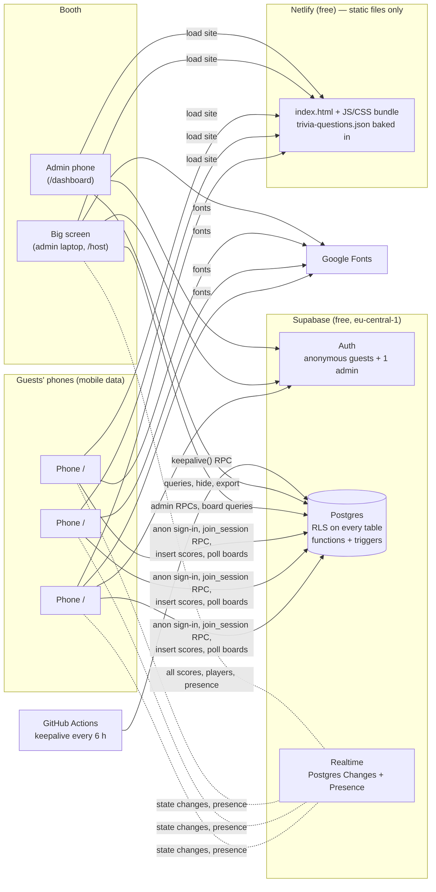
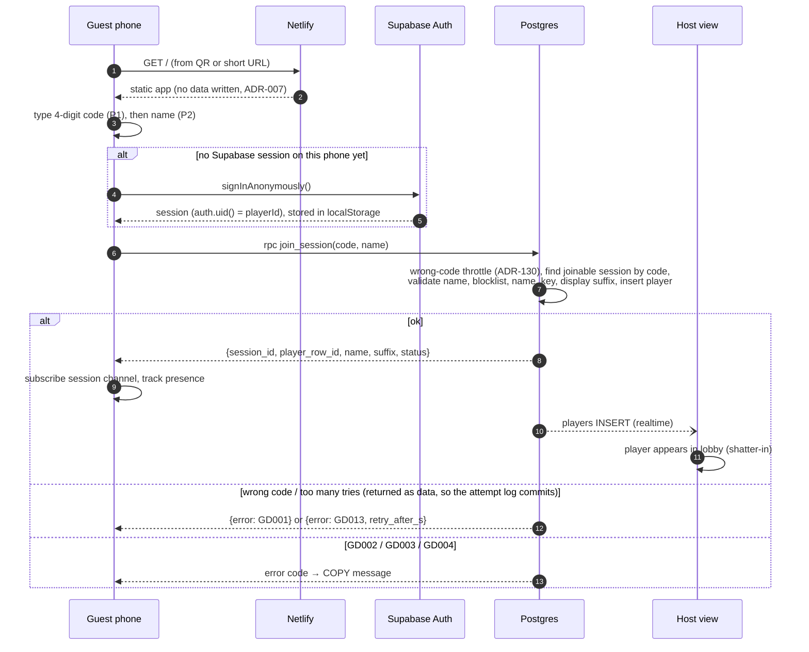
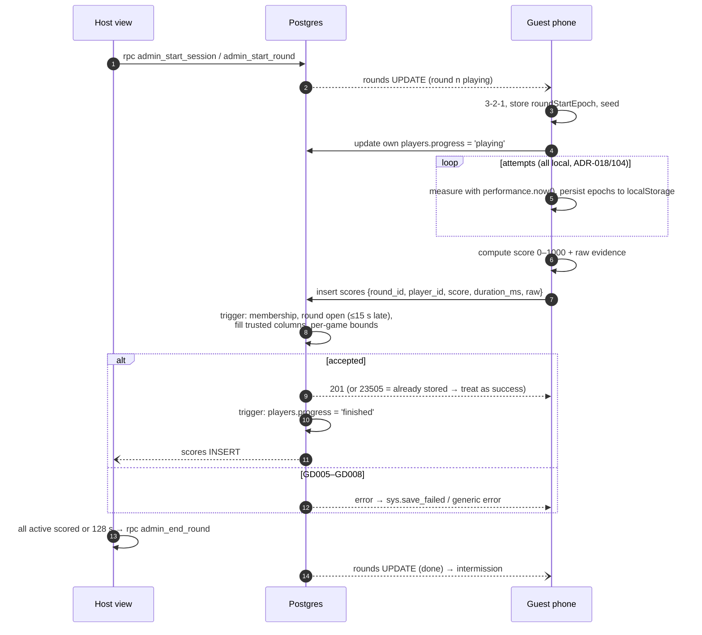
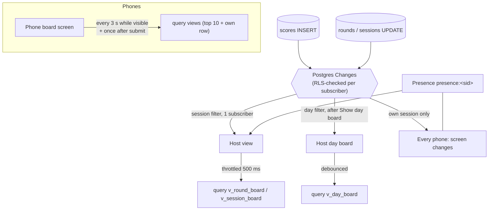

# Architecture

Purpose: how the GDG Booth Game is put together: the static-site + Supabase design with no backend server, the main flows as diagrams (system, join, gameplay and score submission, realtime leaderboards), the trade-offs of going serverless, capacity against the verified free-plan limits, the game module contract, and the planned source tree. Tables and policies are in `DATA_MODEL.md`; state machines in `SESSION_LIFECYCLE.md`.

Last updated: 2026-09-24

---

## 1. System overview



- **Netlify** serves static files only. No functions, no server code (ADR-028).
- **Supabase** is the only backend: Auth, Postgres (with RLS, SQL functions and triggers), Realtime. Region `eu-central-1` (Frankfurt): Supabase has no Middle East region, and Frankfurt is the closest listed region to Amman (geographic inference; measure latency at the dry run).
- Guests use their own mobile data (ADR-029).

## 2. Why no backend, and what it costs

| We gain | We pay |
|---|---|
| Nothing to host, patch or keep awake except the database | The database is the whole security boundary (`SECURITY.md`) |
| Free plans cover the event | Scores are trusted from the client within bounds (ADR-021) |
| Fewer moving parts for a student team | Round lifecycle depends on the host laptop being open (ADR-104); if it closes, rounds pause |
| Deploy = upload static files | Logic that must be atomic lives in SQL functions (ADR-110), which the team must be comfortable editing |
| Realtime without running a WebSocket server | Realtime quotas shape the design: phones poll boards (ADR-112) |

## 3. Join flow



## 4. Gameplay and score submission



## 5. Realtime and leaderboards



Rules:
- **State** (session status, round start/end, own removal) reaches phones by Postgres Changes: few events, each fanned out once per phone.
- **Scores** reach only the host in real time; phones poll the views. This keeps Realtime traffic linear in players instead of quadratic (ADR-112).
- **Hidden names** reach the host in real time; phones pick them up on their next poll (≤ 3 s).
- Presence is used only for the grey-out dots (ADR-103).

## 6. Capacity against verified free-plan limits

Limits checked on 2026-09-24 (sources below). Estimates assume a busy booth: 30 phones per session, 100 sessions per event day, 3 event days.

| Resource | Free limit | Our estimate | Headroom / note |
|---|---|---|---|
| Realtime concurrent connections | 200 | ≈ 30–60 phones + host + dashboard | Fine; practical ceiling ≈ 150 phones connected at once |
| Realtime messages per second | 100 | State events fan out to N phones in bursts (e.g. round start ≈ N messages); scores → 1 subscriber | Comfortable to ≈ 60–80 phones in one session; beyond that bursts can hit the limit, so the load test (`TESTING.md` §5) measures it |
| Realtime messages per month | 2 M | ≈ 1,000 per session → ≈ 300 k per event | Fine |
| Presence messages per second | 20 | 1 track per phone per join, spread over the lobby | A mass reconnect can be throttled briefly; dots recover |
| Channel joins per second | 100 | ≤ 2 channels per phone | Fine |
| Database size | 500 MB | scores ≈ 1 KB/row → ≈ 30 MB | Fine |
| Egress | 5 GB (+5 GB cached) | board polling ≈ 2 MB/session → ≈ 0.6 GB/event | Fine |
| Auth MAU | 50 000 | ≈ 3 000 anonymous users | Fine (anonymous users are real auth users; assumed to count) |
| Anonymous sign-ins per IP | 30/h default, configurable | Many guests share carrier NAT | Raised to 1,000/h (ADR-102) |
| Project pausing | after ~7 days of low DB activity | keepalive every 6 h (a DB write) | ADR-128 |
| Netlify credits | 300/month hard limit; deploy = 15; bandwidth 20/GB | ≈ 0.3 MB per guest first load → ≈ 1.4 GB/event ≈ 28 credits | Deploy budget ADR-126; if credits run out, **all sites on the account pause** |

"No player cap" (ADR-013) stays true in the product; the free plan's realtime limits are the practical ceiling, noted in OQ-16.

Sources:
- Supabase pricing: https://supabase.com/pricing
- Realtime limits: https://supabase.com/docs/guides/realtime/limits
- Postgres Changes (RLS, scaling notes): https://supabase.com/docs/guides/realtime/postgres-changes
- Presence: https://supabase.com/docs/guides/realtime/presence
- Anonymous sign-ins: https://supabase.com/docs/guides/auth/auth-anonymous · rate limits: https://supabase.com/docs/guides/auth/rate-limits
- Free project pausing: https://supabase.com/docs/guides/platform/free-project-pausing
- Regions: https://supabase.com/docs/guides/platform/regions
- Netlify credits: https://docs.netlify.com/manage/accounts-and-billing/billing/billing-for-credit-based-plans/how-credits-work/ · plans: https://www.netlify.com/pricing/

## 7. Game module contract

Every game is a self-contained module under `src/games/<game-id>/` and is registered in `src/games/registry.ts`. The shell (player app) owns the round lifecycle; the game owns only its screen and its maths.

| Part | Contract |
|---|---|
| `id` | One of the `game_id` enum values |
| Screen component | Receives: the per-round seed, language, the round's remaining budget, a "round ended" signal, and callbacks to persist progress and to finish. Renders only inside the game area (the shell draws header/banners). |
| Progress persistence | Calls back with a JSON-serialisable snapshot after every attempt and every start event (epochs, not `performance.now()` values), so the shell can store it (ADR-018) and hand it back on reload. |
| Finish | Calls back once with `{ score, raw, duration_ms }`. The shell submits. |
| Scoring function | Pure function `raw → score`, in its own file, fully unit-tested against the worked examples and test cases of the game doc. No DOM, no time, no randomness. |
| Timeout rule | On "round ended" or its own per-attempt timeouts, finishes with the game doc's timeout rule. Never blocks longer than its documented worst case. |
| Strings | Only via `t()` keys from `COPY.md` §5. |
| Theming | Only design tokens; Simon's pad colours are the one allowed exception. |

## 8. Planned source tree

```
/
├── CLAUDE.md
├── .claude/rules/                 path-scoped rules (games, supabase, ui-i18n, docs-sync)
├── docs/                          this documentation set
├── assets/                        logo files (provided) and source artwork
├── public/
│   └── _redirects                 SPA fallback: /*  /index.html  200
├── src/
│   ├── main.tsx                   picks the app by pathname: /, /host, /dashboard
│   ├── config.ts                  ROUNDS_PER_SESSION, timings from SESSION_LIFECYCLE §1
│   ├── lib/
│   │   ├── supabase.ts            client with the publishable key
│   │   ├── realtime.ts            channel + presence helpers
│   │   ├── storage.ts             gdg.v1.* localStorage state, Web Locks tab guard
│   │   ├── names.ts               client mirror of SCORING §6 (UX only)
│   │   ├── rng.ts                 seeded RNG (shuffles, layouts, sequences)
│   │   └── errors.ts              GDxxx / 23505 → COPY keys
│   ├── i18n/
│   │   ├── en.json · ar.json      generated from / checked against COPY.md
│   │   └── t.ts                   t(key, params) with Intl.PluralRules
│   ├── styles/
│   │   ├── tokens.css             DESIGN_SYSTEM tokens
│   │   └── base.css
│   ├── effects/shatter/           mosaic shatter layer
│   ├── components/                Leaderboard, VersusFrame, CodeInput, Banner, …
│   ├── player/                    P-screens (SCREENS §1)
│   ├── host/                      H-screens + host loop (SESSION_LIFECYCLE §3.1)
│   ├── dashboard/                 D-screens + CSV export
│   └── games/
│       ├── registry.ts
│       ├── stop-the-clock/        screen, scoring.ts, scoring.test.ts
│       ├── odd-one-out/
│       ├── simon/
│       ├── perfect-circle/
│       └── trivia/                imports docs/content/trivia-questions.json
├── supabase/
│   ├── config.toml
│   ├── migrations/                0001_schema.sql … (DATA_MODEL §3–§8, §10)
│   └── tests/                     pgTAP RLS and bounds tests
├── scripts/
│   ├── check-trivia.ts            schema + strict checks (trivia-format §2)
│   ├── check-i18n.ts              en/ar key and placeholder parity
│   ├── contrast.ts                DESIGN_SYSTEM §2.4
│   └── loadtest/                  simulated phones (TESTING §5)
├── e2e/                           Playwright multi-phone tests
├── .github/workflows/
│   ├── keepalive.yml              every 6 h (ADR-128)
│   └── ci.yml                     typecheck, unit tests, checks
├── netlify.toml
├── package.json · vite.config.ts · tsconfig.json
```
