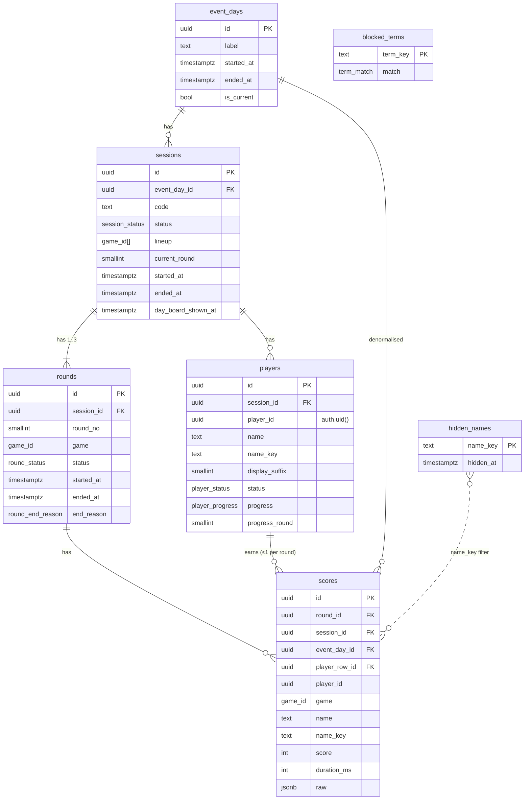

# Data Model

Purpose: the complete Supabase Postgres schema: every table, column, type, constraint and index; the realtime publication; the full RLS policies for guests and the admin; and the database functions that perform joins and admin state transitions. The first migrations in Phase 0 are written from this file. If the schema changes, this file changes in the same commit as the migration.

Last updated: 2026-09-24

Related: `SESSION_LIFECYCLE.md` (which function moves which state), `SCORING.md` (bounds enforced by the score trigger), `SECURITY.md` (why each policy exists), ADR-030, ADR-101, ADR-102, ADR-110, ADR-113.

---

## 1. Principles

Migrations live in `supabase/migrations/` with the CLI's timestamped names, `20260924000001_schema.sql` … `20260924000007_seed.sql`, one per section below ("0001"–"0007" in `PHASES.md`). The migration files are ASCII only: non-ASCII characters are written as `\uXXXX` escapes (regex escapes in plain literals, `E''` escapes in `translate()`).

1. **RLS is enabled on every table in `public`. Never disabled.** (ADR-030)
2. Guests are Supabase **anonymous users**: role `authenticated`, `auth.uid()` = playerId (ADR-102). The unsigned `anon` role can read and write nothing except calling `keepalive()`.
3. The admin is a normal user whose JWT carries `app_metadata.role = 'admin'` (ADR-101). Checked by `private.is_admin()`.
4. Guests have exactly **two direct write paths**: `INSERT` into `scores` (own rows) and `UPDATE` of two progress columns on their own `players` row. Joining goes through `public.join_session` (the one guest-callable `SECURITY DEFINER` function). Admin functions are `SECURITY INVOKER` and succeed only because admin-only RLS policies allow the writes (ADR-110).
5. Helper, policy and trigger functions live in schema **`private`**, which is not exposed through the Data API, so none of them can be called from a browser. Supabase warns against `SECURITY DEFINER` functions in exposed schemas (source in §9).
6. Nothing is ever deleted by the app. Removal = flag; hiding = a row in `hidden_names`; days and sessions are closed, not dropped.
7. Trusted columns on `scores` (game, session, day, name) are filled by a trigger from server-side rows, never taken from the client.
8. Schema changes only through migrations in `supabase/migrations/` (`DEPLOYMENT.md` §5). No destructive migrations once real data exists (no `DROP TABLE`, no `DROP COLUMN`, no type-narrowing).

## 2. ER diagram



## 3. Schema (migration `20260924000001_schema.sql`)

```sql
-- ============ Types ============
create type public.game_id          as enum ('odd_one_out','stop_the_clock','simon','perfect_circle','trivia');
create type public.session_status   as enum ('pending','lobby','playing','results','closed');
create type public.round_status     as enum ('upcoming','playing','done');
create type public.round_end_reason as enum ('all_finished','time_cap','force_end');
create type public.player_status    as enum ('joined','removed');
create type public.player_progress  as enum ('waiting','playing','finished');
create type public.term_match       as enum ('word','substring');

-- ============ Private schema (not exposed via the Data API) ============
create schema if not exists private;
revoke all on schema private from public, anon, authenticated;
grant usage on schema private to authenticated;   -- so RLS policies evaluated as the guest can call the helpers

-- ============ Helpers (immutable, used in constraints) ============
create function private.game_array_is_distinct(a public.game_id[])
returns boolean language sql immutable set search_path = '' as $$
  select cardinality(a) = (select count(distinct x) from unnest(a) x)
$$;

-- Cleaned display name: NFKC, strip Arabic diacritics (tashkeel U+064B–U+065F, U+0670) and tatweel (U+0640),
-- collapse whitespace, trim. Rules and test vectors: SCORING.md §6.
create function private.clean_name(p text)
returns text language sql immutable set search_path = '' as $$
  select btrim(regexp_replace(
           regexp_replace(normalize(coalesce(p, ''), NFKC), '[\u064B-\u065F\u0670\u0640]', '', 'g'),
           '\s+', ' ', 'g'))
$$;

-- Name key: cleaned name, lower-cased, Arabic letter variants unified, all digits to ASCII.
-- (The migration spells these characters as E'' escapes so the file stays ASCII.)
create function private.name_key(p text)
returns text language sql immutable set search_path = '' as $$
  select translate(lower(private.clean_name(p)),
                   'أإآٱىةؤئ٠١٢٣٤٥٦٧٨٩۰۱۲۳۴۵۶۷۸۹',
                   'اااايهوي01234567890123456789')
$$;

-- ============ Tables ============
create table public.event_days (
  id          uuid primary key default gen_random_uuid(),
  label       text not null check (char_length(label) between 1 and 40),
  started_at  timestamptz not null default now(),
  ended_at    timestamptz,
  is_current  boolean not null default true,
  check (not (is_current and ended_at is not null))
);
create unique index event_days_one_current on public.event_days ((true)) where is_current;

create table public.sessions (
  id                  uuid primary key default gen_random_uuid(),
  event_day_id        uuid not null references public.event_days(id),
  code                text not null check (code ~ '^[1-9][0-9]{3}$'),
  status              public.session_status not null,
  lineup              public.game_id[] not null
                        check (cardinality(lineup) between 1 and 3 and private.game_array_is_distinct(lineup)),
  current_round       smallint check (current_round between 1 and 3),
  created_at          timestamptz not null default now(),
  opened_at           timestamptz,           -- became 'lobby'
  started_at          timestamptz,           -- became 'playing'
  ended_at            timestamptz,           -- became 'results'
  day_board_shown_at  timestamptz,           -- host tapped Show day board
  closed_at           timestamptz            -- became 'closed'
);
-- At most one joinable and one running session at any time (ADR-108).
create unique index sessions_one_joinable on public.sessions ((true)) where status in ('pending','lobby');
create unique index sessions_one_running  on public.sessions ((true)) where status in ('playing','results');
create index sessions_day_idx on public.sessions (event_day_id, created_at);

create table public.rounds (
  id          uuid primary key default gen_random_uuid(),
  session_id  uuid not null references public.sessions(id),
  round_no    smallint not null check (round_no between 1 and 3),
  game        public.game_id not null,
  status      public.round_status not null default 'upcoming',
  started_at  timestamptz,
  ended_at    timestamptz,
  end_reason  public.round_end_reason,
  unique (session_id, round_no),
  unique (session_id, game),
  check ((status = 'done') = (ended_at is not null and end_reason is not null))
);

create table public.players (
  id              uuid primary key default gen_random_uuid(),
  session_id      uuid not null references public.sessions(id),
  player_id       uuid not null,   -- = auth.uid() of the anonymous user. No FK to auth.users on purpose:
                                   -- history must survive any cleanup of anonymous users.
  name            text not null check (char_length(name) between 1 and 12),
  name_key        text not null,
  display_suffix  smallint check (display_suffix >= 2),
  status          public.player_status   not null default 'joined',
  progress        public.player_progress not null default 'waiting',
  progress_round  smallint check (progress_round between 1 and 3),
  joined_at       timestamptz not null default now(),
  removed_at      timestamptz,
  unique (session_id, player_id),
  check ((status = 'removed') = (removed_at is not null))
);
create index players_session_key_idx on public.players (session_id, name_key);
create index players_player_idx      on public.players (player_id);

create table public.scores (
  id              uuid primary key default gen_random_uuid(),
  round_id        uuid not null references public.rounds(id),
  player_id       uuid not null,                              -- must equal auth.uid() (RLS)
  score           integer not null check (score between 0 and 1000),
  duration_ms     integer not null check (duration_ms between 0 and 130000),
  raw             jsonb   not null,                           -- per-game shape, SCORING.md §4
  client_version  text    check (char_length(client_version) <= 40),
  -- trusted columns, always overwritten by trigger scores_fill_and_validate:
  session_id      uuid not null references public.sessions(id),
  event_day_id    uuid not null references public.event_days(id),
  player_row_id   uuid not null references public.players(id),
  game            public.game_id not null,
  name            text not null,
  name_key        text not null,
  display_suffix  smallint,
  created_at      timestamptz not null default now(),
  unique (round_id, player_id)                                -- ADR-019: one score per player per round
);
create index scores_day_board_idx on public.scores (event_day_id, game, name_key, score desc, created_at);
create index scores_session_idx   on public.scores (session_id);
create index scores_player_row_idx on public.scores (player_row_id);   -- FK index

create table public.hidden_names (
  name_key   text primary key,
  note       text check (char_length(note) <= 200),
  hidden_at  timestamptz not null default now()
);

create table public.blocked_terms (
  term_key   text primary key check (char_length(term_key) >= 1),  -- stored as private.name_key(term), spaces removed;
                                                                   -- never empty (an empty substring term would block every name)
  match      public.term_match not null default 'word',
  lang       text not null check (lang in ('ar','en','any')),
  added_at   timestamptz not null default now()
);

create table public.keepalive (
  id         smallint primary key check (id = 1),
  pinged_at  timestamptz not null default now()
);
insert into public.keepalive (id) values (1);
```

Notes:
- `sessions.lineup` allows 1–3 games so the Phase 1–2 slice can run 1-round sessions (ADR-120). The app enforces `ROUNDS_PER_SESSION`; once it is 3, a follow-up migration tightens the check to `cardinality(lineup) = 3`.
- `players.name` stores the *cleaned* name (`clean_name`), not the raw input.
- `scores.duration_ms` is the phone-measured time from the end of the 3-2-1 to the submit, capped by the phone at 120 000 ms; the 130 000 upper bound leaves room for the grace window.

## 4. Row Level Security (migration `20260924000002_rls.sql`)

### 4.1 Helper functions (schema `private`)

```sql
-- Admin = JWT app_metadata.role = 'admin'. app_metadata (raw_app_meta_data) cannot be updated by the user,
-- which is why Supabase recommends it for authorization data (source in §9).
-- Note: a JWT only picks up a changed role after the admin signs out and in again.
create function private.is_admin()
returns boolean language sql stable set search_path = '' as $$
  select coalesce(((select auth.jwt()) -> 'app_metadata' ->> 'role') = 'admin', false)
$$;

-- Membership check used by policies. SECURITY DEFINER so a policy on players can query players
-- without recursing into its own RLS. Lives in private, so it can't be called over the Data API.
create function private.is_session_member(sid uuid)
returns boolean language sql stable security definer set search_path = '' as $$
  select exists (
    select 1 from public.players p
    where p.session_id = sid and p.player_id = (select auth.uid())
  )
$$;

create function private.current_event_day_id()
returns uuid language sql stable security definer set search_path = '' as $$
  select id from public.event_days where is_current
$$;
```

### 4.2 Enable RLS and set table privileges

Privileges decide *which operations* the `authenticated` role may attempt at all; policies then decide *which rows*. Guests and the admin share the `authenticated` role, so every write privilege granted below is matched by a policy that only the admin (or the row's own player) passes. Privileges are revoked wholesale and then granted explicitly: current Supabase projects no longer auto-grant table or function access to the API roles, but their default privileges still give `anon` and `authenticated` `TRUNCATE` (which ignores RLS) on new tables.

```sql
alter table public.event_days    enable row level security;
alter table public.sessions      enable row level security;
alter table public.rounds        enable row level security;
alter table public.players       enable row level security;
alter table public.scores        enable row level security;
alter table public.hidden_names  enable row level security;
alter table public.blocked_terms enable row level security;
alter table public.keepalive     enable row level security;

-- Start from nothing, whatever the project's default privileges are. (Supabase's defaults for tables
-- created by postgres grant TRUNCATE/REFERENCES/TRIGGER to anon and authenticated; TRUNCATE ignores RLS.)
-- The unsigned anon role gets nothing. Guests are 'authenticated' (anonymous sign-in).
revoke all on all tables    in schema public from anon, authenticated;
revoke all on all functions in schema public from anon, public;

-- Then grant exactly what the policies below are written for.
-- No DELETE on event_days, sessions, rounds, players, scores: nobody deletes history.
grant select, insert, update         on public.event_days    to authenticated;
grant select, insert, update         on public.sessions      to authenticated;
grant select, insert, update         on public.rounds        to authenticated;
-- players: rows are created only by join_session(); only these columns are updatable at all
-- (guest: progress*, admin: status/removed_at).
grant select                         on public.players       to authenticated;
grant update (progress, progress_round, status, removed_at) on public.players to authenticated;
-- scores: insert-only; never changed or deleted after insert.
grant select, insert                 on public.scores        to authenticated;
-- hidden_names: delete = un-hide (admin only by policy); blocked_terms: admin only by policy.
grant select, insert, update, delete on public.hidden_names  to authenticated;
grant select, insert, update, delete on public.blocked_terms to authenticated;
-- keepalive: no grants; only touched by keepalive().
```

### 4.3 Policies

```sql
-- ---------- Guest (and admin) read access ----------
create policy event_days_select on public.event_days
  for select to authenticated using (true);

-- Guests never list sessions, so they can't read a code they haven't been shown (join goes through join_session()).
create policy sessions_select_member on public.sessions
  for select to authenticated using (private.is_session_member(id));

create policy rounds_select_member on public.rounds
  for select to authenticated using (private.is_session_member(session_id));

create policy players_select_member on public.players
  for select to authenticated using (private.is_session_member(session_id));

-- Current day's scores are public to signed-in users (session boards + day boards).
create policy scores_select_today on public.scores
  for select to authenticated using (event_day_id = (select private.current_event_day_id()));

create policy hidden_names_select on public.hidden_names
  for select to authenticated using (true);

-- ---------- Guest writes ----------
-- Own, non-removed player row; only progress columns (grant above); can't set status to 'removed'
-- (with check) and can't set removed_at (check constraint ties it to status).
create policy players_update_own_progress on public.players
  for update to authenticated
  using      (player_id = (select auth.uid()) and status = 'joined')
  with check (player_id = (select auth.uid()) and status = 'joined');

-- Own score. Membership, round open and bounds are enforced by the trigger in §5 (specific error codes).
create policy scores_insert_own on public.scores
  for insert to authenticated
  with check (player_id = (select auth.uid()));

-- ---------- Admin ----------
create policy event_days_admin    on public.event_days    for all to authenticated using ((select private.is_admin())) with check ((select private.is_admin()));
create policy sessions_admin      on public.sessions      for all to authenticated using ((select private.is_admin())) with check ((select private.is_admin()));
create policy rounds_admin        on public.rounds        for all to authenticated using ((select private.is_admin())) with check ((select private.is_admin()));
create policy players_admin       on public.players       for all to authenticated using ((select private.is_admin())) with check ((select private.is_admin()));
create policy scores_admin_read   on public.scores        for select to authenticated using ((select private.is_admin()));
create policy hidden_names_admin  on public.hidden_names  for all to authenticated using ((select private.is_admin())) with check ((select private.is_admin()));
create policy blocked_terms_admin on public.blocked_terms for all to authenticated using ((select private.is_admin())) with check ((select private.is_admin()));
-- (The missing DELETE/UPDATE grants in §4.2 still stop even the admin from deleting history or editing scores.)
-- (select …) around the helpers lets Postgres evaluate them once per statement instead of once per row.

-- keepalive: no policies (only reachable through keepalive()).
```

What a guest can and can't do, as a result:

| Action | Guest | Admin |
|---|---|---|
| Read sessions/rounds/players of a session they joined | ✅ | ✅ all |
| Read any session's code without having joined | ❌ | ✅ |
| Join a session | ✅ only via `join_session(code, name)` | — |
| Update own `progress`, `progress_round` | ✅ | — |
| Update own `name` or `status`, or anyone else's row | ❌ | ✅ `status`/`removed_at` via `admin_remove_player` |
| Insert own score | ✅ once per round, trigger-checked | — |
| Update/delete any score | ❌ | ❌ (no one) |
| Read current day's scores | ✅ | ✅ all days |
| Insert/update sessions, rounds, days; hide names; blocklist | ❌ (no policy passes) | ✅ via admin functions |
| Delete sessions, rounds, players, scores, days | ❌ | ❌ (no one) |

## 5. Score trigger (migration `20260924000003_score_trigger.sql`)

Error codes raised to the client (the app maps them to `COPY.md` strings):

| SQLSTATE | Meaning | Raised by |
|---|---|---|
| `GD001` | code_invalid: no joinable session with that code | `join_session` |
| `GD002` | name_invalid: empty, too long, or disallowed characters | `join_session` |
| `GD003` | name_blocked | `join_session` |
| `GD004` | removed: this playerId was removed from that session | `join_session` |
| `GD005` | not_in_session | score trigger |
| `GD006` | round_not_open (upcoming) | score trigger |
| `GD007` | round_closed (more than 15 s after round end) | score trigger |
| `GD008` | impossible_score (detail names the failed bound) | score trigger |
| `GD009` | not_admin | admin functions |
| `GD010` | invalid_state (e.g. start a session that isn't a lobby; also an unknown id, or no current event day) | admin functions |
| `GD011` | lineup_invalid | admin functions |
| `GD012` | not_signed_in | `join_session` |
| `23505` | unique_violation on `(round_id, player_id)`: already submitted; **client treats as success** | constraint |

```sql
create function private.scores_fill_and_validate()
returns trigger language plpgsql security definer set search_path = '' as $$
declare
  r  public.rounds%rowtype;
  p  public.players%rowtype;
  s  public.sessions%rowtype;
  why text;
begin
  select * into r from public.rounds where id = new.round_id;
  if not found then raise exception 'not_in_session' using errcode = 'GD005'; end if;
  select * into s from public.sessions where id = r.session_id;
  select * into p from public.players
    where session_id = r.session_id and player_id = new.player_id;
  if not found or p.status = 'removed' then
    raise exception 'not_in_session' using errcode = 'GD005';
  end if;
  if r.status = 'upcoming' then
    raise exception 'round_not_open' using errcode = 'GD006';
  end if;
  if r.status = 'done' and now() > r.ended_at + interval '15 seconds' then
    raise exception 'round_closed' using errcode = 'GD007';
  end if;

  -- trusted columns (client values are ignored)
  new.session_id     := r.session_id;
  new.event_day_id   := s.event_day_id;
  new.game           := r.game;
  new.player_row_id  := p.id;
  new.name           := p.name;
  new.name_key       := p.name_key;
  new.display_suffix := p.display_suffix;
  new.created_at     := now();

  why := private.score_bounds_violation(r.game, new.score, new.duration_ms, new.raw);
  if why is not null then
    raise exception 'impossible_score' using errcode = 'GD008', detail = why;
  end if;
  return new;
end $$;

create trigger scores_fill_and_validate
  before insert on public.scores
  for each row execute function private.scores_fill_and_validate();

-- After a score lands, mark the player finished for that round (keeps the host's "x/y finished" honest).
create function private.scores_mark_finished()
returns trigger language plpgsql security definer set search_path = '' as $$
declare rn smallint;
begin
  select round_no into rn from public.rounds where id = new.round_id;
  update public.players set progress = 'finished', progress_round = rn where id = new.player_row_id;
  return null;
end $$;

create trigger scores_mark_finished
  after insert on public.scores
  for each row execute function private.scores_mark_finished();
```

`private.score_bounds_violation(game, score, duration_ms, raw) returns text` is a `plpgsql` `immutable` function that returns `null` when the submission is plausible, or a short reason (e.g. `'stc.score_above_990'`). Its exact rules per game are specified in `SCORING.md` §4; one branch per game, one `if` per bound, in the same order as that table. It never recomputes the score.

- A `raw` that isn't the game's JSON shape (not an object, a required key missing, a value of the wrong JSON type such as a string or a fractional number where an integer is expected) fails the game's first check, `<prefix>.shape`. Simon and Perfect Circle have no shape code in `SCORING.md` §4, so this adds **`simon.shape`** and **`pc.shape`**. Extra keys are ignored.
- Trivia: a `correct` answer with `answer_ms = null` fails `trivia.too_fast` (a correct answer must have been given).
- Values are read with tolerant helpers (`private.j_int`, `j_num`, `j_bool`), so malformed JSON always yields `GD008` with a reason, never a cast error. `private.simon_min_playback_ms(level)` implements `min_playback_ms`.

## 6. Functions (migration `20260924000004_functions.sql`)

These are the functions the browser calls with `supabase.rpc()`, so they live in `public`. All of them `set search_path = ''` and schema-qualify every name; execute is revoked from `public` and `anon` and granted to `authenticated` (only `keepalive` is also granted to `anon`). Functions with no return type listed below return `void`. Private helpers used here: `private.lineup_is_valid`, `private.new_session_code`, `private.join_payload`.

- **`SECURITY INVOKER`** (Supabase's recommended default): every admin function and `server_now`. They run with the caller's rights, so for a guest the writes are blocked by RLS even without the explicit check. Each admin function still begins with the check below so the client gets a clear error:

  ```sql
  if not private.is_admin() then raise exception 'not_admin' using errcode = 'GD009'; end if;
  ```

- **`SECURITY DEFINER`**, the deliberate exceptions (ADR-110): `join_session` (a guest must find a session by code without being able to read `sessions`) and `keepalive` (the unsigned GitHub job must touch one row). Both take narrow inputs, validate them fully, and touch only the rows described below.

| Function | Who | Does | Errors |
|---|---|---|---|
| `join_session(p_code text, p_name text) returns jsonb` | guest | Normalises the code (NFKC, Arabic-Indic and Eastern Arabic-Indic digits to ASCII, whitespace removed; anything but `^[1-9][0-9]{3}$` → `GD001`); finds the joinable session (`pending`/`lobby`) with that code, `FOR UPDATE`; if this `auth.uid()` already has a row there: returns it if `joined` (the name argument is ignored), raises `GD004` if `removed`; else cleans and validates the name, checks the blocklist, computes `name_key` and `display_suffix` (= count of existing rows with that key in the session, removed ones included, + 1, if ≥ 2), inserts the player. Returns `{session_id, player_row_id, name, display_suffix, session_status}`. | GD001, GD002, GD003, GD004, GD012 |
| `server_now() returns timestamptz` | any signed-in | `select now()`. Used once by the host to compute its clock offset (ADR-104). | — |
| `keepalive() returns void` | anon (and signed-in) | `update keepalive set pinged_at = now() where id = 1`. Called by the GitHub Actions job. | — |
| `admin_open_lobby(p_lineup game_id[]) returns sessions` | admin | Validates the lineup (below). Creates a `lobby` in the current day with a fresh code, if no joinable session exists; else returns the existing joinable one unchanged apart from flipping `pending` → `lobby` (with `opened_at`) if nothing is running (use `admin_set_lineup` to change its lineup). No current day → `GD010`. | GD009, GD010, GD011 |
| `admin_set_lineup(p_session uuid, p_lineup game_id[]) returns void` | admin | Sets the lineup of a `lobby` or `pending` session (any other state or unknown id → `GD010`). **Lineup rule** (here and in `admin_open_lobby`): a one-dimensional array of 1–3 distinct, non-null games, else `GD011`. The app always sends exactly `ROUNDS_PER_SESSION` games (its picker enforces the count); the function and the check constraint are the floor (ADR-120). | GD009, GD010, GD011 |
| `admin_remove_player(p_player_row uuid) returns void` | admin | Only if the player's session is `lobby` (a `pending` session or unknown player → `GD010`): `status = 'removed'`, `removed_at = now()`. Removing an already removed player is a no-op. | GD009, GD010 |
| `admin_start_session(p_session uuid) returns jsonb` | admin | Requires `lobby` with ≥ 1 `joined` player, and no other session `playing`/`results` (close it with `admin_new_session` first; otherwise the unique index would fail with a bare 23505). Sets `playing`, `started_at`, `current_round = 1`; inserts rounds 1..n from the lineup (round 1 `playing` with `started_at = now()`, others `upcoming`); inserts the next session as `pending` with a fresh code and the same lineup. Returns `{round_id, pending_session_id, pending_code}`. | GD009, GD010 |
| `admin_end_round(p_round uuid, p_reason round_end_reason) returns void` | admin | `playing` → `done` with `ended_at`, `end_reason`. If it was the last round: session → `results`, `ended_at = now()`, `current_round = null`. Idempotent (a second call on a `done` round is a no-op, whatever the reason). An `upcoming` round, an unknown id or a null reason → `GD010`. | GD009, GD010 |
| `admin_start_round(p_round uuid) returns void` | admin | Requires the session `playing`, the previous round `done` and this one `upcoming`: → `playing`, `started_at = now()`, `sessions.current_round = round_no`. | GD009, GD010 |
| `admin_show_day_board(p_session uuid) returns void` | admin | Requires `results`: sets `day_board_shown_at = now()` (phones follow the big screen). A second call keeps the first timestamp. | GD009, GD010 |
| `admin_new_session() returns sessions` | admin | Requires the running session (if any) to be `results`: → `closed`, `closed_at`. Then the `pending` session → `lobby`, `opened_at` (an existing `lobby` is returned as is, so a second tap is harmless). If none is joinable, creates a lobby in the current day with the last lineup (that of the most recently created session; none ever, or no current day → `GD010`). | GD009, GD010 |
| `admin_hide_name(p_name_key text, p_note text default null)` / `admin_unhide_name(p_name_key text)`, both `returns void` | admin | Insert (upsert: hiding twice keeps one row, a new note replaces the old) / delete in `hidden_names` (the only delete in the app; it un-hides, it destroys no results). The argument goes through `private.name_key()`, so a typed name works as well as a stored key. | GD009 |
| `admin_add_blocked_term(p_term text, p_match term_match default 'word', p_lang text default 'any')` / `admin_remove_blocked_term(p_term_key text)`, both `returns void` | admin | Stores (upserts) `name_key(p_term)` with spaces removed; remove normalises its argument the same way. An empty term fails the table's check (`23514`). | GD009 |
| `admin_start_new_day(p_label text) returns event_days` | admin | Requires no session `playing`. Closes any `results`/`pending`/`lobby` session; sets current day `is_current = false, ended_at = now()`; inserts the new current day (label trimmed; 1–40 characters, else the check fails with `23514`). | GD009, GD010 |

**Code generation** (`private.new_session_code(day)`, used by `admin_open_lobby`, `admin_start_session`, `admin_new_session`): random `1000 + floor(random()*9000)`; retry while the code equals a joinable or running session's code or any code used in the current event day (collision odds are tiny; after 20 retries, allow reuse of a day's code that is not joinable or running).

**Name validation** inside `join_session` (rules in `SCORING.md` §6):

```sql
v_name := private.clean_name(p_name);
if char_length(v_name) not between 1 and 12
   or v_name !~ '^[A-Za-z0-9\u00C0-\u00D6\u00D8-\u00F6\u00F8-\u00FF\u0621-\u063A\u0641-\u064A\u0660-\u0669\u06F0-\u06F9 ]+$'
then raise exception 'name_invalid' using errcode = 'GD002'; end if;

v_key := private.name_key(v_name);
if exists (
  select 1 from public.blocked_terms b
  where (b.match = 'substring' and position(b.term_key in replace(v_key, ' ', '')) > 0)
     or (b.match = 'word'      and b.term_key = any (string_to_array(v_key, ' ')))
     or (b.match = 'word'      and b.term_key = replace(v_key, ' ', ''))
) then raise exception 'name_blocked' using errcode = 'GD003'; end if;
```

`word` matching is the default so that short English terms don't block common names (e.g. a three-letter term inside "Hassan"); `substring` is only for long, unambiguous terms. `TESTING.md` §3 lists the names that must pass.

## 7. Views (migration `20260924000005_views.sql`)

Views are `security_invoker = true`, so the caller's RLS applies. Realtime can't subscribe to views. The host re-queries a view when a `scores` insert arrives (throttled: at once, then at most every 500 ms); phones poll the views instead of subscribing to scores (§8, ADR-112).

```sql
-- Live board for one round (and, filtered by session, the building block for session totals).
create view public.v_round_board with (security_invoker = true) as
select s.round_id, s.session_id, s.game, s.player_row_id, s.name, s.display_suffix,
       s.score, s.created_at
from public.scores s
where not exists (select 1 from public.hidden_names h where h.name_key = s.name_key);

-- Session leaderboard: total of visible round scores per player.
create view public.v_session_board with (security_invoker = true) as
select s.session_id, s.player_row_id, s.name, s.display_suffix,
       sum(s.score)::int           as total,          -- 0–3000
       count(*)::int               as rounds_scored,
       sum(s.duration_ms)::bigint  as total_duration_ms,
       min(p.joined_at)            as joined_at
from public.scores s
join public.players p on p.id = s.player_row_id
where not exists (select 1 from public.hidden_names h where h.name_key = s.name_key)
group by s.session_id, s.player_row_id, s.name, s.display_suffix;

-- Day board: best score per (event day, game, name key). Ties: earliest achieved wins (ADR-105).
create view public.v_day_board with (security_invoker = true) as
select distinct on (s.event_day_id, s.game, s.name_key)
       s.event_day_id, s.game, s.name_key, s.name, s.score, s.created_at as achieved_at
from public.scores s
where not exists (select 1 from public.hidden_names h where h.name_key = s.name_key)
order by s.event_day_id, s.game, s.name_key, s.score desc, s.created_at asc;
```

```sql
revoke all on public.v_round_board, public.v_session_board, public.v_day_board from anon, authenticated;
grant select on public.v_round_board, public.v_session_board, public.v_day_board to authenticated;
```

Ordering is done in the query that reads the view (`SCORING.md` §5 has the exact `ORDER BY` for each board).

## 8. Realtime publication (migration `20260924000006_realtime.sql`)

```sql
alter publication supabase_realtime
  add table public.sessions, public.rounds, public.players, public.scores, public.hidden_names;
```

**Fan-out rule (ADR-112).** The Supabase Free plan allows 100 Realtime messages per second for the whole project (§9). If every phone subscribed to `scores`, one round finishing with 15 phones would already send 15 × 15 = 225 messages in about a second. So phones subscribe only to **rare state changes** that concern them, and **poll** leaderboards; only the host (one subscriber) receives every score.

| Subscriber | Channel | Postgres Changes subscriptions | Leaderboards | Presence |
|---|---|---|---|---|
| Phone in a session | `session:<session_id>` | `sessions` UPDATE `id=eq.<sid>`; `rounds` * `session_id=eq.<sid>`; `players` UPDATE `id=eq.<own player_row_id>` | poll `v_round_board` / `v_session_board` every 3 s while a board is visible, and once right after submitting; poll `v_day_board` every 10 s after Show day board | `track({ player_id })` on `presence:<sid>` once per join |
| Host view | `session:<sid>` (+ `session:<pending_sid>` while playing) | `sessions`, `rounds` as the phone; `players` * `session_id=eq.<sid>`; `scores` INSERT `session_id=eq.<sid>`; `hidden_names` * | re-query views on each change (scores: throttled, at once then at most every 500 ms) | reads `presence:<sid>` state |
| Host day board | `day:<event_day_id>` | `scores` INSERT `event_day_id=eq.<day>` | re-query `v_day_board` (debounced) | — |
| Dashboard | none | — | query on demand + manual refresh | — |

Postgres Changes delivers a row to a subscriber only if that subscriber's RLS allows selecting it, so a phone never receives another session's rows. Polling uses the REST API (Free plan: unlimited API requests; egress counts, §9) with small responses: top 10 rows plus the caller's own row.

## 9. Verified platform facts

Checked against official docs on 2026-09-24. Re-check before the event if it is months away.

| Fact | Source |
|---|---|
| RLS is applied to Postgres Changes ("records are sent only to clients who are allowed to read them based on your RLS policies"); not applied to DELETE events | https://supabase.com/docs/guides/realtime/authorization, https://supabase.com/docs/guides/realtime/postgres-changes |
| Tables are added with `alter publication supabase_realtime add table …`; filters support `eq`, `in`, etc., combined with AND only | https://supabase.com/docs/guides/realtime/postgres-changes |
| Postgres Changes authorises every event per subscriber on a single thread; Broadcast is recommended at scale | https://supabase.com/docs/guides/realtime/postgres-changes, https://supabase.com/docs/guides/realtime/subscribing-to-database-changes |
| Free Realtime limits: 200 concurrent connections, 100 messages/s, 100 channel joins/s, 20 presence messages/s, 2 M messages/month | https://supabase.com/docs/guides/realtime/limits, https://supabase.com/pricing |
| Presence is an in-memory CRDT store (no database writes) | https://supabase.com/docs/guides/realtime/concepts, https://supabase.com/docs/guides/realtime/presence |
| `raw_app_meta_data` cannot be updated by the user; good place for authorization data | https://supabase.com/docs/guides/database/postgres/row-level-security |
| Column-level privileges (`revoke update … ; grant update (cols) …`) are documented (as an advanced feature) | https://supabase.com/docs/guides/database/postgres/column-level-security |
| Prefer `security invoker`; a `security definer` function must set `search_path`; don't put definer helpers in exposed schemas | https://supabase.com/docs/guides/database/functions, https://supabase.com/docs/guides/database/postgres/row-level-security |
| Anonymous users get the `authenticated` role; JWT claim `is_anonymous`; IP rate limit default 30/hour, configurable under Authentication → Rate Limits | https://supabase.com/docs/guides/auth/auth-anonymous, https://supabase.com/docs/guides/auth/rate-limits |
| PostgreSQL regular expressions support `\uwxyz` escapes | https://www.postgresql.org/docs/current/functions-matching.html |

## 10. Seed data (migration `20260924000007_seed.sql`)

- One `event_days` row: label `'Day 1'`, current.
- `blocked_terms`: the Arabic and English starter list, maintained by the team (OQ-13), stored via `admin_add_blocked_term` semantics (`name_key`, spaces removed). The list itself is kept out of this doc. Until OQ-13 is answered, the seed migration holds a clearly marked **placeholder** of a few obvious English terms (`word` match, including the short term that the "must pass" names in `TESTING.md` §3 contain); the real list replaces it in a follow-up migration or live from the dashboard.
- The seed lives in the migration (so it reaches dev and prod), not in `supabase/seed.sql`; `[db.seed]` is disabled in `supabase/config.toml`.
- The admin user is **not** created by migration: it is created in the dashboard, then promoted with a one-off SQL statement run by a maintainer (`DEPLOYMENT.md` §2.4):

```sql
update auth.users
set raw_app_meta_data = raw_app_meta_data || '{"role":"admin"}'
where email = '<admin email>';
```
