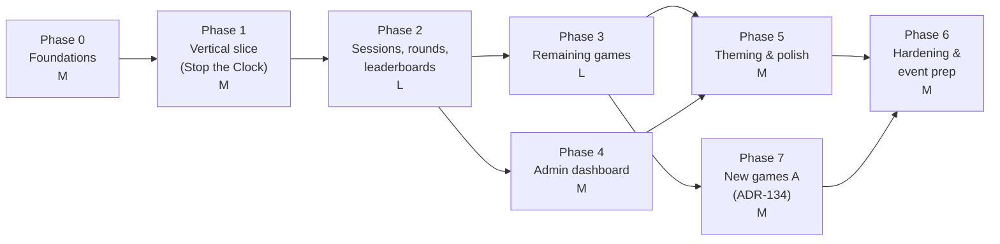

# Phases

Purpose: the build plan, phase by phase. Each phase has a goal, scope (in/out), tasks, **checkable acceptance criteria**, dependencies and a rough size (S ≈ 1–3 days, M ≈ 4–7 days, L ≈ 1–2 weeks for a small student team working part-time). A phase is done only when all its acceptance criteria pass; record that in `PROGRESS.md`. Changes to the brief's suggested order are recorded in ADR-118 and ADR-120.

Last updated: 2026-09-25

---

## Overview

Phases 3 and 4 can run in parallel once Phase 2 is done. Phase 7 (added 2026-09-25) grows the pool after Phase 3 and must pass before Phase 6's final deploy.

### Minimum shippable version (if time runs short)

**Phases 0, 1, 2 + exactly three games + the safety parts of Phase 4 + Phase 6.**
- Games to keep: **Stop the Clock** (already built in Phase 1), **Trivia**, **Odd One Out**.
- **Cut first: Perfect Circle** (hardest metric to make fair across screen sizes, most device tuning). **Cut second: Simon.**
- If the 30 trivia questions aren't written and reviewed by content freeze, swap **Trivia ↔ Simon** (Simon needs no content).
- Because a session is exactly 3 distinct games (ADR-012), the minimum is three working games; fewer isn't shippable without changing a locked decision.
- From Phase 4, the MVP needs **hide name**, **blocked words** and **CSV export**; session history and the combined-results view can be basic tables.
- From Phase 5, the MVP needs tokens, fonts, RTL correctness and projector readability; the full shatter choreography can fall back to the reduced-motion crossfades.
- Phase 6 is never cut (dry run is mandatory, ADR-032).

---

## Phase 0: Foundations · M

**Goal:** an empty but real app deployed to Netlify, talking to Supabase with the full schema and RLS in place, keepalive running.

**In:** repo, tooling, both Supabase projects, auth config, admin account, all migrations from `DATA_MODEL.md` (all tables, RLS, trigger with bounds, functions, views, realtime publication, seed), keepalive, i18n scaffold, design tokens, CI.
**Out:** any real screen beyond a placeholder per route.

Tasks:
1. GitHub repo (public, ADR-128); Vite + React + TypeScript (ADR-107); ESLint/Prettier; Vitest; `npm run build` → `dist`.
2. One cloud Supabase project for dev and prod (ADR-127); **keepalive workflow on day zero** (ADR-128).
3. Auth: anonymous sign-ins on, sign-ups on, confirm email on, anonymous rate limit 1,000/h, admin user + `app_metadata.role` (`DEPLOYMENT.md` §2).
4. Migrations `0001`–`0007` from `DATA_MODEL.md`; pgTAP suite from `TESTING.md` §3.
5. Netlify site on a dedicated account, env vars per context, `_redirects`, deploy previews on (`DEPLOYMENT.md` §3).
6. `src/` skeleton per `ARCHITECTURE.md` §8; three routes render placeholders.
7. i18n: `en.json`/`ar.json` with the `COPY.md` §3 keys, `t()` with `Intl.PluralRules`, `dir`/`lang` switching, `check:i18n` script.
8. `tokens.css` from `DESIGN_SYSTEM.md` §2–§6 (sampled logo colours), fonts loaded, `contrast` script.
9. CI: typecheck, unit tests, `check:i18n`, `check:trivia` (schema mode).

Acceptance criteria:
- [ ] AC0.1 `supabase test db --linked` passes on the cloud project: every RLS case in `TESTING.md` §3.
- [ ] AC0.2 `select … rowsecurity` shows RLS on for every `public` table.
- [ ] AC0.3 The keepalive workflow has ≥ 2 green scheduled runs, and `keepalive.pinged_at` updates on the cloud project.
- [ ] AC0.4 Production URL serves `/`, `/host`, `/dashboard` (no 404 on reload).
- [ ] AC0.5 `/host` sign-in with the admin account succeeds and a guest-style anonymous session can't call `admin_open_lobby` (`GD009`).
- [ ] AC0.6 Toggling language switches `dir` to `rtl` and loads Cairo; `check:i18n` passes.
- [ ] AC0.7 No secret key anywhere in the repo or Netlify (`git grep -nE "sb_secret_[A-Za-z0-9]"` empty).

Depends on: nothing (logo not needed yet).

## Phase 1: Vertical slice · M

**Goal:** prove the whole pipeline with one game: QR/URL → code + name → lobby with presence and remove → Start → Stop the Clock → score submission → session results.

**In:** P1–P4, P5–P7, P9 (basic), H0–H2, H4 (basic); Stop the Clock complete per its doc; `join_session`; presence; remove; `admin_start_session`, `admin_end_round` incl. **basic force-end** (ADR-118); `ROUNDS_PER_SESSION = 1` (ADR-120).
**Out:** multi-round, intermission, pending lobby UI, day boards, 120 s cap automation (force-end covers stuck rounds), shatter, dashboard.

Tasks:
1. Anonymous sign-in on name submit (not on load, ADR-007); `join_session` error mapping.
2. Lobby on phone and host; presence dots (ADR-103); remove + "Removed by host".
3. Host: open lobby, lineup picker (1 game), Start, End round.
4. Phone round shell: 3-2-1, local persistence (`SESSION_LIFECYCLE.md` §4.1), submit with retry/idempotency.
5. Stop the Clock game module + scoring unit tests (all STC-T cases).
6. Host round board (realtime scores), phone round board (polling), basic session results.

Acceptance criteria:
- [ ] AC1.1 Opening the URL creates no auth user and no rows (check `auth.users` count before/after).
- [ ] AC1.2 US-G1 AC1–AC5 pass on an iPhone and an Android.
- [ ] AC1.3 Presence dot greys within 10 s of airplane mode (US-H3).
- [ ] AC1.4 Removed player sees "Removed by host" within 2 s and can't rejoin with the same code.
- [ ] AC1.5 3 phones play Stop the Clock end to end; scores match a hand calculation from their guesses; big screen shows them within 1 s.
- [ ] AC1.6 Reloading mid-attempt resumes the same attempt (STC-T7); a second submit is treated as success, not duplicated.
- [ ] AC1.7 End round works with one phone never playing (no score row for it).
- [ ] AC1.8 All STC unit tests pass; the running screen shows no change for 20 s (STC-T8).

Depends on: Phase 0.

## Phase 2: Sessions, rounds and leaderboards · L

**Goal:** the full session lifecycle with 3 rounds and every board.

**In:** multi-round sequencing and the host loop (`SESSION_LIFECYCLE.md` §3.1), 120 s cap + host deadline, intermission after every round (ADR-117), pending lobby + corner code (ADR-108, ADR-015), session results with totals, Show day board, New session with preselected lineup, day boards (best per name), duplicate-name suffixes, reload/late-join/removed edge cases, hidden names on boards.
**Out:** other games (use Stop the Clock ×1 per session until Phase 3; the code supports N rounds), dashboard UI (hiding can be tested via SQL function calls), shatter choreography.
(As built, 2026-09-24: the other four game modules already existed, so Phase 2 was built and tested with real 3-round sessions of three different games, and the Phase 3 integration items (AC3.2–AC3.5) landed with it. Results per AC: `PROGRESS.md`.)

Tasks:
1. Host loop: all-finished detection, deadline from `server_now()` offset, auto intermission, "Next round now".
2. Rounds 1..N in `admin_start_session`; `admin_start_round`; results transition.
3. Pending session creation at Start; corner code on H2/H3/H5; P3b.
4. Boards: round, session total, day board views + polling (phones) / realtime (host) per ADR-112.
5. H4, H5, P8, P9, P10 screens; Show day board; New session.
6. Edge cases E1–E29 implemented; e2e tests E2E-1…E2E-8 (with the games available). As built: `e2e/phase2.spec.ts` (E2E-1, -3, -6, -7, -8), `e2e/phase1.spec.ts` (E2E-2 for Stop the Clock, -4, -5); the E# → test map is in `PROGRESS.md`.

Acceptance criteria:
- [ ] AC2.1 A session with `ROUNDS_PER_SESSION` rounds runs start to results with no host action other than Start (auto intermissions).
- [ ] AC2.2 A round with a dead phone ends at 128 s (host deadline) with `time_cap`; with force-end, `force_end`.
- [ ] AC2.3 A latecomer during play joins the pending session via the corner code and is in the lobby after New session (E2E-3).
- [ ] AC2.4 New session preselects the lineup shown in the picker.
- [ ] AC2.5 Day board shows one row per name key with the best score; ties by earliest (unit + e2e).
- [ ] AC2.6 Duplicate names get suffixes 2, 3 (E2E-8).
- [ ] AC2.7 Host tab closed mid-round and reopened: session continues correctly (E2E-6).
- [ ] AC2.8 Every edge case E1–E29 has a passing test or a documented manual check.
- [ ] AC2.9 `admin_hide_name` removes a name from the host board within 1 s and from phones within 3 s.

Depends on: Phase 1.

## Phase 3: Remaining games · L

**Goal:** Odd One Out, Simon, Perfect Circle and Trivia complete, each to its doc.

**In:** the four game modules and their scoring tests; trivia loader + draw; `check:trivia` strict mode; lineup picker with 5 games (Trivia greyed if < 5 ready); set `ROUNDS_PER_SESSION = 3` and tighten the lineup check constraint by migration once three games pass (ADR-120).
**Out:** final theming polish (basic tokens only), shatter.

Build order (so the MVP is reachable early): **Trivia → Odd One Out → Simon → Perfect Circle.**

Tasks per game: module + screen states (§6/§7 of its doc), scoring pure function + all test cases, raw payload matching the JSON Schema, server bounds tests, reload/timeout behaviour, accessibility items.

Acceptance criteria:
- [ ] AC3.1 Every worked example and test case in each game doc passes as a unit test.
- [ ] AC3.2 Every game finishes inside its documented worst-case time and handles "round ended" (E27).
- [ ] AC3.3 Server accepts each game's valid payloads and rejects each bound's failing payload with the right reason code.
- [ ] AC3.4 A full 3-round session with three different games runs on 3 phones.
- [ ] AC3.5 `ROUNDS_PER_SESSION = 3` merged; picker enforces 3 distinct games.
- [ ] AC3.6 Trivia draw tests TRV-T3–T5 pass; the pool has ≥ 5 ready questions (30 by Phase 6).
- [ ] AC3.7 Simon colour-blind test SIM-T7 and Odd One Out 44 px check OOO-T6 pass.

Depends on: Phase 2. Trivia content depends on OQ-03 (writers).

## Phase 4: Admin dashboard · M

**Goal:** the admin can see everything and fix anything without SQL.

**In:** D0–D6: today, session history + detail, combined results (sort, filters, best-per-name toggle), CSV export (UTF-8 BOM), hide/unhide, blocked words, event days.
**Out:** charts (not needed).

Acceptance criteria:
- [ ] AC4.1 Session history lists every session of the day with lineup, start, players, winner (US-A2).
- [ ] AC4.2 Combined results match a SQL count; best-per-name toggle equals `v_day_board` for the same day/game (US-A3).
- [ ] AC4.3 CSV opens in Excel and Google Sheets with Arabic names intact.
- [ ] AC4.4 Hide from the admin phone takes ≤ 10 s end to end, including typing (US-A1).
- [ ] AC4.5 A blocked word added live stops new joins with that word (US-A5).
- [ ] AC4.6 New event day: boards reset, the previous day stays in history, blocked while playing (US-A4).

Depends on: Phase 2.

## Phase 5: Theming and polish · M

**Goal:** it looks, moves and reads like our chapter, in both languages, on a projector and in bright light.

**In:** sampled logo colours (OQ-08) into tokens; full GDG theme on every screen; shatter variants (`DESIGN_SYSTEM.md` §6.2) incl. the ~15 s day-board merge; versus framing; per-game theming; RTL pass; projector scale; bright-light tuning (Odd One Out rotation); copy pass with native Arabic review (OQ-04); reduced motion everywhere.
**Out:** new features.

Acceptance criteria:
- [ ] AC5.1 Tokens use the sampled logo values (done in docs 2026-09-24; confirm against a vector logo if provided); `contrast` script passes the §2.4 rules.
- [ ] AC5.2 Every screen in `SCREENS.md` reviewed in AR and EN; no untranslated keys (E2E-9); names in `<bdi>`.
- [ ] AC5.3 Shatter at ≥ 45 fps on the low-end Android; reduced motion replaces it with crossfades.
- [ ] AC5.4 Projector check (`TESTING.md` §6) passes; big-screen theme decided and recorded.
- [ ] AC5.5 Bright-light check passes; OOO rotation value recorded.
- [ ] AC5.6 Chapter lead has reviewed the look (OQ-07) or given written feedback that's been applied.

Status (2026-09-24): shatter variants wired into every screen that `DESIGN_SYSTEM.md` §6.2 names (table "Where it's wired"), incl. the ~15 s day-board merge with the ADR-010 flow unchanged, the host's Reduce motion toggle and the logo z-order (`SHATTER_LOGO_CLASS` on every logo). Unit-tested: reduced-motion paths (OS and host toggle), ≤ 48 shards on the projector, no effect into a game screen, the merge timeline, the logo never hidden or animated. Still open: **AC5.3** needs the fps measurement on the low-end Android and a projector look (TESTING §6); AC5.1 waits on a vector logo (OQ-08); AC5.6 on brand approval (OQ-07); AC5.2/AC5.4/AC5.5 not started here.

Depends on: Phases 3 and 4; logo file in `/assets`.

## Phase 6: Hardening and event prep · M

**Goal:** confidence it survives the booth.

**In:** load tests L1–L5, device matrix, security review, bounds tuning, content freeze (30 reviewed questions, blocklist), final production deploy, dry run, runbook rehearsal.
**Out:** any feature work.

Acceptance criteria:
- [ ] AC6.1 Load tests L1–L4 pass; L3/L5 results recorded (ceiling noted in OQ-16 if any).
- [ ] AC6.2 Device matrix (`TESTING.md` §6) all green.
- [ ] AC6.3 Security checklist (`SECURITY.md` §5) all ticked.
- [ ] AC6.4 `check:trivia --strict` passes (30 ready, 2 reviewers each).
- [ ] AC6.5 Final production deploy tagged; Netlify ≥ 100 credits left; auto publishing locked.
- [ ] AC6.6 Dry run (`TESTING.md` §8) passed with ≥ 5 real phones the day before; sign-off in `PROGRESS.md`.
- [ ] AC6.7 Two team members have each run a full session from the runbook alone.

Depends on: Phase 5 (or the MVP subset). Must finish **before** the day before the event.

## Phase 7: New games, Phase A (ADR-134) · M

**Goal:** Close the Brackets and Color Clash complete, each to its doc (`games/close-brackets.md`, `games/color-clash.md`), under the same contract as the five originals, with no change to the existing games.

**In:** the two game modules (seeded content, screen states, reload resume, `onFinish` once, round-ended handling); pure scoring + worked examples; enum labels and server bounds by two additive migrations (`20260925000500`, `20260925000600`); pgTAP bound tests (`09_score_bounds_new_games.sql`); payload e2e and `worstCase.test.tsx` extended; AR/EN strings; P7 breakdown rows; the Color Clash colour-vision check in `npm run contrast`; docs.
**Out:** How Many?, Phase B (Swipe Sort, Pairs), Phase C (Steady Hand); the picker grid and scrollable leaderboard tabs from the brief (the existing picker and tabs are data-driven and list 7 games as they are).

Acceptance criteria:
- [ ] AC7.1 Every worked example and test case in both game docs passes as a unit test (CB-T1–T11, CC-T1–T10).
- [ ] AC7.2 Both games finish inside their 32 s worst case and on "round ended" (`worstCase.test.tsx`, 7 games).
- [ ] AC7.3 `supabase test db` passes locally, then `--linked` after `db push` (not on an event day, ADR-119): every new bound accepts its passing case and rejects its failing case with the reason code; the five existing games' bounds tests are unchanged and green.
- [ ] AC7.4 `e2e/payloads.spec.ts` accepts both games' own `buildRaw` payloads in a real session (`close_brackets, color_clash, odd_one_out`).
- [ ] AC7.5 Same seed → same bracket sequences (per length and index) and the same Stroop trials (exactly 3 congruent per 10); a reload mid-attempt resumes the same attempt without resetting any clock (CB-T11, CC-T10).
- [ ] AC7.6 `npm run contrast` passes, including ΔE ≥ 40 between the three Color Clash inks under deuteranopia and protanopia (CC-T11).
- [ ] AC7.7 On a real iPhone (Safari) and Android (Chrome): touch targets ≥ 48 px, no bidi-mirrored brackets in Arabic, rotation overlay and screen lock behave as for the other games (`TESTING.md` §6).
- [ ] AC7.8 Playtest with ≥ 5 strong players per game: median 780–900, nobody reaches 1000 (CB-T13, CC-T12); otherwise retune the constants and record it in ADR-134.
- [ ] AC7.9 The host picker lists 7 games and a 3-game lineup with either new game starts and completes; day boards and the dashboard (history, combined results, game filter) show the new games with no special-casing.
- [ ] AC7.10 Native Arabic review of the new strings, especially the colour names (OQ-04, `COPY.md` §5.7).

Depends on: Phase 3. Must pass before Phase 6's final production deploy (the migrations go to the event database, ADR-127).
