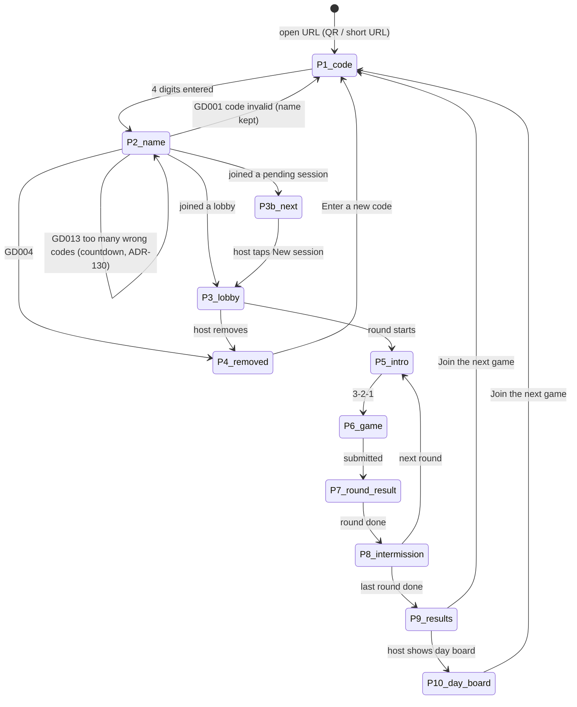
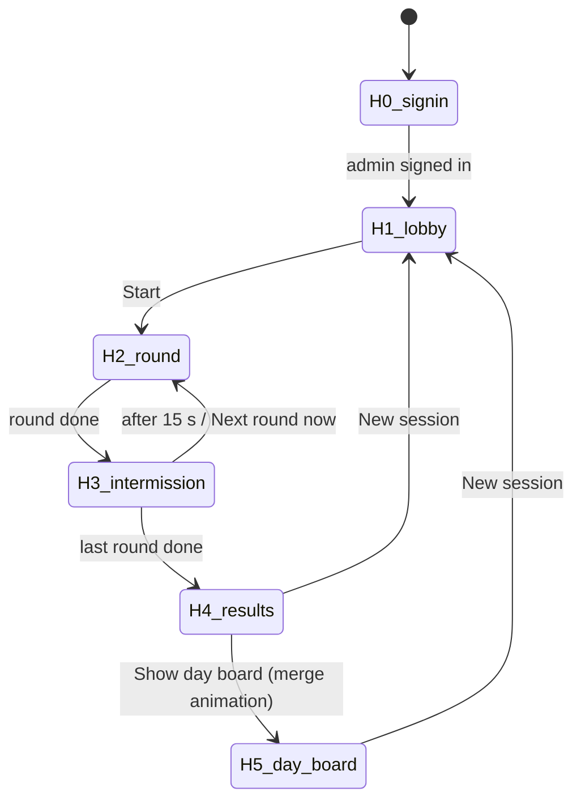
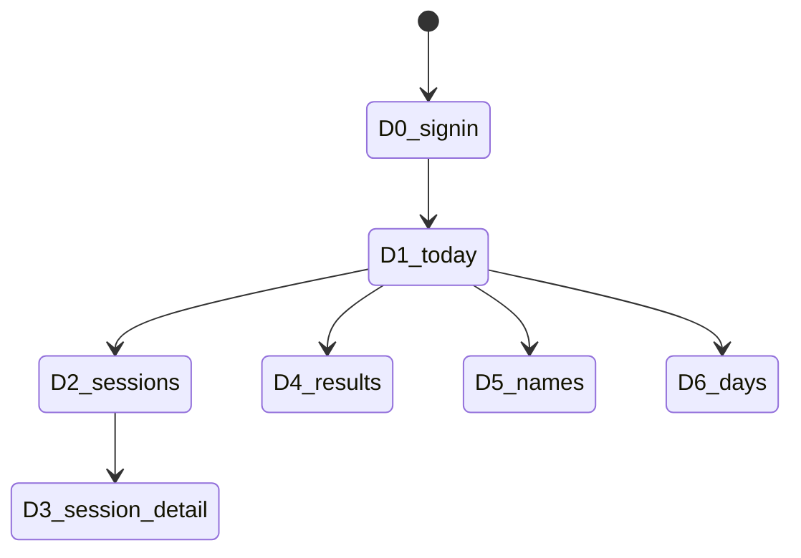

# Screens

Purpose: every screen of the player phone, the big screen (host view) and the admin dashboard: its states, what it shows, which strings it uses (keys from `COPY.md`), and how it transitions. Game-internal states are specified in each `docs/games/*.md` file and only referenced here. Visual tokens come from `DESIGN_SYSTEM.md`.

Last updated: 2026-09-24

Routes: `/` player · `/host` big screen · `/dashboard` admin (ADR-107). Sizes: phones portrait 320–430 px wide; big screen 16:9.

---

## 1. Player phone

### 1.1 Flow



A player who joined but missed a round (phone was away) goes from P5/P8 straight to P7 with the "missed" state.

Transitions (`DESIGN_SYSTEM.md` §6.2, phone density): the screen shatter plays on join → P3, P3 → P5, P7 → P8, P8 → P5, → P9, P9 → P10, → P4/P11 and "Join the next game" → P1. P5, P6 and P7 of one round are one screen for this purpose, so **nothing ever plays into or over a game**; a reload lands on its screen without an effect; P8's steps change without one. The top bar (logo) is outside the transition. Reduced motion: 200 ms crossfade.

### 1.2 Screens

**P0 Shell (every player screen).** Top bar: GDG logo (small, static, above the shatter layer: `SHATTER_LOGO_CLASS`), language toggle (hidden during rounds, E17). System banners from §4 overlay the top.
Strings: `app.name`, `common.lang_toggle`.

**P1 Enter code.**
```
┌──────────────────────────┐
│ [GDG logo]      العربية  │
│                          │
│  Enter the code on       │
│  the screen              │
│  ┌──┐┌──┐┌──┐┌──┐        │
│  │ 4││ 8││ 2││ 1│        │
│  └──┘└──┘└──┘└──┘        │
│  (numeric keypad)        │
│  [        Next         ] │
└──────────────────────────┘
```
States: `empty`, `typing`, `error_format` (fewer than 4 digits on Next), `error_invalid` (returned from P2 after GD001), `offline`.
Behaviour: `inputmode="numeric"`, accepts Arabic-Indic digits (normalised), auto-advances to P2 at 4 digits. Nothing is sent to the server here (ADR-007). A 4-digit value that can't be a code (leading 0, ADR-111) shows `error_invalid` without leaving P1; returning from P2 with GD001 clears the code (so auto-advance doesn't fire again) and keeps the name.
Strings: `join.code.title`, `join.code.placeholder`, `join.code.next`, `join.code.error_format`, `join.code.error_invalid`.

**P2 Enter name.**
```
┌──────────────────────────┐
│ ← Change code   (4821)   │
│  What should we call you?│
│  ┌────────────────────┐  │
│  │ Sara               │  │
│  └────────────────────┘  │
│  Up to 12 letters or     │
│  numbers          4 / 12 │
│  [     Let's play      ] │
└──────────────────────────┘
```
States: `empty`, `typing`, `submitting` (button spinner), `error_empty`, `error_invalid` (GD002), `error_blocked` (GD003), `error_rate` (auto-retry once after 5 s, E29), `error_network`, `error_warming` (E18), `wait` (GD013 after 5 wrong codes, ADR-130: `join.error_wait` counts down the server's `retry_after_s` once a second, Join is disabled, name and code stay; the deadline survives "Change code" and back; at 0 the message goes and Join works again).
Behaviour: name pre-filled from the last session on this phone; `maxlength` enforced as cleaned characters (≤ 12: a keystroke that would exceed it is ignored), with a live `n / 12` counter; empty/invalid names are caught on the phone (`SCORING.md` §6 mirror) before anything is sent; submit calls anonymous sign-in (if no session yet) then `join_session`.
Strings: `join.back`, `join.name.title`, `join.name.placeholder`, `join.name.hint`, `join.name.counter`, `join.name.submit`, `join.name.error_empty`, `join.name.error_invalid`, `join.name.error_blocked`, `join.error_rate`, `join.error_network`, `join.error_warming`, `join.error_wait`.

**P3 Lobby (joined, waiting).**
```
┌──────────────────────────┐
│      You're in!          │
│   Playing as Sara 2      │
│   Your 3 games:          │
│   ① Stop the Clock       │
│   ② Odd One Out          │
│   ③ Trivia               │
│   14 players             │
│   Waiting for the host   │
│   to start …             │
└──────────────────────────┘
```
States: `waiting`, `lineup_changed` (list animates when the host edits the lineup).
Strings: `lobby.in`, `lobby.you_are`, `lobby.lineup`, `lobby.players_count`, `lobby.waiting`, `game.*.name`.

Behaviour: the player count is polled every 3 s (phones don't subscribe to other players, ADR-112); the lineup follows the `sessions` row (realtime).

**P3b Pending lobby ("next round").** Same layout as P3 with the headline and sub-line replaced; reached by typing the corner code while a session runs (E6). The lineup follows the pending session row, so edits from the host's next-games picker show at once. When the host taps New session the pending session becomes the lobby and the phone switches to P3 (realtime `sessions` UPDATE); the player row is carried over.
Strings: `lobby.next_round`, `lobby.next_round_sub`, `lobby.you_are`, `lobby.lineup`, `game.*.name`.

**P4 Removed.** Headline, body, one button.
Strings: `removed.title`, `removed.body`, `removed.cta`.

**P5 Round intro.** Versus frame: blue `<` and amber `>` slide in around the game name; pitch line; "Round n of N"; then 3-2-1 and "Go!".
Strings: `round.label`, `game.<id>.name`, `game.<id>.pitch`, `round.get_ready`, `round.go`.

**P6 Game.** One of the five games; states and strings in `docs/games/<game>.md` §6 or §7 and `COPY.md` §5.

**P7 Round result (own score + live board).**
```
┌──────────────────────────┐
│  Your score              │
│        750               │
│  (game detail line)      │
│ ─────────────────────────│
│  Round leaderboard       │
│  1  Omar         938     │
│  2  Lina         812     │
│  3  Sara 2       750  ◀  │
│  …                       │
│  Waiting for others…     │
│  9/14 done               │
└──────────────────────────┘
```
States: `saving` (pending submit), `saved`, `save_failed` (E14), `missed` (no score for this round), `new_best` (celebrate shatter when this beats the player's day-board best for that game).
Board: polled every 3 s (ADR-112); top 10 plus the player's own row if lower; names in `<bdi>`. Game detail line for Stop the Clock: the three `game.stop_the_clock.result_row` rows (`game.stop_the_clock.missed` for a missed start), closest guess amber-ringed. "x/y done" counts joined players with `progress = finished` for the round (polled). The language toggle stays hidden while the round is playing. `new_best`: once saved, the phone reads its name key's best earlier score today in this game (`scores`, excluding this round); a strictly higher score shows `results.new_best` (a first play is not a "new best"), which plays the celebrate shatter as it appears (static amber ring with reduced motion; `RevealIn variant="celebrate"`).
Strings: `round.your_score`, `round.board_title`, `round.waiting_others`, `round.missed`, `round.no_scores`, `sys.saving`, `sys.save_failed`, `results.new_best`, plus the game's result line key.

**P8 Intermission.** Mirrors the big screen: round board (7 s) → total so far (5 s) → "Next: <game>" (versus frame, pitch, "Get ready…"), held until the next round starts; the 3-2-1 is P5's. Steps run from the local time the phone saw the round end (ADR-104, ADR-129). The player's own row is highlighted in both boards (polled every 3 s while shown). Shown to every member between rounds, including one that missed the round. The language toggle is visible.
States: `round_board`, `session_total`, `next_intro`.
Strings: `intermission.round_board`, `intermission.session_total`, `intermission.next`, `round.label`, `round.get_ready`, `round.no_scores`, `results.no_scores`, `game.<id>.name`, `game.<id>.pitch`.

**P9 Session results.**
```
┌──────────────────────────┐
│  Final results           │
│  Your total    2 140     │
│  You placed #3 of 14     │
│  Stop the Clock    750   │
│  Odd One Out       684   │
│  Trivia            706   │
│ ─────────────────────────│
│  1  Omar        2 604    │
│  2  Lina        2 331    │
│  3  Sara 2      2 140 ◀  │
│  [ Join the next game  ] │
└──────────────────────────┘
```
States: `normal`, `no_scores` (session had no scores), `not_scored` (this player has no scores: shows the board and the button only).
"Your total" and the breakdown come from the phone's own score rows (so a hidden player still sees them, ADR-115); the rank comes from the session board (absent when hidden). Breakdown rows follow the round order; a missing round shows `results.breakdown_missing` ("–").
Strings: `results.title`, `results.your_total`, `results.rank`, `results.breakdown_missing`, `results.no_scores`, `results.join_next`, `game.*.name`.

**P10 Day board.** Shown after the host taps Show day board (phones follow `sessions.day_board_shown_at`): tabs for the session's 3 games, top 10 each + own row (matched by name key, without suffix); the player's best today is highlighted. Boards poll every 10 s; hidden names are polled every 3 s and dropped at once (AC2.9). "Join the next game" stays at the bottom. A session closed by New session keeps showing it.
Strings: `dayboard.title`, `dayboard.empty`, `game.*.name`, `results.join_next`.

**P11 Session ended elsewhere.** If the session was closed by a new event day (E25): a `closed` session that never reached results, or whose event day is no longer current. Message + button.
Strings: `results.session_ended`, `results.join_next`.

## 2. Big screen (host view, projected)

Everything on this screen uses the projector scale (`DESIGN_SYSTEM.md` §3.2). Host controls are small, grouped in the inline-end bottom corner, and labelled.

### 2.1 Flow



Transitions (`DESIGN_SYSTEM.md` §6.2, projector density): the screen shatter plays on every arrow above except H0 → H1 and H4 → H5 (the ~15 s day-board merge), and on each H3 step. A reload lands on its screen without an effect. With reduced motion (OS or the host's toggle) they are 200 ms crossfades, and H1/H4/H5 (the screens with the logo) swap instantly.

### 2.2 Screens

**H0 Sign-in.** Email, password, submit; errors. Not projected in normal use (sign in before plugging in the projector).
Strings: `host.signin.title`, `host.signin.email`, `host.signin.password`, `host.signin.submit`, `host.signin.error`, `host.signin.not_admin`.

**H1 Lobby.**
```
┌────────────────────────────────────────────────────────────────────┐
│ [GDG logo]                                         14 players      │
│                                                                    │
│   ┌──────────┐      Game code            Omar ●   Lina ●   Sara ●  │
│   │  QR      │      4 8 2 1              Sara 2 ● Adam ○   …       │
│   │          │                           (each with [×] remove)    │
│   └──────────┘      Scan to play · امسح لتلعب                      │
│   gdg-booth.example  or visit … · أو زُر …                          │
│                                                                    │
│  Games: ① Stop the Clock ② Odd One Out ③ Trivia  [edit]   [ Start ] │
└────────────────────────────────────────────────────────────────────┘
```
- The join instructions (`host.lobby.scan`, `host.lobby.or_visit`, `host.lobby.code_label`) are shown **in both languages at once**, since the audience is mixed; everything else follows the host's screen language.
- Players appear with a shatter-in; presence dot `●` blue when connected, `○` grey after 10 s without presence (ADR-103).
- Remove `[×]` → confirm → `admin_remove_player`.
- Lineup picker: one card per **registered** game (`src/games/registry.ts`), tap to add in order (① ② ③), tap again to remove, at most `ROUNDS_PER_SESSION`; Trivia greyed if fewer than 5 ready questions. A valid pick is saved at once with `admin_set_lineup` (phones' P3 follows); the lobby itself comes from `admin_open_lobby` with the default lineup (first `ROUNDS_PER_SESSION` registered games).
- Host controls (inline-end bottom corner, every host screen): the screen action (Start / End round / New session), Reduce motion (H6), the language toggle and Sign out (the rest of H6 comes later).
- Start disabled until ≥ 1 player and a valid lineup.
States: `empty`, `players`, `lineup_invalid`, `starting`.
Strings: `host.lobby.scan`, `host.lobby.or_visit`, `host.lobby.code_label`, `host.lobby.players`, `host.lobby.empty`, `host.lobby.remove`, `host.lobby.remove_confirm`, `host.lineup.title`, `host.lineup.need`, `common.lang_toggle`, `host.signout`, `game.trivia.unavailable`, `host.start`, `host.start_disabled_hint`, `game.*.name`, `common.cancel`, `common.confirm`.

**H2 Round live.**
```
┌────────────────────────────────────────────────────────────────────┐
│ Round 1 of 3 · Stop the Clock                      1:42 left       │
│                                                     9/14 finished  │
│   1  Omar            938                                           │
│   2  Lina            812                                           │
│   3  Sara 2          750                                           │
│   …  (top 10)                                                      │
│                                                                    │
│ ┌──────────────────┐                     [next games ▾] [End round] │
│ │Next game: 5307   │  Late? Join the next round                    │
│ └──────────────────┘                                               │
└────────────────────────────────────────────────────────────────────┘
```
- Board updates live (host subscribes to scores). New #1 → celebrate shatter on that row.
- "next games ▾" opens the lineup picker for the **pending** session (ADR-009).
- End round → confirm → `admin_end_round(force_end)`.
- The host loop (`SESSION_LIFECYCLE.md` §3.1) ends the round by itself with `all_finished` when score rows ≥ joined players, or `time_cap` at the 128 s deadline (server time via one `server_now()` offset). "x/y finished" = score rows / joined players. Time left counts down the phones' 3 s + 120 s.
- Corner code (inline-start bottom, H2–H5): `host.corner.next_code` with the pending session's code in large digits + `host.corner.late`. "next games ▾" (`host.lineup.next_title`) opens the same game cards as H1 for the pending session, with `common.done` to close it.
- Stop the Clock rounds show scores only; guesses stay hidden until the intermission reveal.
States: `live`, `no_scores_yet`, `ending`.
Strings: `round.label`, `game.<id>.name`, `round.time_left`, `host.round.finished`, `round.board_title`, `host.corner.next_code`, `host.corner.late`, `host.lineup.next_title`, `host.round.force_end`, `host.round.force_end_confirm`, `round.no_scores`.

**H3 Intermission** (after every round; requested in chat 2026-09-24, ADR-117).
1. Round board, 7 s: "Round n results", top 10 with a shatter-in; #1 in amber. For Stop the Clock this step is the **guess reveal** (three strips, `games/stop-the-clock.md` §6).
2. Total so far, 5 s: running session totals (top 10), rank changes animated.
3. "Next: <game>", 3 s: versus frame + 3-2-1.
Control: "Next round now" skips to step 3 (from the tap). Corner code and the next-games picker stay visible.
After the **last** round only step 1 runs (7 s, no skip), then H4 (ADR-129). The steps are anchored on the round's `ended_at` in server time, so a reload lands on the same step; a host that reopens after the 15 s shows 3 s of step 3 before starting the round.
Stop the Clock reveal: three strips (5 s, 10 s, 7 s targets, labelled with `game.stop_the_clock.target`), the time axis never mirrored in Arabic; one dot per player per measured guess at `50 % + 50 % × (guess − target) / 5 s`, dots beyond ±5 s pinned to the edge (outlined); the top 5 of the round board are labelled with their display names. Dots burst in strip by strip within 5 s (`DESIGN_SYSTEM.md` §6.2; 200 ms fade-ins with reduced motion).
States: `round_board`, `stc_reveal`, `session_total`, `next_intro`.
Strings: `intermission.round_board`, `intermission.session_total`, `intermission.next`, `intermission.skip`, `round.label`, `game.stc.reveal_title`, `game.stc.reveal_axis`, `game.stop_the_clock.target`, `game.<id>.name`, `round.no_scores`, `results.no_scores`, `host.corner.next_code`, `host.corner.late`, `host.lineup.next_title`.

**H4 Session results.** Winner card (versus frame, amber), then the full session board (top 10 by total, SCORING §5 order) as a table: rank, name (with suffix), one column per round in round order (game name as header; "–" for a missing round), total. Late scores (E22) and hidden names re-query it. Stays until the host acts. Corner code + next-games picker stay (ADR-129).
Controls: `Show day board`, `New session`.
States: `results`, `no_scores`.
Strings: `results.title`, `host.results.winner`, `results.no_scores`, `results.breakdown_missing`, `host.results.total`, `host.results.show_day_board`, `host.new_session`, `game.*.name`.

**H5 Day boards.** After the ~15 s merge (`DESIGN_SYSTEM.md` §6.2, `src/host/Results.tsx`; H4 and H5 are one screen): 0–1.5 s the session board fragments; then each game's tab in turn for 4 s while shards stream into its highlighted rows; 13.5 s back to the first tab; from 15 s the normal rotation. Reduced motion: a crossfade straight to the first tab. A reload onto H5 skips the merge; New session mid-merge is allowed (E21). Then: one tab per game in the session's lineup, auto-rotating every 8 s (tabs also tappable); each shows the top 10 best-per-name for today (names without suffix). Rows whose best came from this session are highlighted (dashed outline) for the first rotation. Re-queried on every score of the day (`day:<event_day_id>` channel) and on hidden-name changes. The next code sits in the corner (it is now the lobby-to-be).
Controls: `New session`.
Strings: `dayboard.title`, `dayboard.empty`, `game.*.name`, `host.new_session`, `host.corner.next_code`, `host.corner.late`, `host.lineup.next_title`, `common.done`.

**H6 Host overlays.** Settings (gear): screen language, dark screen, reduce motion, sign out. Built so far as corner controls: language, **Reduce motion** (`aria-pressed`; remembered on the laptop; every shatter falls back to crossfades/static and `data-motion="reduced"` zeroes the CSS durations) and Sign out. Banners: reconnecting, database unreachable.
Strings: `host.settings.language`, `host.settings.theme`, `host.settings.reduced_motion`, `host.signout`, `host.banner.reconnecting`, `host.banner.db_down`.

## 3. Admin dashboard (`/dashboard`, never projected)

Phone-first layout (the admin often uses it on their phone), works on the laptop too. Same sign-in as H0.



**D1 Today.** Current event day label; running session (code, status, lineup, players) or "No session running"; stat tiles (players, sessions, scores today); quick "Hide a name" field.
Strings: `dash.title`, `dash.nav.*`, `dash.today.running`, `dash.today.none`, `dash.stat.players`, `dash.stat.sessions`, `dash.stat.scores`, `dash.names.hide_title`, `status.*`.

**D2 Session history.** Table for the selected day: start time, code, lineup, players, winner, status. Tap a row → D3.
Strings: `dash.sessions.col.start`, `dash.sessions.col.code`, `dash.sessions.col.games`, `dash.sessions.col.players`, `dash.sessions.col.top`, `dash.sessions.col.status`, `dash.results.filter_day`, `status.*`.

**D3 Session detail.** Players (with removed flag) and each one's three round scores and total; per-round end reason.
Strings: `dash.session.detail_title`, `dash.session.removed`, `dash.session.end_reason.*`, `dash.results.col.*`, `game.*.name`.

**D4 Combined results.** Every score of the selected day(s): name, game, score, time, session. Sortable columns; filters: day (default current, or all), game (all/one); toggle **Best per name** (one row per name key per game). Export CSV of exactly what is shown (client-side, UTF-8 with BOM so Excel shows Arabic correctly).
```
┌──────────────────────────────┐
│ All results        [Export]  │
│ Day [Day 2 ▾] Game [All ▾]   │
│ [✓] Best per name            │
│ Name ▲   Game      Score Time │
│ Omar     Simon      801 14:02│
│ Lina     Trivia     835 14:10│
└──────────────────────────────┘
```
Strings: `dash.results.best_toggle`, `dash.results.filter_day`, `dash.results.filter_game`, `dash.results.all`, `dash.results.col.name`, `dash.results.col.game`, `dash.results.col.score`, `dash.results.col.time`, `dash.results.col.session`, `dash.export`, `game.*.name`.

**D5 Names.** Hide a name (type it; preview of matching name keys with their boards; confirm) → `admin_hide_name`; list of hidden names with Unhide; blocked words list with add (word / anywhere) and remove.
Strings: `dash.names.hide_title`, `dash.names.hide_input`, `dash.names.hide_btn`, `dash.hide_confirm`, `dash.names.hidden_list`, `dash.names.unhide`, `dash.names.blocked_title`, `dash.names.blocked_add`, `dash.names.match_word`, `dash.names.match_substring`, `dash.names.remove`.

**D6 Event days.** List of days (label, start, end, sessions count); "Start new event day" with a label field and confirm; disabled while a session is playing.
Strings: `dash.days.current`, `dash.days.start_new`, `dash.days.label`, `dash.days.confirm`, `dash.days.blocked_running`.

## 4. System states (all surfaces)

| State | Where | Shows | Strings |
|---|---|---|---|
| Offline | phone, host | Banner; retries automatically | `sys.offline`, `sys.reconnected`, `host.banner.reconnecting` |
| Other tab | phone | Full screen, nothing else runs (ADR-121); a reload retries the lock briefly so it doesn't race the page it replaces | `sys.other_tab` |
| Landscape during a round | phone | Overlay; timers keep running | `sys.rotate` |
| Score saving / failed | phone | Inline on P7 | `sys.saving`, `sys.save_failed` |
| Unknown error | all | Inline message + retry | `sys.generic_error`, `sys.try_again` |
| Database unreachable | host | Red banner with runbook pointer | `host.banner.db_down` |
