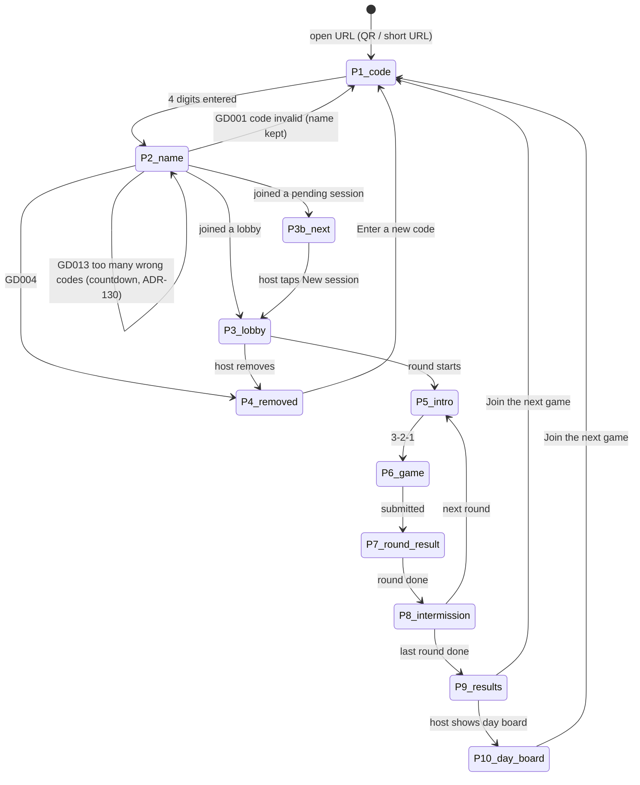
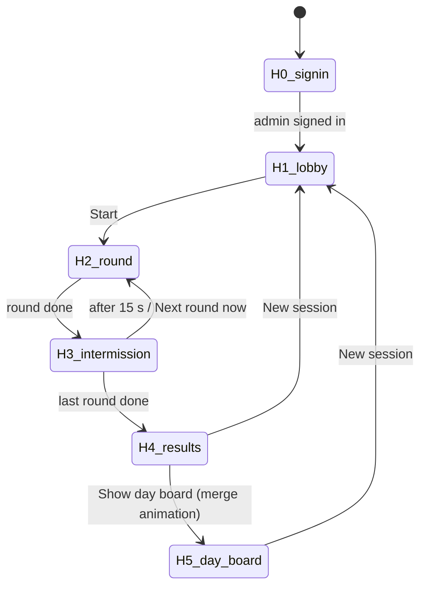
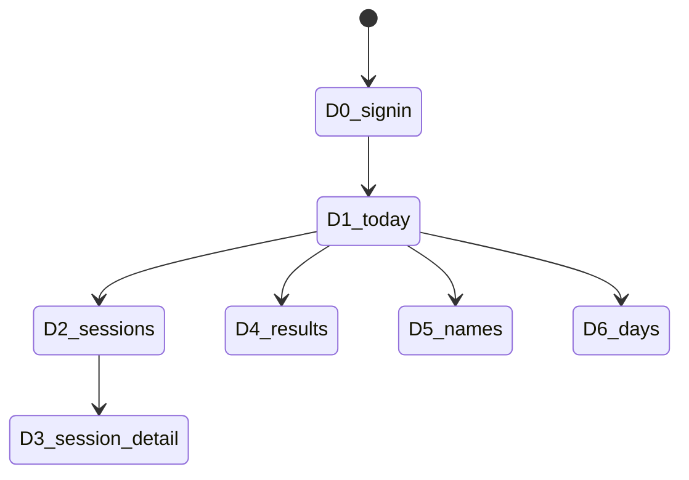

# Screens

Purpose: every screen of the player phone, the big screen (host view) and the admin dashboard: its states, what it shows, which strings it uses (keys from `COPY.md`), and how it transitions. Game-internal states are specified in each `docs/games/*.md` file and only referenced here. Visual tokens come from `DESIGN_SYSTEM.md`.

Last updated: 2026-09-25

Routes: `/` player · `/host` big screen · `/dashboard` admin (ADR-107). Sizes: phones portrait 320–430 px wide; big screen 16:9.

---

## 1. Player phone

### 1.1 Flow



A player who joined but missed a round (phone was away) goes from P5/P8 straight to P7 with the "missed" state.

Transitions (`DESIGN_SYSTEM.md` §6.2, phone density): the screen shatter plays on join → P3, P3 → P5, P7 → P8, P8 → P5, → P9, P9 → P10, → P4/P11 and "Join the next game" → P1. P5, P6 and P7 of one round are one screen for this purpose, so **nothing ever plays into or over a game**; a reload lands on its screen without an effect; P8's steps change without one. The top bar (logo) is outside the transition. Reduced motion: 200 ms crossfade.

### 1.2 Screens

Layout (v2 "quiet scoreboard", `DESIGN_SYSTEM.md` §0.3, ADR-131): one column inside the 16 px gutter; **every screen starts with an eyebrow + title** (the one `h1`); flat white panels with a 1 px line and `--r-panel`; label · value lists for breakdowns; one hero per screen (the code cells, the countdown, the own score or total) at 700 weight, framed by thin facing chevrons where it is a score; full-width buttons at `--button-height` / `--r-control`, sticky at the bottom where the screen scrolls. No pills, no numbered circles. Components: `src/player/chrome.tsx` (header, chevron frame, detail list); every data screen is a thin polling container around a pure `…View` (dev fixtures in `src/dev/fixtures/player.tsx`, rendered at `/__preview`).

**P0 Shell (every player screen).** Top bar (56 px, bottom line): GDG logo inline-start (small, static, above the shatter layer: `SHATTER_LOGO_CLASS`), language toggle inline-end as a text button (hidden during rounds, E17). The system banner from §4 sits directly **under** the top bar (sticky), so the logo never moves.
Strings: `app.name`, `common.lang_toggle`.

**P1 Enter code.**
```
┌──────────────────────────┐
│ [GDG logo]      العربية  │
│ STEP 1 OF 2              │
│ Enter the code on the    │
│ big screen               │
│ ┌────┐┌────┐┌────┐┌────┐ │
│ │ 4  ││ 8  ││ |  ││    │ │
│ └────┘└────┘└────┘└────┘ │
│ 4-digit code             │
│                          │
│ [         Next         ] │
└──────────────────────────┘
```
Four digit cells (56 px tall, tabular, never mirrored) drawn over **one real input** that covers them (transparent text and caret): any tap on the cells lands on the input, which keeps the numeric keypad, paste, one-time-code autofill and Arabic-Indic normalisation. The active cell (next digit) gets the blue ring and a caret while focused; filled cells get an ink border; on an error every cell does, and the error text replaces the helper line.
States: `empty`, `typing`, `error_format` (fewer than 4 digits on Next), `error_invalid` (returned from P2 after GD001), `offline`.
Behaviour: `inputmode="numeric"`, accepts Arabic-Indic digits (normalised), auto-advances to P2 at 4 digits. Nothing is sent to the server here (ADR-007). A 4-digit value that can't be a code (leading 0, ADR-111) shows `error_invalid` without leaving P1; returning from P2 with GD001 clears the code (so auto-advance doesn't fire again) and keeps the name.
Strings: `join.code.eyebrow`, `join.code.title`, `join.code.placeholder` (placeholder + helper line), `join.code.next`, `join.code.error_format`, `join.code.error_invalid`.

**P2 Enter name.**
```
┌──────────────────────────┐
│ ‹ Change code  CODE 4821 │
│ STEP 2 OF 2              │
│ What should we call you? │
│ Name                     │
│ ┌──────────────────────┐ │
│ │ Sara                 │ │
│ └──────────────────────┘ │
│ Up to 12 letters…  4 / 12│
│ ▌ error / wait text      │
│ [       Let's play     ] │
└──────────────────────────┘
```
States: `empty`, `typing`, `submitting` (button busy), `error_empty`, `error_invalid` (GD002), `error_blocked` (GD003), `error_rate` (auto-retry once after 5 s, E29), `error_network`, `error_warming` (E18), `wait` (GD013 after 5 wrong codes, ADR-130: `join.error_wait` counts down the server's `retry_after_s` once a second, Join is disabled, name and code stay; the deadline survives "Change code" and back; at 0 the message goes and Join works again). Errors are text in a message block under the field, never colour alone.
Behaviour: name pre-filled from the last session on this phone; `maxlength` enforced as cleaned characters (≤ 12: a keystroke that would exceed it is ignored), with a live `n / 12` counter; empty/invalid names are caught on the phone (`SCORING.md` §6 mirror) before anything is sent; submit calls anonymous sign-in (if no session yet) then `join_session`.
Strings: `join.back`, `join.name.code_label`, `join.name.eyebrow`, `join.name.title`, `join.name.label`, `join.name.placeholder`, `join.name.hint`, `join.name.counter`, `join.name.submit`, `join.name.error_empty`, `join.name.error_invalid`, `join.name.error_blocked`, `join.error_rate`, `join.error_network`, `join.error_warming`, `join.error_wait`.

**P3 Lobby (joined, waiting).**
```
┌──────────────────────────┐
│ GAME 4821                │
│ You're in!               │
│ ┌──────────────────────┐ │
│ │ PLAYING AS  [Sara 2] │ │
│ ├──────────────────────┤ │
│ │ YOUR GAMES           │ │
│ │ 1  Stop the Clock    │ │
│ │ 2  Odd One Out       │ │
│ │ 3  Trivia            │ │
│ └──────────────────────┘ │
│ 14 players               │
│ ● Waiting for the host…  │
└──────────────────────────┘
```
The lineup is a numbered list with small tabular ordinals and row lines; the name is a tag (`<bdi>`); the count shows its number large (the element's text stays the plural string, e.g. "14 players"); the blue dot marks "live".
States: `waiting`, `lineup_changed` (the list follows the host's edits).
Strings: `lobby.code`, `lobby.in`, `lobby.playing_as`, `lobby.lineup`, `lobby.players_count`, `lobby.waiting`, `game.*.name`.

Behaviour: the player count is polled every 3 s (phones don't subscribe to other players, ADR-112); the lineup follows the `sessions` row (realtime).

**P3b Pending lobby ("next round").** Same layout as P3 with the title replaced and a lead line under it (no waiting line); the eyebrow shows the pending session's code. Reached by typing the corner code while a session runs (E6). The lineup follows the pending session row, so edits from the host's next-games picker show at once. When the host taps New session the pending session becomes the lobby and the phone switches to P3 (realtime `sessions` UPDATE); the player row is carried over.
Strings: `lobby.code`, `lobby.next_round`, `lobby.next_round_sub`, `lobby.playing_as`, `lobby.lineup`, `lobby.players_count`, `game.*.name`.

**P4 Removed.** Eyebrow, title, body; the button sits at the bottom.
Strings: `app.name`, `removed.title`, `removed.body`, `removed.cta`.

**P5 Round intro.** Centred: "Round n of N" eyebrow; the game name between thin facing chevrons (blue `<` from the inline-start, amber `>` from the inline-end, sliding in); pitch line; the 3-2-1 number large in ink with "Get ready…" under it; then "Go" shows briefly at the top of the game.
Strings: `round.label`, `game.<id>.name`, `game.<id>.pitch`, `round.get_ready`, `round.go`.

**P6 Game.** One of the seven games (the five originals, Close the Brackets and Color Clash, ADR-134); states and strings in `docs/games/<game>.md` §6 or §7 and `COPY.md` §5. Shared v2 chrome only: each game's intro card is eyebrow (`game.<id>.intro`) + title + pitch, progress labels ("Try n of 3", "Grid n of 3", "Length n", "n / 5", "Closed n", "Correct n") are small muted labels, titles use medium weight, chips are small-radius tags; every game spec (sizes, timings, colours, pad shapes, touch targets) is unchanged.

P6 for the ADR-134 games (full states in their docs §6): both put a countdown bar + seconds at the top (as Trivia), small muted progress labels under it, the stimulus in the middle and the answer buttons at the bottom for thumbs; the button rows keep their order in Arabic (`direction: ltr`).
```
Close the Brackets            Color Clash
┌──────────────────────────┐  ┌──────────────────────────┐
│ ▬▬▬▬▬▬▬▬▬▬▬▬▬▬░░░░░   18 │  │ ▬▬▬▬▬▬▬▬▬▬▬▬▬▬▬░░░░   21 │
│ Length 6        Closed 4 │  │ Correct 10               │
│                          │  │                          │
│   <  [  {  <  {  (       │  │        CHARCOAL          │ ← word in blue ink
│            [ ]  }  )     │  │                          │
│   (amber closers; the    │  │                          │
│    next slot outlined)   │  │ ┌──────┐┌──────┐┌──────┐ │
│ ┌────┐┌────┐┌────┐┌────┐ │  │ │ ■    ││ ■    ││ ■    │ │
│ │ )  ││ ]  ││ }  ││ >  │ │  │ │ Blue ││Amber ││Charc.│ │
│ └────┘└────┘└────┘└────┘ │  │ └──────┘└──────┘└──────┘ │
└──────────────────────────┘  └──────────────────────────┘
```
Strings: Close the Brackets `game.close_brackets.intro`, `.length`, `.solved`, `.wrong`, `.timeout`, `.times_up`, `.key.round|square|curly|angle` (button labels for screen readers); Color Clash `game.color_clash.intro`, `.correct`, `.too_slow`, `.times_up`, `.word.blue|amber|charcoal`, `.ink.blue|amber|charcoal`.

**P7 Round result (own score + live board).**
```
┌──────────────────────────┐
│ ROUND 1 OF 3 · STOP THE… │
│        Your score        │
│      〈   750   〉        │
│   [New personal best]    │
│ ┌──────────────────────┐ │
│ │5 seconds      5.23 s │ │ ← closest: amber tint + rule
│ │10 seconds     9.61 s │ │
│ │7 seconds  Missed the…│ │
│ └──────────────────────┘ │
│ ROUND LEADERBOARD        │
│  1  Omar            938  │
│  3  Sara 2          750  │ ← own row
│ ● Waiting for others…    │
│   9/14 done              │
└──────────────────────────┘
```
States: `saving` (pending submit), `saved`, `save_failed` (E14), `missed` (no score for this round: the title says so, a lead line points to the board), `new_best` (celebrate shatter when this beats the player's day-board best for that game).
Board: polled every 3 s (ADR-112); top 10 plus the player's own row if lower; names in `<bdi>`. The breakdown is a label · value list per game (read from the submitted `raw`, never recomputed): Stop the Clock target · guess (`game.stop_the_clock.missed` for a missed start), closest guess amber; Odd One Out grid · time (+ penalty note, "Time's up" for a timed-out grid); Simon length reached · speed bonus; Perfect Circle roundness · closed (or "No circle in time"); Trivia correct answers; Close the Brackets sequences closed · longest · misses; Color Clash correct · wrong or missed · average time (no average without a correct tap). "x/y done" counts joined players with `progress = finished` for the round (polled). The language toggle stays hidden while the round is playing. `new_best`: once saved, the phone reads its name key's best earlier score today in this game (`scores`, excluding this round); a strictly higher score shows `results.new_best` as an amber-tinted tag (a first play is not a "new best"), which plays the celebrate shatter as it appears (static amber ring with reduced motion; `RevealIn variant="celebrate"`).
Strings: `round.label`, `game.<id>.name`, `round.your_score`, `round.board_title`, `round.waiting_others`, `round.missed`, `round.missed_sub`, `round.no_scores`, `sys.saving`, `sys.save_failed`, `results.new_best`; breakdown: `game.stop_the_clock.target`, `game.stop_the_clock.guess`, `game.stop_the_clock.missed`, `game.odd_one_out.result_label`, `game.odd_one_out.result_value`, `game.odd_one_out.result_timeout`, `game.odd_one_out.penalty_note`, `game.simon.result_length`, `game.simon.result_bonus`, `game.perfect_circle.result_roundness`, `game.perfect_circle.result_closure`, `game.perfect_circle.result_pct`, `game.perfect_circle.result_timeout`, `game.trivia.result_label`, `game.trivia.result_value`, `game.close_brackets.result_solved`, `game.close_brackets.result_longest`, `game.close_brackets.result_misses`, `game.color_clash.result_correct`, `game.color_clash.result_wrong`, `game.color_clash.result_speed`, `game.color_clash.result_speed_value`.

**P8 Intermission.** Mirrors the big screen: round board (7 s: eyebrow game name, title "Round n results") → total so far (5 s: eyebrow "Round n of N") → "Next: <game>" (centred like P5: eyebrow, chevron-framed title, pitch, "Get ready…"), held until the next round starts; the 3-2-1 is P5's. Steps run from the local time the phone saw the round end (ADR-104, ADR-129). The player's own row is highlighted in both boards (polled every 3 s while shown). Shown to every member between rounds, including one that missed the round. The language toggle is visible.
States: `round_board`, `session_total`, `next_intro`.
Strings: `intermission.round_board`, `intermission.session_total`, `intermission.next`, `round.label`, `round.get_ready`, `round.no_scores`, `results.no_scores`, `game.<id>.name`, `game.<id>.pitch`.

**P9 Session results.**
```
┌──────────────────────────┐
│     SESSION COMPLETE     │
│      Final results       │
│        YOUR TOTAL        │
│     〈  2,140  〉        │
│   You placed #3 of 14    │
│ ┌──────────────────────┐ │
│ │Stop the Clock    750 │ │
│ │Odd One Out       684 │ │
│ │Trivia            706 │ │
│ └──────────────────────┘ │
│ SESSION LEADERBOARD      │
│  1  Omar          2,604  │
│  3  Sara 2        2,140  │ ← own row
│ [  Join the next game  ] │ ← sticky
└──────────────────────────┘
```
States: `normal`, `no_scores` (session had no scores), `not_scored` (this player has no scores: shows the board and the button only).
"Your total" and the breakdown come from the phone's own score rows (so a hidden player still sees them, ADR-115); the rank comes from the session board (absent when hidden). Breakdown rows follow the round order; a missing round shows `results.breakdown_missing` ("–").
Strings: `results.eyebrow`, `results.title`, `results.your_total`, `results.rank`, `results.breakdown_missing`, `results.board_title`, `results.no_scores`, `results.join_next`, `game.*.name`.

**P10 Day board.** Shown after the host taps Show day board (phones follow `sessions.day_board_shown_at`): equal-width text tabs (blue underline on the selected one; long names wrap to two lines) for the session's 3 games, top 10 each + own row (matched by name key, without suffix); the player's best today is highlighted. Boards poll every 10 s; hidden names are polled every 3 s and dropped at once (AC2.9). "Join the next game" stays at the bottom. A session closed by New session keeps showing it.
Strings: `results.eyebrow`, `dayboard.title`, `dayboard.empty`, `game.*.name`, `results.join_next`.

**P11 Session ended elsewhere.** If the session was closed by a new event day (E25): a `closed` session that never reached results, or whose event day is no longer current. Eyebrow, title, a line on what to do, button at the bottom.
Strings: `app.name`, `results.session_ended`, `results.session_ended_body`, `results.join_next`.

## 2. Big screen (host view, projected)

Everything on this screen uses the projector scale (`DESIGN_SYSTEM.md` §3.2) and the v2 layout (§0.2): a header strip (logo · `host.header.tagline` or the screen title · inline-end the next-session code during play), a 12-column body, and one operator bar at the bottom (lineup / next session's games inline-start; `host.settings.title` menu with Reduce motion, language and Sign out; then the screen's one solid primary action). Boards are tables (`host.board.rank`, `host.board.player`, `host.board.score`). On H2/H3 the logo sits outside the screen transitions (`HostShell`), so it never fades.

### 2.1 Flow



Transitions (`DESIGN_SYSTEM.md` §6.2, projector density): the screen shatter plays on every arrow above except H0 → H1 and H4 → H5 (the ~15 s day-board merge), and on each H3 step. A reload lands on its screen without an effect. With reduced motion (OS or the host's toggle) they are 200 ms crossfades, and H1/H4/H5 (the screens with the logo) swap instantly.

### 2.2 Screens

**H0 Sign-in.** Email, password, submit; errors. Not projected in normal use (sign in before plugging in the projector).
Strings: `host.signin.title`, `host.signin.email`, `host.signin.password`, `host.signin.submit`, `host.signin.error`, `host.signin.not_admin`.

**H1 Lobby.**
```
┌────────────────────────────────────────────────────────────────────┐
│ [GDG logo]                                         14 players      │
│                                                                    │
│   ┌──────────┐      Game code            Omar ●   Lina ●   Sara ●  │
│   │  QR      │      4 8 2 1              Sara 2 ● Adam ○   …       │
│   │          │                           (each with [×] remove)    │
│   └──────────┘      Scan to play · امسح لتلعب                      │
│   gdg-booth.example  or visit … · أو زُر …                          │
│                                                                    │
│  Games: ① Stop the Clock ② Odd One Out ③ Trivia  [edit]   [ Start ] │
└────────────────────────────────────────────────────────────────────┘
```
- v2 body: three columns (roughly 11 : 12 : 13 of the width) on one three-row grid (head · main · foot, CSS subgrid), vertically centred in the body: the three column labels share one baseline (`host.lobby.scan`, `host.lobby.code_label`, the `host.lobby.players` count), the code sits centred against the QR, and the players panel ends where the steps end. Join column: the QR in a white bordered panel at 85 % of `--proj-qr`, then `host.lobby.or_visit` with the URL and three numbered steps `host.lobby.step_scan`/`step_code`/`step_name` (`host.lobby.join_title` is the column's accessible label). Code: framed by thin facing chevrons; it shrinks below `--proj-code` only when its column is too narrow for four digits and both chevrons. Players panel: name tags in as many columns as fit (2 at 16:9), **newest first** so a guest who just joined finds their name at the top; a long list scrolls inside the panel; the remove `×` appears on hover/focus at the tag's inline end; grey presence = hollow dot + muted name. Empty = a calm centred message: `host.lobby.empty` + `host.lobby.empty_hint`. At 16:10 and 4:3 the join column takes the inline-start side and the code sits above the players; the operator bar may wrap to two lines there.
- Big-screen labels are sentence case, medium weight, muted, never tracked or uppercased. The join labels (`host.lobby.scan`, the steps, `host.lobby.code_label`) are shown **in both languages at once, on one line** (screen language, then `·` and the other language, muted); everything else follows the host's screen language.
- Players appear with a shatter-in; presence dot `●` blue when connected, `○` grey after 10 s without presence (ADR-103).
- Remove `[×]` → confirm → `admin_remove_player`.
- Lineup picker, **in pick order**: the label line reads `host.lineup.title` (replaced by `host.lineup.need`, in ink, while the lineup is incomplete) followed by the unpicked **registered** games (`src/games/registry.ts`, any number) as quiet "+ <game>" add buttons (the row scrolls sideways if they don't fit; disabled while the lineup is full); below it the picks as ordered slots "1 A → 2 B → 3 C" (an empty slot shows only its number). Tap an add button to append it, tap a pick to remove it (its × shows on hover); at most `ROUNDS_PER_SESSION`. Every game keeps one button `lineup-<game>` with `aria-pressed` = picked; a picked button's text starts with its number. A valid pick is saved at once with `admin_set_lineup` (phones' P3 follows); the lobby itself comes from `admin_open_lobby` with the default lineup (first `ROUNDS_PER_SESSION` registered games).
- Operator bar (every host screen): inline-start the lineup (H1) or the next session's games (H2–H5); inline-end the Settings text button (gear icon; opens a one-row strip just above it, aligned to its inline-end edge: Reduce motion, the language toggle, Sign out) and the screen's primary action.
- Start disabled until ≥ 1 player and a valid lineup; a disabled primary button is neutral (`--surface-2` fill, line border, muted text). With no players, `host.start_disabled_hint` sits as a small muted line right above Start (beside it at 16:10 and 4:3).
States: `empty`, `players`, `lineup_invalid`, `starting`.
Strings: `host.lobby.scan`, `host.lobby.or_visit`, `host.lobby.code_label`, `host.lobby.players`, `host.lobby.empty`, `host.lobby.empty_hint`, `host.lobby.join_title`, `host.lobby.step_scan`, `host.lobby.step_code`, `host.lobby.step_name`, `host.lobby.remove`, `host.lobby.remove_confirm`, `host.lineup.title`, `host.lineup.need`, `host.settings.title`, `host.settings.reduced_motion`, `common.lang_toggle`, `host.signout`, `game.trivia.unavailable`, `host.start`, `host.start_disabled_hint`, `game.*.name`, `common.cancel`, `common.confirm`.

**H2 Round live.**
```
┌────────────────────────────────────────────────────────────────────┐
│ Round 1 of 3 · Stop the Clock                      1:42 left       │
│                                                     9/14 finished  │
│   1  Omar            938                                           │
│   2  Lina            812                                           │
│   3  Sara 2          750                                           │
│   …  (top 10)                                                      │
│                                                                    │
│ ┌──────────────────┐                     [next games ▾] [End round] │
│ │Next game: 5307   │  Late? Join the next round                    │
│ └──────────────────┘                                               │
└────────────────────────────────────────────────────────────────────┘
```
- Board updates live (host subscribes to scores). New #1 → celebrate shatter on that row.
- "next games ▾" opens the lineup picker for the **pending** session (ADR-009).
- End round → confirm → `admin_end_round(force_end)`.
- The host loop (`SESSION_LIFECYCLE.md` §3.1) ends the round by itself with `all_finished` when score rows ≥ joined players, or `time_cap` at the 128 s deadline (server time via one `server_now()` offset). "x/y finished" = score rows / joined players. Time left counts down the phones' 3 s + 120 s.
- Next-session code (header inline-end, H2–H5): `host.corner.late` as an eyebrow + the pending session's code in tabular digits. H2 body: side panel (round eyebrow + game title, time left, `host.round.finished`, the lineup with the current round in blue) + the live board table; `host.round.no_scores_yet` before the first score. The operator bar's inline-start (H2–H5) is a text button, `host.lineup.next_title` eyebrow + the pending lineup (`A → B → C`), that opens the same segmented picker as H1 for the pending session, with `common.done` to close it. The H2 board has no title of its own (the table head says it); its region is labelled `round.board_title`.
- Stop the Clock rounds show scores only; guesses stay hidden until the intermission reveal.
States: `live`, `no_scores_yet`, `ending`.
Strings: `round.label`, `game.<id>.name`, `round.time_left`, `host.round.finished`, `round.board_title`, `host.corner.late`, `host.lineup.next_title`, `host.round.force_end`, `host.round.force_end_confirm`, `round.no_scores`.

**H3 Intermission** (after every round; requested in chat 2026-09-24, ADR-117).
1. Round board, 7 s: "Round n results", top 10 with a shatter-in; #1 in amber. For Stop the Clock this step is the **guess reveal** (three strips, `games/stop-the-clock.md` §6).
2. Total so far, 5 s: running session totals (top 10), rank changes animated.
3. "Next: <game>", 3 s: versus frame + 3-2-1.
Control: "Next round now" skips to step 3 (from the tap). Corner code and the next-games picker stay visible.
After the **last** round only step 1 runs (7 s, no skip), then H4 (ADR-129). The steps are anchored on the round's `ended_at` in server time, so a reload lands on the same step; a host that reopens after the 15 s shows 3 s of step 3 before starting the round.
Stop the Clock reveal: three strips (5 s, 10 s, 7 s targets, labelled with `game.stop_the_clock.target`), the time axis never mirrored in Arabic; one dot per player per measured guess at `50 % + 50 % × (guess − target) / 5 s`, dots beyond ±5 s pinned to the edge (outlined); the top 5 of the round board are labelled with their display names, each label placed in the first free lane (above, below, then a second row above/below) so neighbouring names don't collide. `game.stop_the_clock.reveal_title` and a single `game.stop_the_clock.reveal_axis` label over the centre line head the strips. Dots burst in strip by strip within 5 s (`DESIGN_SYSTEM.md` §6.2; 200 ms fade-ins with reduced motion).
States: `round_board`, `stc_reveal`, `session_total`, `next_intro`.
Strings: `intermission.round_board`, `intermission.session_total`, `intermission.next`, `intermission.skip`, `round.label`, `game.stc.reveal_title`, `game.stc.reveal_axis`, `game.stop_the_clock.target`, `game.<id>.name`, `round.no_scores`, `results.no_scores`, `host.corner.late`, `host.lineup.next_title`.

**H4 Session results.** Winner (`host.results.winner` eyebrow, name + total framed by the chevrons) in the side panel; Show day board is the primary action, New session a text button, then the full session board (top 10 by total, SCORING §5 order) as a table: rank, name (with suffix), one column per round in round order (game name as header; "–" for a missing round), total. Late scores (E22) and hidden names re-query it. Stays until the host acts. Corner code + next-games picker stay (ADR-129).
Controls: `Show day board`, `New session`.
States: `results`, `no_scores`.
Strings: `results.title`, `host.results.winner`, `results.no_scores`, `results.breakdown_missing`, `host.results.total`, `host.results.show_day_board`, `host.new_session`, `game.*.name`.

**H5 Day boards.** After the ~15 s merge (`DESIGN_SYSTEM.md` §6.2, `src/host/Results.tsx`; H4 and H5 are one screen): 0–1.5 s the session board fragments; then each game's tab in turn for 4 s while shards stream into its highlighted rows; 13.5 s back to the first tab; from 15 s the normal rotation. Reduced motion: a crossfade straight to the first tab. A reload onto H5 skips the merge; New session mid-merge is allowed (E21). Then: one tab per game in the session's lineup, auto-rotating every 8 s (tabs also tappable); each shows the top 10 best-per-name for today (names without suffix). Layout: the tabs as a vertical list of text tabs in the 4-column side (the selected one in ink with a blue underline), the table in the other 8. Rows whose best came from this session are highlighted (blue tint + blue inline-start rule) for the first rotation. Re-queried on every score of the day (`day:<event_day_id>` channel) and on hidden-name changes. The next code sits in the corner (it is now the lobby-to-be).
Controls: `New session`.
Strings: `dayboard.title`, `host.dayboard.empty`, `game.*.name`, `host.new_session`, `host.corner.late`, `host.lineup.next_title`, `common.done`.

**H6 Host overlays.** Settings (gear): screen language, dark screen, reduce motion, sign out. Built so far as the operator bar's Settings menu (quiet text buttons): language, **Reduce motion** (`aria-pressed`; remembered on the laptop; every shatter falls back to crossfades/static and `data-motion="reduced"` zeroes the CSS durations) and Sign out. Banners: reconnecting, database unreachable.
Strings: `host.settings.title`, `host.settings.language`, `host.settings.theme`, `host.settings.reduced_motion`, `host.signout`, `host.banner.reconnecting`, `host.banner.db_down`.

## 3. Admin dashboard (`/dashboard`, never projected)

A calm data app on the booth laptop (DESIGN_SYSTEM §0.4); it works on a phone too. Same sign-in as H0. Every page has the side nav (inline start; top tabs under 768 px) with the logo, Today · Sessions · Results · Names · Days, and at the bottom "Signed in as" + email, the language toggle and Sign out. Then a page header (title, description, actions), a filter row where relevant, and flush table panels. Each table has a loading state (placeholder rows) and an empty state (title + hint). Under 768 px table rows become compact cards (the primary cell as title, other cells as "label value").



Shell strings: `dash.title`, `dash.nav.*`, `dash.account.signed_in`, `common.lang_toggle`, `host.signout`, `dash.loading`.

**D0 Sign-in.** A centred panel: logo and language toggle, "Dashboard" eyebrow, title, email, password, error callout, full-width Sign in.
Strings: `dash.title`, `host.signin.*`, `common.lang_toggle`, `sys.generic_error`.

**D1 Today.** Header: "Current day" eyebrow, the day label as title, "Started at {time}" (with no open day: `dash.today.desc_none`). A three-cell stat strip (players, sessions, scores today). Two panels: **Running now** (status badge; code, status, the lineup as a numbered list) or the empty state "No session running"; **Hide a name** (a note + the quick field, AC4.4).
Strings: `dash.days.current`, `dash.today.desc`, `dash.today.desc_none`, `dash.today.running`, `dash.today.none`, `dash.today.none_hint`, `dash.today.hide_note`, `dash.stat.players`, `dash.stat.sessions`, `dash.stat.scores`, `dash.sessions.col.code`, `dash.sessions.col.status`, `dash.sessions.col.games`, `dash.names.hide_title`, `status.*`.

**D2 Session history.** Header + description; filter row: day select and the session count. Table, newest first: started, code, games, players (end-aligned), winner (name + total), status badge, a chevron. The whole row opens D3 (click, Enter or Space).
Strings: `dash.sessions.desc`, `dash.sessions.count`, `dash.sessions.empty`, `dash.sessions.empty_hint`, `dash.sessions.open`, `dash.sessions.col.start`, `dash.sessions.col.code`, `dash.sessions.col.games`, `dash.sessions.col.players`, `dash.sessions.col.top`, `dash.sessions.col.status`, `dash.results.filter_day`, `dash.days.current_badge`, `status.*`.

**D3 Session detail.** Back link to Sessions; title "Session {code}" with the status badge; a meta strip (started, players, code); a **Rounds** panel (round n · game · end reason; before Start, the lineup); a **Players** table: name (with a Removed badge), one column per round (the header shows the game), total. A missing score shows "–".
Strings: `dash.nav.sessions`, `dash.session.detail_title`, `dash.session.rounds`, `dash.session.no_players`, `dash.session.removed`, `dash.session.end_reason.*`, `dash.session.col.round`, `dash.session.col.total`, `dash.sessions.col.*`, `dash.stat.players`, `dash.results.col.name`, `results.breakdown_missing`, `game.*.name`, `status.*`.

**D4 Combined results.** Every score of the selected day(s): name, game, score, time, session. Header action: **Export CSV** of exactly what is shown (client-side, UTF-8 with BOM so Excel shows Arabic correctly). Filter row: day (default current, or all), game (all/one), **Best per name** (one row per name key per game), row count; under 768 px also "Sort by". Column headers sort (a chevron shows the direction; score starts descending).
```
┌────────────────────────────────────────────────┐
│ Results                          [↓ Export CSV]│
│ Every score across sessions and games…         │
│ Day [Day 2 ▾]  Game [All ▾]  [✓ Best per name] │
│                                        40 rows │
│ Name ⇅      Game ⇅       Score ▾  Time ⇅  Sess │
│ Lina        Trivia           835  14:10   4821 │
│ Omar        Simon            801  14:02   4821 │
└────────────────────────────────────────────────┘
```
Strings: `dash.nav.results`, `dash.results.desc`, `dash.results.count`, `dash.results.empty`, `dash.results.empty_hint`, `dash.results.sort`, `dash.results.best_toggle`, `dash.results.filter_day`, `dash.results.filter_game`, `dash.results.all`, `dash.results.col.*`, `dash.export`, `dash.days.current_badge`, `game.*.name`.

**D5 Names.** Two columns (one under 1024 px). **Hide a name**: type it → Hide everywhere → a confirm dialog listing the boards it is on today (badges "Game: score", or "No names match") → `admin_hide_name`. **Hidden names** table (name key, hidden at, Unhide). **Blocked words**: an add form (word; Whole word / Anywhere in the name as a segmented control; Add word) and a table (word, match, Remove).
Strings: `dash.names.desc`, `dash.names.hide_title`, `dash.names.hide_input`, `dash.names.hide_btn`, `dash.hide_confirm`, `dash.names.hide_preview_empty`, `dash.names.hidden_list`, `dash.names.hidden_empty`, `dash.names.unhide`, `dash.names.col.*`, `dash.names.blocked_title`, `dash.names.blocked_add`, `dash.names.blocked_empty`, `dash.names.match_word`, `dash.names.match_substring`, `dash.names.remove`, `common.cancel`, `common.confirm`.

**D6 Event days.** A **Start new event day** panel: note, label field, button → confirm dialog. While a session is playing the field and button are disabled and a callout says so. Days table: label (+ Current badge), started, ended, sessions (end-aligned).
Strings: `dash.nav.days`, `dash.days.desc`, `dash.days.note`, `dash.days.current_badge`, `dash.days.start_new`, `dash.days.label`, `dash.days.confirm`, `dash.days.blocked_running`, `dash.days.col.*`, `dash.results.filter_day`, `common.cancel`, `common.confirm`.

## 4. System states (all surfaces)

| State | Where | Shows | Strings |
|---|---|---|---|
| Offline | phone, host | Banner (phone: right under the top bar); retries automatically | `sys.offline`, `sys.reconnected`, `host.banner.reconnecting` |
| Other tab | phone | Full screen (eyebrow, title, a line), nothing else runs (ADR-121); a reload retries the lock briefly so it doesn't race the page it replaces | `app.name`, `sys.other_tab`, `sys.other_tab_body` |
| Landscape during a round | phone | Overlay; timers keep running | `sys.rotate` |
| Score saving / failed | phone | Inline on P7 | `sys.saving`, `sys.save_failed` |
| Unknown error | all | Inline message + retry | `sys.generic_error`, `sys.try_again` |
| Database unreachable | host | Red banner with runbook pointer | `host.banner.db_down` |
