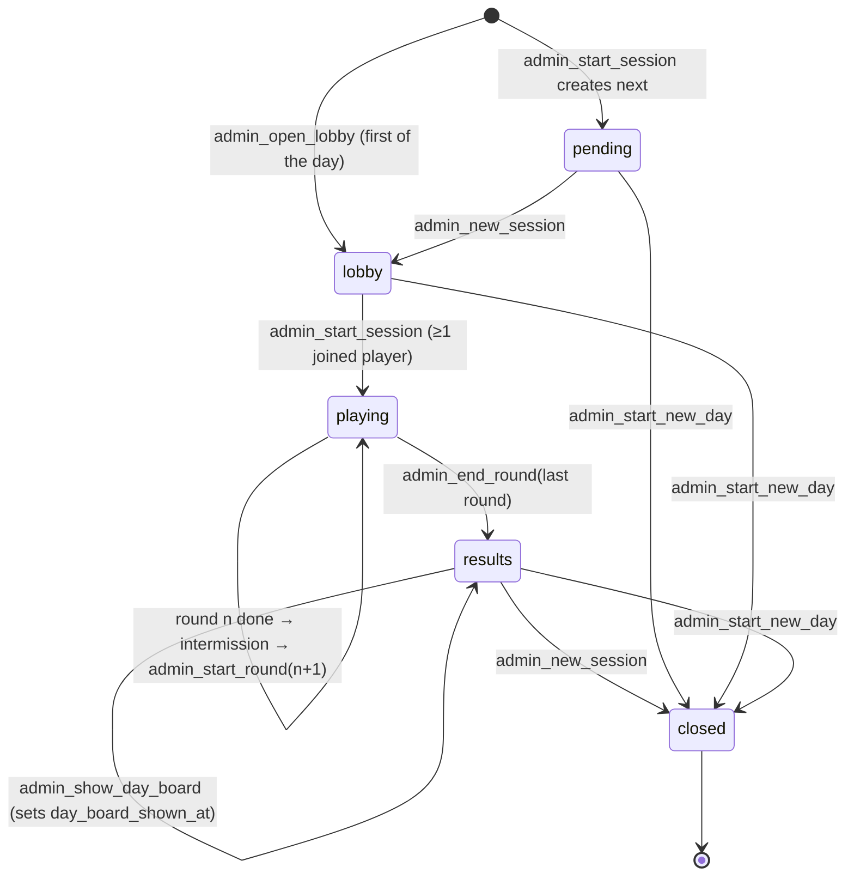
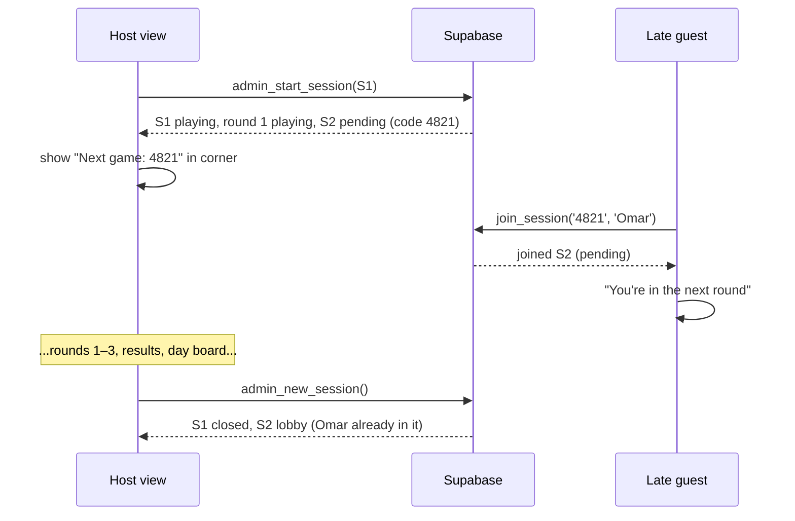
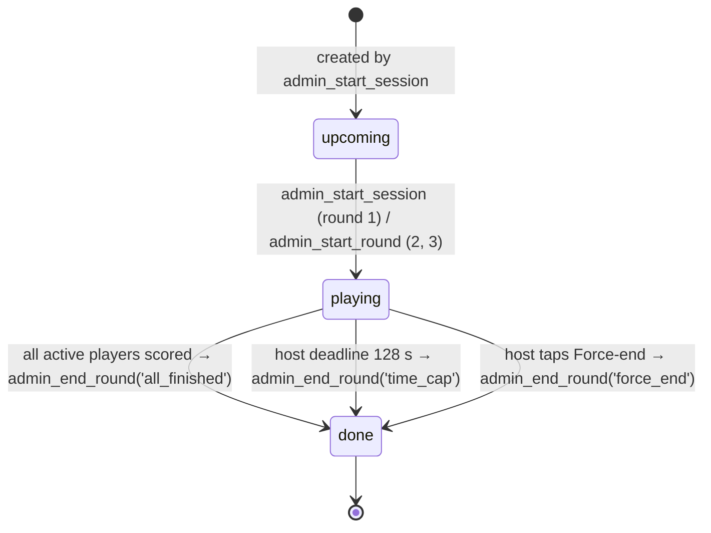
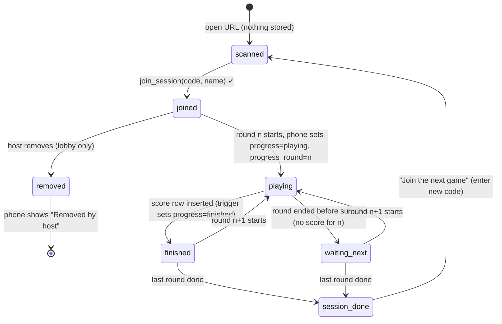
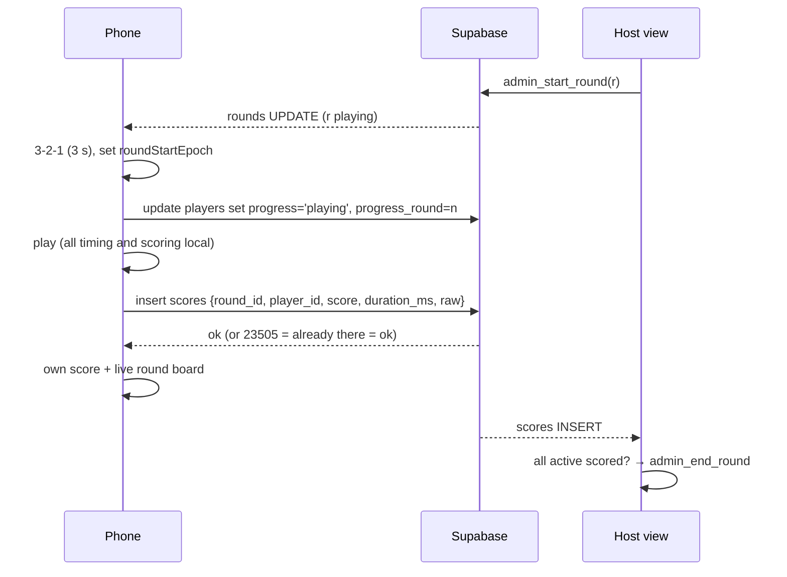

# Session Lifecycle

Purpose: exactly how a session, its three rounds and each player move through their states. Covers who triggers each transition, what the phone and the big screen show, timings, and the expected behaviour in every edge case we could think of. Implementation of the host loop, the phone state machine and the database functions follows this file; `DATA_MODEL.md` §6 has the function signatures.

Last updated: 2026-09-24

Related: ADR-003, ADR-010, ADR-012, ADR-014–ADR-020, ADR-104, ADR-108, ADR-117.

---

## 1. Timing constants

| Constant | Value | Where it lives |
|---|---|---|
| Rounds per session | 3 distinct games (1 during Phases 1–2, ADR-120) | app config `ROUNDS_PER_SESSION` |
| Round start countdown (3-2-1) | 3 s, on phone and big screen | app config |
| Round cap | **120 s** after the countdown ends, measured on each phone | app config |
| Host deadline for a round | `started_at + 3 s + 120 s + 5 s grace = 128 s` (server time) | host client |
| Late score acceptance | up to 15 s after `rounds.ended_at` | score trigger |
| Intermission | 15 s: round board 7 s → session total 5 s → "Next: <game>" 3 s; skippable by host | app config |
| Presence grey-out | 10 s without presence | host client |
| Score submit retry | every 2 s, up to the late-acceptance window | phone |

## 2. Session state machine

| State | Joinable | Big screen | Phones of members |
|---|---|---|---|
| `pending` | ✅ with its own code | Current session's screens, with the pending code small in a corner | "You're in the next round" + lineup |
| `lobby` | ✅ | Lobby: code, QR, URL, players + presence, remove, lineup picker, Start | "You're in! Waiting for the host" + lineup |
| `playing` | ❌ (the pending session takes new joins) | Round live board / intermission | Countdown → game → own score + live board → intermission |
| `results` | ❌ | Session results; after Show day board: day boards | Own total, rank, round breakdown, session board; "Join the next game" |
| `closed` | ❌ | — | Same as `results`, frozen |

Invariants (enforced by partial unique indexes): at most one joinable (`pending`/`lobby`) and one running (`playing`/`results`) session at any time.

### 2.1 Pending lobby (ADR-108)

## 3. Round state machine

### 3.1 The host loop (runs in the host view, ADR-104)

1. On load (or reload), fetch `server_now()` once; `offset = server_now − Date.now()` (adjusted by half the round-trip).
2. Subscribe to the running session's channel. Reconstruct state from the database (never from local memory).
3. While a round is `playing`:
   - Every 500 ms: if `count(scores for round) ≥ count(players where status = 'joined')` → `admin_end_round(round, 'all_finished')`.
   - If `Date.now() + offset ≥ started_at + 128 s` → `admin_end_round(round, 'time_cap')`.
   - Force-end button → `admin_end_round(round, 'force_end')`.
4. On round `done`: run the intermission (15 s, or until "Next round now"), then `admin_start_round(next)`. After the last round the session is `results`: stop and wait for **Show day board**, then **New session**.
5. All calls are idempotent; a double tap or two open host tabs can't double-advance (functions check the current state and raise `GD010`, which the host view ignores).

If the host laptop is closed or crashes mid-round, rounds stop advancing. Phones keep playing and submitting; when the host view is reopened it reconstructs state and immediately ends any round past its deadline. See the runbook.

## 4. Player state machine

`scanned`, `waiting_next` and `session_done` are phone-only states; the database has `status ∈ {joined, removed}` and `progress ∈ {waiting, playing, finished}` + `progress_round`.

### 4.1 Phone-side persisted state (ADR-018)

The phone keeps one object in localStorage under `gdg.v1.current`, rewritten on every meaningful change:

| Field | Meaning |
|---|---|
| `sessionId`, `playerRowId`, `name`, `displaySuffix` | membership |
| `lang` | chosen language (separate key `gdg.v1.lang`) |
| `roundId`, `game`, `roundStartEpoch` | round in progress; epoch ms at the end of the 3-2-1 |
| `attemptIndex`, `attemptStartEpoch`, `attemptResults[]` | game progress (per-game shape in `docs/games/*`) |
| `seed` | per-round random seed (grid positions, Simon sequence, trivia draw) so a reload shows the same content |
| `pendingSubmit` | the score payload if submitted but not yet acknowledged |
| `submittedRounds[]` | round ids with an acknowledged score |

Elapsed times after a reload are computed as `Date.now() − *StartEpoch`, so a reload never resets a clock. Precise in-attempt timing uses `performance.now()` while the page stays alive (it resets on reload, so it is never persisted).

## 5. Phone flow per round

- Phone local cap: at 120 s after `roundStartEpoch` the game force-finishes and scores whatever was completed, following the per-game timeout rule (`SCORING.md` §3). If the phone was not in the round at all (joined after it started, or was dead), it submits nothing.
- If the `rounds` UPDATE to `done` arrives before the phone finishes (another trigger ended the round), the phone finishes immediately with the same rule and submits within the 15 s acceptance window.

## 6. Edge cases

"Expected" is the behaviour the implementation must produce. ✅ = covered by a test in `TESTING.md`.

| # | Scenario | Expected behaviour |
|---|---|---|
| E1 | **Reload in lobby** | Phone restores `sessionId` from storage, re-subscribes, shows the lobby again. No second player row (same `auth.uid()`; `join_session` is idempotent). |
| E2 | **Reload mid-round** | Phone restores round state, recomputes elapsed from stored epochs, resumes the same attempt with the same seed. The hidden Stop the Clock timer keeps running; an Odd One Out grid continues with the same layout; a Perfect Circle stroke in progress is discarded (not counted as an invalid stroke); Simon replays the current sequence (the per-tap timer restarts; the round clock doesn't). |
| E3 | **Reload after finishing a round** | Shows own score + live board (from `submittedRounds` and the board query). Never a new game. A replay attempt would be refused by the unique constraint. |
| E4 | **Reload after the session ended** | Shows the session results for that session, with "Join the next game". |
| E5 | **Removed, then rescans** | `join_session` with the same code raises `GD004` → "Removed by host". A different code (next session) works normally. |
| E6 | **Late join during play** | Guest types the corner code → joins the pending session → "You're in the next round". Typing the *running* session's old code → `GD001` "That code isn't active — use the code on the screen now." |
| E7 | **Phone dies / leaves mid-round** | Presence greys out; the player stays active; the round waits until all others finish, then until the 128 s host deadline, unless the host force-ends. No score row for that round; later rounds the same. |
| E8 | **Admin closes laptop / host view crashes** | Phones continue the current round and submit (acceptance window counts from `ended_at`, which isn't set yet, so late phones are fine). Rounds don't advance. On reopen: sign-in persists, host view reconstructs state, ends overdue rounds, resumes the intermission logic. Runbook §5.5. |
| E9 | **Two tabs, same phone** | Web Locks: the second tab shows "Already open in another tab" and does nothing (ADR-121). |
| E10 | **Two different browsers on one phone** (e.g. scanner app's in-app browser vs Safari) | Different storage → different anonymous user → a separate player. Accepted. |
| E11 | **Duplicate names in a session** | Second "Sara" gets display suffix 2 ("Sara 2"), third gets 3. Keys ignore case and Arabic letter variants (`SCORING.md` §6). Day board merges them under one name key (ADR-105). |
| E12 | **Zero players finish a round** | Round ends at the host deadline with `time_cap`; round board shows "No scores this round"; session continues. If nobody scored in all 3 rounds, results show "No scores this session" and New session works normally. |
| E13 | **Start with zero joined players** | Start button disabled; `admin_start_session` raises `GD010` if called anyway. |
| E14 | **Network drop mid-submit** | Payload kept in `pendingSubmit`; retried every 2 s; on reconnect the insert succeeds or returns 23505 (already stored) and both count as success. If the 15 s window passes, `GD007`: the phone shows "Your score couldn't be saved in time" and the score is shown locally only. |
| E15 | **Screen locks mid-round** | Timers are epoch-based, so the round keeps going. On unlock the phone recomputes; any attempt whose timeout passed is closed with its timeout rule; if the round cap passed, the phone submits immediately. Realtime reconnects automatically; the phone then re-reads round state. |
| E16 | **Phone rotates to landscape** | Games are portrait-only: an overlay says "Turn your phone back upright". Timers keep running (no pause). A Perfect Circle stroke in progress is discarded without using an invalid-stroke try. |
| E17 | **Language switched mid-game** | The toggle is hidden during rounds (visible on join, lobby, intermission, results). A device language change mid-round has no effect until the next screen. |
| E18 | **Supabase project paused at first request** | Shouldn't happen (keepalive). If it does: the join fails, the phone shows "We're warming up, try again in a minute", and the host view shows a red banner "Database unreachable". Runbook §5.1: restore the project from the dashboard. |
| E19 | **Guest joins the pending session while still in the running one** | Only possible from a second tab/browser or by typing the code after finishing (the "Join the next game" button appears at results). The server allows it; they remain active in the running session. Accepted. |
| E20 | **Host changes the lineup during play** | Changes only the pending session (`admin_set_lineup` on `pending`). The running session's rounds were fixed at Start. |
| E21 | **Host taps New session before Show day board** | Allowed: skips the merge animation; day boards still contain the scores. |
| E22 | **Score arrives after the round was force-ended** | Accepted if within 15 s of `ended_at`; it appears on the round board if the intermission is still showing and always counts on day boards and session totals. |
| E23 | **Two host tabs open** | Both render; state transitions are idempotent and guarded (`GD010` ignored). Runbook says keep one. |
| E24 | **Hidden name while on screen** | Rows disappear from every board within ~1 s (`hidden_names` realtime → refetch). The player's own phone still shows their own score at the top. |
| E25 | **New event day while a pending lobby has players** | Not allowed while a session is `playing`. Otherwise joinable/results sessions are closed; phones in them show "This game has ended — join the next one". |
| E26 | **Player's phone joins a round late** (reconnects after round start, never opened the game) | If the round is still `playing` and the phone has no state for it, the phone starts the game right away (3-2-1, normal local cap). The phone doesn't compare its clock with the server's (ADR-104), so the round may end earlier at the host deadline; the phone then finishes with the timeout rule (§5) and submits what it has. |
| E27 | **Round cap hits during an attempt** | That attempt closes with its timeout rule; remaining attempts count as timed out; the score is submitted (`SCORING.md` §3). |
| E28 | **Guest types the right code with an invalid name** | Name error shown inline; code is kept; nothing is stored until the name is valid. |
| E29 | **Anonymous sign-in rate-limited** | Join shows "Too many people joining at once — try again in a few seconds" and retries once after 5 s. Rate limit is set high (ADR-102), so this should never happen in practice. |
