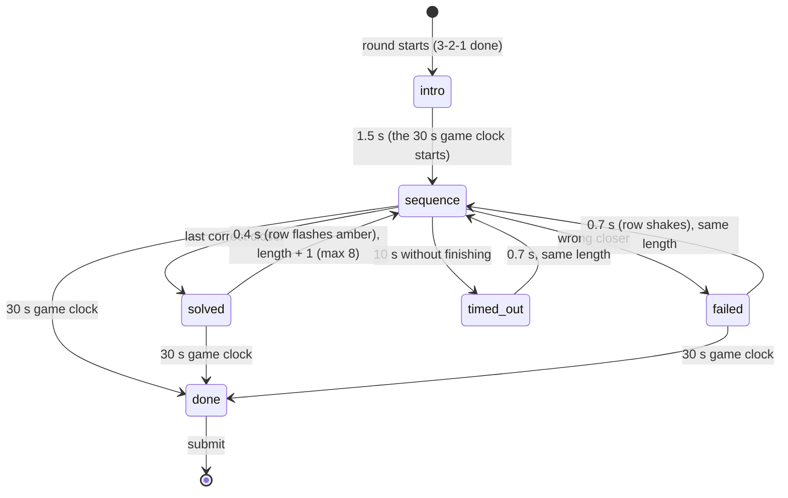

# Game: Close the Brackets

Purpose: the complete spec for Close the Brackets: rules, flow, timings, difficulty curve, scoring with worked examples, rejection bounds, UI states, theming, accessibility, edge cases and test cases. Shared rules are in `SCORING.md`; if they disagree, `SCORING.md` wins.

Last updated: 2026-09-25

Game id: `close_brackets` · One-line pitch (COPY `game.close_brackets.pitch`): "Close every bracket, last one first. Beat the clock."

Related: ADR-134 (pool expansion), `docs/games/newgames.md` (the brief, Phase A item 1).

---

## 1. Rules

- A row of opening brackets appears, for example `{ ( [ <`. The player closes them **last one first** by tapping the four big buttons `)` `]` `}` `>` (here: `>` `]` `)` `}`).
- The first sequence has **2** brackets; every solved sequence adds one, up to **8**. After that every sequence has 8.
- A **wrong tap fails the sequence**: the row shakes, and the next sequence has the **same length**. The game never ends early.
- Each sequence has its own **10 s timeout**; a timed-out sequence counts like a failed one (same length next).
- The whole game lasts **30 s** from the first sequence. A sequence still open at 30 s simply doesn't count (no penalty).
- The score comes from the sum of the solved lengths, plus a small speed bonus.

Brief deviations (recorded in ADR-134): the brief's "turns red" is an **ink** shake, because the palette has no red (DESIGN_SYSTEM §1; Trivia uses ink for wrong too); the per-sequence 10 s timeout is added so every attempt has its own timeout (CLAUDE.md).

## 2. Sequences and difficulty curve

| Solved so far | Next length | Notes |
|---|---|---|
| 0 | 2 | warm-up |
| 1 … 5 | 3 … 7 | one more bracket per solve |
| ≥ 6 | 8 | the cap; every further sequence is 8 long |

- The four bracket kinds: round `( )`, square `[ ]`, curly `{ }`, angle `< >`. Each opener is drawn uniformly from the kinds that differ from the one before it (no two identical neighbours, so a sequence never degenerates into `((((`).
- **Seeded** (fairness and reload): the k-th sequence of length L that a player sees is generated from `Rng("<round seed>:cb:L<L>:<k>")` (`src/lib/rng.ts`), where k counts sequences shown at that length (0 for the first, +1 after every solved, failed or timed-out sequence of the same length, reset when the length changes). So everyone in a round who reaches length 5 for the first time sees the same five openers, and a reload shows the same sequence again.
- Buttons are fixed and identical for everyone: `)` `]` `}` `>`, left to right, never shuffled, never mirrored in RTL.

## 3. Flow and timings



| Step | Duration |
|---|---|
| Intro card | 1.5 s |
| Game clock (everything below runs inside it) | 30 s |
| Sequence | player-controlled, 10 s timeout |
| Solved transition | 0.4 s |
| Failed / timed-out transition | 0.7 s |
| Worst case total | 1.5 + 30 ≈ **32 s** (inside the 120 s cap) |

Measurement:
- A sequence's clock starts when it is committed to the screen (`performance.now()` and `Date.now()` stored as `seqStartEpoch`); taps are measured on **`pointerdown`**.
- `solve_ms` = the sum, over solved sequences, of `round(last correct tap − sequence start)`. Transitions aren't counted in `solve_ms` but do run inside the 30 s.
- A second `pointerdown` within 60 ms of the previous one is ignored (bounce / palm contact), so two-thumb players can still tap fast.

## 4. Scoring

`n` = sequences solved. `S` = sum of their lengths, fully determined by `n` because lengths go 2, 3, …, 8, 8, …: **`S(n) = n(n + 3)/2` for `n ≤ 7`, `35 + 8(n − 7)` above**. `g = solve_ms / S` (mean ms per correct closer, reading time included).

- Speed bonus `B = 100 × clamp((900 − g) / 600, 0, 1)` when `n ≥ 1`, else 0 (0 at ≥ 900 ms per bracket, full at ≤ 300 ms).
- **`score = round(min(1000, 15 × S + B))`**; `n = 0` → 0.
- The bonus (≤ 100) is worth less than one length-8 sequence (120), so it mostly breaks ties.

Calibration (`SCORING.md` §3.6 has the assumptions): a strong player solves 9 sequences (S = 51) at ≈ 460 ms per bracket → ≈ 840; 1000 needs 11 solves (S = 67, i.e. 2…8 and four more 8s) without a slip, ≤ 380 ms per bracket including reading.

| Player | n | S | solve_ms | g (ms) | B | Score |
|---|---|---|---|---|---|---|
| A (strong) | 9 | 51 | 23562 | 462 | 73 | 765 + 73 = **838** |
| B (typical) | 6 | 27 | 20600 | 763.0 | 22.84 | round(405 + 22.84) = **428** |
| C (weak) | 4 | 14 | 14000 | 1000 | 0 | **210** |
| D (one solve) | 1 | 2 | 1400 | 700 | 33.33 | round(63.33) = **63** |
| E (near-perfect) | 11 | 67 | 21440 | 320 | 96.67 | min(1000, 1101.67) = **1000** |
| F (nothing solved) | 0 | 0 | null | — | 0 | **0** |

## 5. Submission and rejection bounds

```json
{
  "$schema": "https://json-schema.org/draft/2020-12/schema",
  "title": "close_brackets raw",
  "type": "object",
  "required": ["solved", "failed", "timeouts", "solve_ms"],
  "additionalProperties": false,
  "properties": {
    "solved":   { "type": "integer", "minimum": 0, "maximum": 30 },
    "failed":   { "type": "integer", "minimum": 0, "maximum": 50 },
    "timeouts": { "type": "integer", "minimum": 0, "maximum": 3 },
    "solve_ms": { "type": ["integer", "null"], "minimum": 0, "maximum": 30000 }
  }
}
```

Database bounds (`SCORING.md` §4, in check order): malformed object/types [`cb.shape`]; `solved` 0–30, `failed` 0–50, `timeouts` 0–3, `solve_ms` ≤ 30000 [`cb.range`]; `solve_ms` null iff `solved = 0` [`cb.solve_ms`]; `solved = 0` ⇒ `score = 0` [`cb.zero`]; `solve_ms ≥ 150 × S(n)` [`cb.too_fast`]; `min(1000, 15 × S) ≤ score ≤ min(1000, 15 × S + 100)` [`cb.formula_band`].

Why: 150 ms per bracket *including reading* is below sustained human tapping; 30 solves would need well under 150 ms per bracket; a failed sequence costs at least its 0.7 s transition, so 50 fails can't fit in 30 s; three 10 s timeouts fill the whole game.

## 6. UI states (phone)

| State | Shows | Input |
|---|---|---|
| `intro` | Eyebrow `game.close_brackets.intro`, title, pitch | none |
| `sequence` | Top: countdown bar + seconds left; `Length n` and `Solved n` as small muted labels. Middle: the openers in a row (blue), one slot under each; the slot under the last open bracket is outlined. Bottom: the four closer buttons | the four buttons |
| correct tap | The closer appears in its slot in amber; the button flashes amber for 150 ms | keeps going |
| `solved` (0.4 s) | The whole row (openers + closers) turns amber | none |
| `failed` (0.7 s) | The row shakes (3 × 6 px, ink), caption `game.close_brackets.wrong` | none |
| `timed_out` (0.7 s) | Caption `game.close_brackets.timeout` | none |
| `done` | Caption `game.close_brackets.times_up` (the shell then shows P7) | none |

P7 breakdown (`SCREENS.md` P7): sequences closed · longest length · misses (failed + timed out).

## 7. Theming

- Brackets are drawn as SVG in the **chevron style** (`DESIGN_SYSTEM.md` §5): thick rounded strokes (≈ 20 % of the glyph width), round caps and joins; `<` `>` are the brand chevron itself. Not the logo, never the mosaic mark.
- Openers `--gdg-blue`; placed closers and the correct-tap / solved flashes `--gdg-amber` (a fill/stroke, never text); wrong = ink shake, no red.
- Buttons: `--surface` with a 1 px `--line-strong` border and `--r-control`, blue glyph; the flash fills `--highlight` and turns the glyph `--on-highlight`.
- Countdown bar as in Trivia: `--primary` fill, amber in the last 5 s with the number on an amber tag (never amber text).

## 8. Accessibility

- Buttons are at least 72 × 72 CSS px on a 360 px phone (4 across, 8 px gaps), well above the 48 px minimum; each has an `aria-label` (`game.close_brackets.key.<kind>`).
- Meaning never relies on colour alone: a placed closer is a shape in a slot, the next slot is outlined, a failure also shows a caption.
- Reduced motion: no shake, no flash animation (static amber / caption only); the countdown bar steps once per second.
- The bracket row and the buttons are game geometry: `direction: ltr` in both languages (an Arabic page must not mirror `(` into `)`); SVG glyphs avoid Unicode bidi mirroring entirely.

## 9. Edge cases

| Case | Behaviour |
|---|---|
| Multi-touch / bounce | Only the first `pointerdown` per 60 ms counts. |
| Tap during a transition or the intro | Ignored. |
| Reload mid-sequence | Same sequence (seeded by length + index) with the closers already placed; its time continues from `seqStartEpoch` and the game clock from `gameStartEpoch` (reloading never gains time). `solve_ms` for that sequence falls back to `Date.now()` precision. |
| Reload during a transition | The transition finishes at its stored end time, then the next sequence starts. |
| Screen lock | Clocks keep running on epochs; on return any passed timeout or the game end applies at once. |
| Round ends early (cap / force-end / all finished) | Finish now with what is solved; the open sequence doesn't count. |
| Rotation | The shell's portrait overlay covers the game; clocks keep running (E16). |

## 10. Test cases

| # | Input | Expected |
|---|---|---|
| CB-T1 | Example A (n 9, solve_ms 23562) | 838 |
| CB-T2 | Example B (n 6, solve_ms 20600) | 428 |
| CB-T3 | `S(n)` for n = 0, 1, 7, 8, 11 | 0, 2, 35, 43, 67 |
| CB-T4 | n 9, solve_ms 7649 (150 × 51 = 7650) | `GD008 cb.too_fast`; 7650 accepted |
| CB-T5 | n 9, score 866 (15 × 51 + 101) | `GD008 cb.formula_band`; 865 and 765 accepted, 764 rejected |
| CB-T6 | n 0, solve_ms 1200 | `GD008 cb.solve_ms` |
| CB-T7 | n 0, score 10 | `GD008 cb.zero` |
| CB-T8 | timeouts 4 | `GD008 cb.range` |
| CB-T9 | Same seed, length, index | identical openers; no identical neighbours |
| CB-T10 | Wrong tap at length 4 | failed + 1, next sequence length 4 (index + 1) |
| CB-T11 | Reload mid-sequence | same openers and placed closers; game ends at the original 30 s |
| CB-T12 | Idle player | 2 timeouts (at 10 s and 20.7 s; the third would end after 30 s), score 0, finishes by 32 s (`worstCase.test.tsx`) |
| CB-T13 | Playtest: 5 strong players | median 780–900; nobody reaches 1000 → else retune the 15 / 100 constants (ADR-134) |
