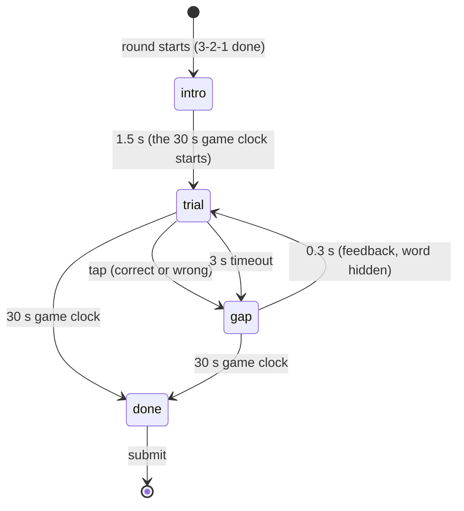

# Game: Color Clash

Purpose: the complete spec for Color Clash: rules, flow, timings, difficulty curve, scoring with worked examples, rejection bounds, UI states, theming (including the colour-vision check of the three inks), accessibility, edge cases and test cases. Shared rules are in `SCORING.md`; if they disagree, `SCORING.md` wins.

Last updated: 2026-09-25

Game id: `color_clash` · One-line pitch (COPY `game.color_clash.pitch`): "Tap the color of the ink, not the word."

Related: ADR-134 (pool expansion), `docs/games/newgames.md` (the brief, Phase A item 2).

---

## 1. Rules

- A colour word appears, printed in one of three **inks**: blue, amber or charcoal. The player taps the button for the **ink**, not the word (a Stroop task).
- Three buttons, always in the same order (blue, amber, charcoal): each shows a **swatch and the colour's name**.
- About **30 %** of trials are congruent (the word names its own ink), so "always tap the other colour" doesn't work.
- The word is in the player's language (`game.color_clash.word.*`).
- Each trial has its own **3 s timeout**; a timeout counts like a wrong tap.
- The game lasts **30 s** from the first word. Score: correct taps minus wrong taps (and timeouts), plus a small speed bonus.

## 2. Trials and difficulty curve

- Trials come in blocks of 10: in every block exactly **3** trials are congruent, at positions shuffled by `Rng("<round seed>:cc:block<b>")`.
- Trial k's ink is uniform over the three inks, from `Rng("<round seed>:cc:trial<k>")`; an incongruent trial's word is one of the two other colours, from the same generator.
- So every player in a round gets the same sequence of (word, ink) pairs, and a reload shows the same trial again (`src/lib/rng.ts`). Only the pace differs: a faster player sees more trials.
- Difficulty is constant: the interference itself is the difficulty, and the 70 % incongruent share keeps it high for the whole 30 s.

## 3. Flow and timings



| Step | Duration |
|---|---|
| Intro card | 1.5 s |
| Game clock (everything below runs inside it) | 30 s |
| Trial | until the tap, 3 s timeout |
| Gap after every trial (feedback; the word is hidden so each trial is a new onset) | 0.3 s |
| Worst case total | 1.5 + 30 ≈ **32 s** (inside the 120 s cap) |

Measurement: the reaction time `rt` is `performance.now()` at the **`pointerdown`** minus the moment the word was committed to the screen (epoch fallback after a reload), capped at 3000 ms. `mean_rt_ms` = the rounded mean `rt` over **correct** trials. A second `pointerdown` within 60 ms of the previous one is ignored (bounce).

## 4. Scoring

`c` = correct, `w` = wrong, `t` = timeouts, `net = c − w − t`, `r̄ = mean_rt_ms`.

- Speed bonus `B = 75 × clamp((1000 − r̄) / 600, 0, 1)` when `c ≥ 1`, else 0 (0 at ≥ 1 s, full at ≤ 400 ms).
- **`score = clamp(round(25 × net + B), 0, 1000)`**.
- The bonus (≤ 75) is worth less than three correct taps; random tapping (⅓ right) has a negative `net` and scores 0.

Calibration (`SCORING.md` §3.7 has the assumptions): a strong player averages ≈ 630 ms with one slip in ≈ 33 trials → ≈ 820; 1000 needs about 38 correct in a row at ≤ 480 ms mean.

| Player | c / w / t | r̄ (ms) | net | B | Score |
|---|---|---|---|---|---|
| A (strong) | 32 / 1 / 0 | 630 | 31 | 46.25 | round(821.25) = **821** |
| B (typical) | 25 / 2 / 0 | 850 | 23 | 18.75 | round(593.75) = **594** |
| C (weak) | 17 / 3 / 1 | 1140 | 13 | 0 | **325** |
| D (spammer) | 12 / 24 / 0 | 300 | −12 | 75 | clamp(−225) = **0** |
| E (idle) | 0 / 0 / 9 | null | −9 | 0 | **0** |
| F (near-perfect) | 40 / 0 / 0 | 450 | 40 | 68.75 | clamp(1068.75) = **1000** |

## 5. Submission and rejection bounds

```json
{
  "$schema": "https://json-schema.org/draft/2020-12/schema",
  "title": "color_clash raw",
  "type": "object",
  "required": ["correct", "wrong", "timeouts", "mean_rt_ms"],
  "additionalProperties": false,
  "properties": {
    "correct":    { "type": "integer", "minimum": 0, "maximum": 100 },
    "wrong":      { "type": "integer", "minimum": 0, "maximum": 100 },
    "timeouts":   { "type": "integer", "minimum": 0, "maximum": 10 },
    "mean_rt_ms": { "type": ["integer", "null"], "minimum": 0, "maximum": 3000 }
  }
}
```

Database bounds (`SCORING.md` §4, in check order): malformed object/types [`cc.shape`]; `correct` 0–100, `wrong` 0–100, `timeouts` 0–10, `mean_rt_ms` ≤ 3000 [`cc.range`]; `mean_rt_ms` null iff `correct = 0` [`cc.rt`]; `correct = 0` ⇒ `score = 0` [`cc.zero`]; `mean_rt_ms ≥ 250` [`cc.too_fast`]; `correct × (mean_rt_ms + 300) ≤ 30300` (the correct trials and their gaps must fit in the 30 s) [`cc.too_many`]; `clamp(25 × net, 0, 1000) ≤ score ≤ clamp(25 × net + 75, 0, 1000)` [`cc.formula_band`].

Why: a correct Stroop response under 250 ms on average is below human choice-reaction time; the 0.3 s gap after every trial caps how many can fit; nine 3.3 s timeout cycles fill the game, so 10 is generous.

## 6. UI states (phone)

| State | Shows | Input |
|---|---|---|
| `intro` | Eyebrow `game.color_clash.intro`, title, pitch | none |
| `trial` | Top: countdown bar + seconds left, `Correct n` small and muted. Middle: the word, large, in its ink. Bottom: the three buttons (swatch + name) | the three buttons |
| `gap` after a correct tap (0.3 s) | Word hidden; the tapped button gets an amber ring | ignored |
| `gap` after a wrong tap (0.3 s) | Word hidden, an ink cross (rounded-stroke SVG) in its place; the tapped button shakes | ignored |
| `gap` after a timeout (0.3 s) | `game.color_clash.too_slow` in the word's place | ignored |
| `done` | `game.color_clash.times_up` (the shell then shows P7) | none |

P7 breakdown (`SCREENS.md` P7): correct · wrong or missed · average time.

## 7. Theming

Colour is the game here, the one place besides Simon where colour alone carries meaning, so the three inks were chosen for colour-vision deficiencies:

- Inks are the brand tokens (`--clash-blue` = `--gdg-blue`, `--clash-amber` = `--gdg-amber`, `--clash-charcoal` = `--gdg-ink`), no new colours.
- They differ in **lightness** as well as hue (luminance ≈ 0.22 / 0.49 / 0.009), and blue vs amber sits on the blue–yellow axis that red–green deficiencies keep. Checked with the Machado et al. (2009) full-severity simulation in linear sRGB (`npm run contrast` re-computes it, `DESIGN_SYSTEM.md` §2.5):

| Pair | Normal: contrast · ΔE | Deuteranopia | Protanopia | Tritanopia (info) |
|---|---|---|---|---|
| blue / amber | 1.95 · 119 | 2.27 · 120 | 1.52 · 113 | 1.63 · 79 |
| blue / charcoal | 4.70 · 62 | 4.34 · 63 | 5.28 · 62 | 5.22 · 59 |
| amber / charcoal | 9.15 · 102 | 9.87 · 102 | 8.01 · 99 | 8.49 · 80 |

  (Contrast = WCAG ratio between the two simulated inks; ΔE = CIE76 distance in CIELAB. ΔE above ~40 reads as clearly different colours; the lowest pair here is 59.)
- The word is set large and bold (`--type-target-size` × 0.8, 700) with a thin **ink outline** on every ink, so amber letters stay readable on paper (amber is never bare text, `DESIGN_SYSTEM.md` §2.4) and all three inks get the same treatment (the outline is not a cue).
- Buttons: `--surface`, 1 px `--line-strong` border, `--r-control`; a swatch filled with the ink (1 px `--line-strong` edge) above the colour name in `--text`. Correct = amber ring, wrong = ink shake (no red).
- Countdown bar as in Trivia.

## 8. Accessibility

- Each button shows the colour **name** as text next to its swatch, so the answer never depends on seeing the swatch colour; the three inks are distinguishable under deuteranopia and protanopia (§7). A player with achromatopsia can't play the Stroop task by design; that is accepted for a one-minute booth game (EVENT_RUNBOOK note).
- Buttons ≥ 96 px tall and a third of the width each (≈ 104 px on a 360 px phone), well above 48 px.
- Reduced motion: no shake, no ring animation (static ring / cross only); the countdown bar steps once per second.
- The button row is game geometry: same order (blue, amber, charcoal) in both languages (`direction: ltr`); the labels themselves follow the page language.

## 9. Edge cases

| Case | Behaviour |
|---|---|
| Multi-touch / bounce | Only the first `pointerdown` per 60 ms counts. |
| Tap during the gap or the intro | Ignored. |
| Language toggle | Hidden during rounds (E17), so the word language can't change mid-game. |
| Reload mid-trial | The same trial (seeded by index) reappears; its time continues from `trialStartEpoch` (a reload never gains time) and the game clock from `gameStartEpoch`. |
| Reload during the gap | The gap ends at its stored time, then the next trial appears. |
| Screen lock | Clocks keep running on epochs; on return a passed timeout or the game end applies at once. |
| Round ends early | Finish now; the open trial doesn't count. |
| Rotation | The shell's portrait overlay covers the game; clocks keep running (E16). |

## 10. Test cases

| # | Input | Expected |
|---|---|---|
| CC-T1 | Example A (32 / 1 / 0, 630 ms) | 821 |
| CC-T2 | Example B (25 / 2 / 0, 850 ms) | 594 |
| CC-T3 | Example D (spammer) | 0 |
| CC-T4 | `mean_rt_ms` 249 with 32 correct | `GD008 cc.too_fast`; 250 accepted |
| CC-T5 | 50 correct at 307 ms (50 × 607 = 30350) | `GD008 cc.too_many`; 306 ms accepted |
| CC-T6 | Example A with score 851 (25 × 31 + 76) | `GD008 cc.formula_band`; 775 and 850 accepted |
| CC-T7 | Same seed | same (word, ink) sequence; exactly 3 congruent in every block of 10 |
| CC-T8 | Wrong tap | wrong + 1, gap 0.3 s, next trial index + 1 |
| CC-T9 | Idle player | 9 timeouts, score 0, finishes by 32 s (`worstCase.test.tsx`) |
| CC-T10 | Reload mid-trial | same trial; the game ends at the original 30 s |
| CC-T11 | Colour-vision check | `npm run contrast` prints the §7 table; every pair ΔE ≥ 40 under deuteranopia and protanopia |
| CC-T12 | Playtest: 5 strong players | median 780–900; nobody reaches 1000 → else retune the 25 / 75 constants (ADR-134) |
