# Game: How Many?

Purpose: the complete spec for How Many?: rules, field layout, flow, timings, difficulty curve, scoring with worked examples, rejection bounds, UI states, theming, accessibility, edge cases and test cases. Shared rules are in `SCORING.md`; if they disagree, `SCORING.md` wins.

Last updated: 2026-09-26

Game id: `how_many` · One-line pitch (COPY `game.how_many.pitch`): "A flash of chevrons. How many did you see?"

Related: ADR-138 (the playtest retune: counts, grids, flash and answer times, no `too_perfect`), ADR-137 (2) (the fixed step schedule, §3/§9), ADR-136 (this game, the reveal and the "true counts only on the big screen" rule), ADR-018 (reload), ADR-025 (the Stop the Clock reveal it extends), `docs/plans/games-v3.md` §1 and §5, `docs/games/newgames.md` (the brief).

---

## 1. Rules

- Three **flashes** with rising counts. Each flash shows a field of brand chevrons (random rotation, blue/amber mix, never overlapping) for exactly **2.5 s**, then hides it.
- The player types how many they saw on an on-screen number pad and taps OK, within **15 s** per flash.
- No feedback on the phone until the end of the round, and **the true counts are never shown on the phone** (everyone in the room shares them). The big screen reveals everyone's guesses against the true counts (§6, `SCREENS.md` H3).
- Each answer has its own 15 s timeout; typed digits at the timeout count as the guess, nothing typed = no answer.

## 2. Field and difficulty curve

- Flash `i` draws `N_i` uniformly from its band, every integer included (ADR-138): **4–7**, **9–13**, **14–18**.
- The field is a square split into a fixed `g_i × g_i` cell grid, `g = [4, 5, 6]` (16 / 25 / 36 cells ≥ the band maxima 7 / 13 / 18). The grid is fixed per flash, so cell size never hints at `N`.
- `N_i` distinct cells are chosen; each gets one chevron (the Odd One Out glyph, `src/games/odd-one-out/Chevron.tsx`) at **70 %** of the cell, its centre jittered by up to **±15 %** of the cell per axis, rotated 0–359°, blue or amber 50/50. Because 0.7 + 2 × 0.15 = 1.0, a glyph never leaves its cell: chevrons never overlap and never leave the field, whatever the rotation (the glyph's ink stays within 49 % of its box from the centre).
- Seeding: `Rng("<round seed>:hm:round<i>")` (`src/games/how-many/field.ts`, `fieldFor(seed, i)`, pure and memoised) draws, in this order, `N_i`, the cells (`sampleWithoutReplacement`), then per chevron jitter-x, jitter-y, rotation and colour. Everyone in a round sees the same three fields; a reload computes the same ones again.
- Difficulty: counts rise 4–7 → 9–13 → 14–18 while the flash stays 2.5 s. Flash 1 is subitizing (seen at a glance), flash 2 is counting in groups, flash 3 is fast grouping or estimation. The tolerance band widens with the flash (`W` below), so a good player scores similarly on all three.
- On a 360 px phone (a ≈ 328 px field) the glyphs are ≈ 57 / 46 / 38 px on flashes 1 / 2 / 3 (HM-T13 checks them on devices).
- Why these numbers (ADR-138, playtest 2026-09-26): with 40–70 dots in a 1 s flash players "couldn't even see them"; the smaller counts, bigger glyphs and a 2.5 s flash make every flash readable.

## 3. Flow and timings

```mermaid
stateDiagram-v2
    [*] --> intro: round starts (3-2-1 done)
    intro --> look_i: 1.5 s
    look_i --> flash_i: 1.0 s ("Look", empty field frame, fixation dot)
    flash_i --> answer_i: 2.5 s (field hidden in one frame)
    answer_i --> locked_i: OK tapped
    answer_i --> locked_i: 15 s timeout (typed digits count; nothing typed = no answer)
    locked_i --> look_i+1: 0.5 s ("Locked in")
    locked_3 --> done
    done --> [*]: submit
```



| Step | Duration |
|---|---|
| Intro card | 1.5 s |
| `look` (fixation dot, field frame drawn, empty) | 1.0 s |
| `flash` | 2.5 s |
| `answer` | until OK, 15 s timeout |
| `locked` | 0.5 s |
| Worst case total | 1.5 + 3 × (1 + 2.5 + 15 + 0.5) = **58.5 s** → `worstCaseMs = 60 000` (inside the 120 s cap) |

- **Fixed schedule** (ADR-137 (2)). The game clock is anchored on `roundStartEpoch` and on the player's own OK taps; every step boundary comes from stored epochs, never from the moment a timer happened to fire:
  - look 1 starts at `roundStartEpoch + 1500`;
  - the flash window is `lookStartEpoch + 1000 … + 3500`; `answerStartEpoch` is the end of the flash (`flashStartEpoch + 2500`, or `lookStartEpoch + 3500` when the flash was skipped);
  - an answer ends at the OK tap, or at `answerStartEpoch + 15 000` on a timeout; `lockedEndEpoch` = that end + 500;
  - look `i+1` starts at `lockedEndEpoch_i`.

  One scheduler applies what is due as a **catch-up loop**: after a reload, a screen lock, a JS freeze or a hidden page whose timers were throttled, every step whose epoch has passed is closed at once with its own rule (a passed flash window is skipped, a passed answer times out with whatever is typed, `null` on a fresh look), and the chain continues from the stored epochs. A phone that comes back late is therefore on whatever step the schedule says, and an idle round always ends at `roundStartEpoch + 58.5 s` (plus the time to come back, if the phone was frozen past it). **A hidden page never pauses the schedule**: flashes that end while the page is hidden are skipped and their answers time out on schedule (team decision 2026-09-26). The loop runs on each timer, on `visibilitychange` and `pageshow` (back-forward cache), and once at mount before the first paint.
- **The flash is one frame.** The whole field mounts in one commit with all `N_i` chevrons (no per-chevron transition, no fade-in) and nothing in it changes until it unmounts. The `flash` phase is persisted at that commit; `flashStartEpoch` is written by the effect after the paint. Until it is written, the flash is due at the window's end (`lookStartEpoch + 3500`), so it always has a deadline; a paint that lands more than 250 ms after the look's end (the page froze between the commit and the paint) records `flashStartEpoch = lookStartEpoch + 1000`, so the field only stays until the window's end and is hidden at once if that has passed — it never gets a new 2.5 s after an unlock. The field is **unmounted** at `flashStartEpoch + 2500` (a timer, plus the `visibilitychange` / `pageshow` fallback). Nothing else on the screen changes during the flash: the eyebrow and the "Look" caption stay, only the frame's contents swap from the fixation dot to the chevrons.
- A look whose end is processed more than **250 ms** late (a locked screen, a throttled tab, the catch-up) or while the page is hidden skips the flash, exactly as a reload does (§9): the flash window belongs to the fixed schedule, so a late flash would stretch the round past its worst case.
- `answer_ms` = `performance.now()` at the OK `pointerdown` minus the moment the pad appeared (after a reload: the epoch, measured from the earlier of the answer anchor and the moment the pad appeared on this page load), capped at 15 000. An OK within **300 ms** of the pad appearing is ignored (two taps take longer; the server rejects faster answers, §5). Keys are `pointerdown` with a 60 ms bounce guard.
- Round ended early (`roundEnded`): finish at once. The open flash (look, flash or answer) counts as timed out with whatever is typed; flashes not started count as `guess: null, timed_out: true`. `true_count` always comes from the seed.

## 4. Scoring

For flash `i` with true count `N_i` and guess `g_i` (null → `s_i = 0`):

- `rel_i = |g_i − N_i| / N_i`
- `s_i = clamp(1 − max(0, rel_i − D) / (W_i − D), 0, 1)` with **`D = 0.05`** (dead zone: within 5 % = full marks) and **`W = [0.30, 0.40, 0.50]`** (30 / 40 / 50 % off = 0).
- **`score = clamp(round(1000 × (s_1 + s_2 + s_3) / 3), 0, 1000)`**.

Calibration (`SCORING.md` §3.8; unchanged formula, retuned content, ADR-138): with at most 18 chevrons shown for 2.5 s, **exact counts are common**, and with these counts ±1 is already outside the 5 % dead zone (1/18 ≈ 5.6 %), so full marks on a flash means the exact count. A **strong** booth player is exact on flash 1, ±1 on flash 2, ±2 on flash 3 → **≈ 905**; exact / exact / ±1 → ≈ 990. Typical ±1 / ±2 / ±3 → ≈ 617. **1000** (all three exact) is **reachable** and is normal play, not a cheat signal: the calibration no longer keeps 1000 out of reach, and ties at the top are broken by the earlier score (`SCORING.md` §5).

Worked examples (`N = [6, 11, 16]`):

| Player | Guesses | `rel` | `s` | Score |
|---|---|---|---|---|
| A (strong) | 6, 10, 14 | 0, 0.0909, 0.125 | 1, 0.8831, 0.8333 | round(905.48) = **905** |
| B (typical) | 5, 9, 13 | 0.1667, 0.1818, 0.1875 | 0.5333, 0.6234, 0.6944 | round(617.05) = **617** |
| C (weak) | 4, 8, 11 | 0.3333, 0.2727, 0.3125 | 0, 0.3636, 0.4167 | round(260.10) = **260** |
| D (idle) | null ×3 | – | 0, 0, 0 | **0** |
| E (one timeout) | 6, null, 15 | 0, –, 0.0625 | 1, 0, 0.9722 | round(657.41) = **657** |
| F (perfect) | 6, 11, 16 | 0, 0, 0 | 1, 1, 1 | **1000** |
| G (near-perfect) | 6, 11, 15 | 0, 0, 0.0625 | 1, 1, 0.9722 | round(990.74) = **991** |

## 5. Submission and rejection bounds

```json
{
  "$schema": "https://json-schema.org/draft/2020-12/schema",
  "title": "how_many raw",
  "type": "object",
  "required": ["rounds"],
  "additionalProperties": false,
  "properties": {
    "rounds": {
      "type": "array", "minItems": 3, "maxItems": 3,
      "items": {
        "type": "object",
        "required": ["true_count", "guess", "answer_ms", "timed_out"],
        "additionalProperties": false,
        "properties": {
          "true_count": { "type": "integer", "minimum": 4, "maximum": 18 },
          "guess":      { "type": ["integer", "null"], "minimum": 0, "maximum": 999 },
          "answer_ms":  { "type": ["integer", "null"], "minimum": 0, "maximum": 15000 },
          "timed_out":  { "type": "boolean" }
        }
      }
    }
  }
}
```

`answer_ms` is null iff `timed_out`. `guess` may be non-null when timed out (auto-submitted digits); `guess` null ⇒ `timed_out`. The rounds are in flash order; the big-screen reveal reads `rounds[i].true_count` and `rounds[i].guess`.

Database bounds (`SCORING.md` §4, in check order):

| Code | Check |
|---|---|
| `hm.shape` | object; `rounds` an array of exactly 3 objects; `true_count` int, `guess` int or null, `answer_ms` int or null (keys present), `timed_out` bool |
| `hm.range` | `true_count` in the flash's band: 4–7, 9–13, 14–18 (during the rollout the server also accepts the pre-ADR-138 bands 8–15, 20–35, 40–70, migration `20260926000100`); `guess` 0–999; `answer_ms` 0–15000 |
| `hm.timeout` | `answer_ms` null iff `timed_out`; `guess` null ⇒ `timed_out` |
| `hm.too_fast` | not timed out ⇒ `answer_ms ≥ 300` |
| `hm.formula_band` | `score ≤ round(1000 × Σ s_i / 3) + 1`, `s_i` computed in `numeric` as §4 (0 for a null guess); upper side only |

There is no `hm.too_perfect` check any more (ADR-138): three exact counts of ≤ 18 chevrons shown for 2.5 s are normal play.

Why: an answer needs two taps (a digit and OK) after the pad appears, which takes at least 300 ms; under-reporting only hurts the sender, so the band has no lower side. A script that reads the seed can post 1000; that is the accepted cheating risk (ADR-021). `validateHowManyRaw` in `scoring.ts` mirrors these checks for tests (the current bands only).

## 6. UI states (phone, P6)

| State | Shows | Input |
|---|---|---|
| `intro` | Eyebrow `game.how_many.intro` ("3 flashes · 2.5 seconds each"), title `game.how_many.name`, pitch | none |
| `look` | Eyebrow `game.how_many.round` ("Flash n of 3"); the empty field frame (1 px `--line` border, `--surface`) with a small ink fixation dot; caption `game.how_many.look` | none |
| `flash` | The same, with all chevrons in the frame instead of the dot (one frame); no other change | none |
| `answer` | Countdown bar + seconds (15 → 0, amber under 3 s); eyebrow; `game.how_many.question`; the typed number as the hero (or a muted `–`); the pad | pad keys |
| `locked` | `game.how_many.locked`, or `game.how_many.timeout` after a timeout; pad hidden | none |
| `done` | `game.how_many.done` (the shell then shows P7) | none |

Number pad: 3 × 4 grid (1–9, backspace, 0, OK), full width, each key ≥ 56 px tall (`--touch-target-min` + `--s-2`); max 3 digits (digit keys disable at 3); OK and backspace disabled while empty; backspace deletes the last digit. Only digits can be entered: there is no text input, so the keyboard and Arabic-Indic digits never come into it.

P7 breakdown (`SCREENS.md` P7): one row per flash, label `game.how_many.result_round`, value `game.how_many.result_guess` or `game.how_many.result_missed`. **No true counts on the phone** (P7 is visible while others still play); the big screen reveals them.

Big screen (H3, ADR-136): after the round, the reveal shows three strips (one per flash) with the true count at the centre, every player's guess as a dot on a ±50 % relative-error axis and a crowd-average marker (`docs/plans/games-v3.md` §5, `src/host/HowManyReveal.tsx`). With the small counts one guess step is a wide step on the axis (on a count of 5, 4 and 6 sit at 30 % and 70 %), and exact guesses share the centre line; the top **4** of the round board are labelled (`HM_REVEAL_LABELLED`, ADR-138), so their names always fit the 4 label lanes even when they all typed the exact count.

## 7. Theming

- Chevrons: the Odd One Out glyph in `--gdg-blue` / `--gdg-amber` strokes on `--surface`; the field frame `--line`; the fixation dot `--text`.
- The pad: secondary buttons (`--surface`, 1 px `--line-strong`, `--r-control`), digits at `--type-heading-size`; OK = the primary action (`--action`). The typed digits are tabular at `--type-score-size` / `--type-score-weight`: the one hero.
- Countdown bar as in Trivia and Color Clash.
- **Colour carries no information**: blue/amber only break up the field; a colour-blind or monochrome viewer plays exactly the same game. No second cue is needed.

## 8. Accessibility

- Pad keys ≥ 56 px tall and a third of the width each, labelled with their digits; backspace has `aria-label` `game.how_many.backspace`; the typed number is a polite live region. `touch-action: manipulation` on the keys and the field, so a double tap never zooms.
- A 2.5 s flash cannot be made screen-reader accessible; documented gap, like Perfect Circle.
- Reduced motion: nothing animates anyway (the flash is one frame); the countdown bar steps once per second.
- Direction: the field and the pad are game geometry and keep `direction: ltr` in Arabic (1-2-3 rows as on a phone dialler); the labels follow the page language. Digits are Western in both languages (ADR-123).

## 9. Edge cases

| Case | Behaviour |
|---|---|
| Reload during `look` | Resume `look` until `lookStartEpoch + 1000`; if that has passed, the flash window (`lookStartEpoch + 1000 … + 3500`) has started or passed: **never show the field again**; go to `answer` with `answerStartEpoch = lookStartEpoch + 3500` (the 15 s timeout counts from there). |
| Reload during `flash` | Same rule: the flash happened; straight to `answer` with the deadline `flashStartEpoch + 2500 + 15000`. |
| Reload during `answer` | Same flash, typed digits restored from the snapshot, deadline unchanged. |
| Reload during the intro | Look 1 still starts at `roundStartEpoch + 1500` (the intro is never replayed from the reload); if that has passed, the look/flash rules apply from that epoch (a passed window skips the flash, a passed answer times out). |
| Reload during `locked` | "Locked in" ends at its stored `lockedEndEpoch`, then the next look (or the finish). |
| Reload during `locked` after `lockedEndEpoch` | The next look counts from `lockedEndEpoch`, not from the reload; a passed flash window skips the flash and the answer runs from `lockedEndEpoch + 3500`. |
| Screen lock during the flash | The timer fires late; on return the field is hidden at once (the `visibilitychange` / `pageshow` handler) and `answer` runs with what the schedule leaves of its 15 s. A freeze between the flash's commit and its paint never shows the field for a new 2.5 s (§3). |
| Screen lock during the look | The late look skips the flash (§3); `answer` runs from `lookStartEpoch + 3500`, on the schedule. |
| Long screen lock / JS freeze | On return every step whose epoch passed is closed with its rule, in order (answers time out with whatever was typed, later looks skip their flash); the player lands on the step the schedule is on. Flashes missed while locked are timed out, never replayed; the round ends by its worst case (or at once, if the lock outlasted it). |
| Page hidden but timers running (background tab, covered or minimised window, an app switch before the browser freezes the page) | The same schedule keeps running: flashes that end while hidden are skipped, their answers time out on schedule, and a returning player is on whatever step the schedule says. The round never pauses and never runs past 58.5 s. |
| Timeout with digits typed | The typed number is the guess, `timed_out = true`, `answer_ms = null`. |
| Round ended early | Finish now: open flash = timed out with typed digits; unstarted flashes null. |
| Rotation | The shell's portrait overlay covers the game; clocks keep running (E16). |
| Tap during `look` / `flash` / `locked` | Ignored (no pad is shown). |
| Multi-touch / bounce | Only the first `pointerdown` per 60 ms counts. |
| OK within 300 ms of the pad | Ignored. |
| Leading zeros | `007` → 7 (the display shows the digits as typed). |
| Language toggle | Hidden during rounds (E17). |

Snapshot (epochs only, persisted with `onProgress` after every start — including the flash's commit and its start epoch — every key and every answer): `{ phase, roundIndex, lookStartEpoch, flashStartEpoch, answerStartEpoch, lockedEndEpoch, typed, rounds }`.

## 10. Test cases

| # | Input | Expected |
|---|---|---|
| HM-T1 | Example A | 905 |
| HM-T2 | Example B | 617 |
| HM-T3 | Example E (one null) | 657 |
| HM-T4 | Example F; Example G | 1000; 991; Example D → 0 |
| HM-T5 | Same seed | same `N_i`, cells, rotations, colours; `N_i` in band (every integer 4–7 / 9–13 / 14–18 drawn across seeds); no two chevrons share a cell (`field.test.ts`) |
| HM-T6 | 200 seeds × 3 flashes | every glyph inside the field, pairwise centre distance ≥ 0.7 cell (no overlap) (`field.test.ts`) |
| HM-T7 | `answer_ms` 299 on a non-timed-out flash | `GD008 hm.too_fast`; 300 accepted (`10_score_bounds_how_many.sql`) |
| HM-T8 | Guesses = true counts ×3, score 1000 | **accepted** (ADR-138: no `hm.too_perfect`) |
| HM-T9 | Example A with score 907 | `GD008 hm.formula_band`; 906 and 700 accepted |
| HM-T10 | `true_count` 16 in flash 1 | `GD008 hm.range` (outside the new band and the rollout's old band); `answer_ms` 15001 → `hm.range`, 15000 accepted; `guess` null with `timed_out` false → `hm.timeout` |
| HM-T11 | Reload during `flash` (snapshot with `flashStartEpoch` 400 ms ago) | field not rendered; `answer` shown; deadline = `flashStartEpoch + 17500` (`HowMany.test.tsx`) |
| HM-T12 | Idle player | three nulls, score 0, finished by 60 s (`HowMany.test.tsx`, `worstCase.test.tsx`) |
| HM-T13 | Real devices | chevrons on every flash legible at 360 px (≈ 38 px on flash 3); pad keys ≥ 56 px; no zoom on double-tap |
| HM-T14 | Playtest, 5 strong players | record the spread; 1000 is expected now and then (ADR-138); retune `D` / `W` or the bands only with evidence (e.g. most strong players at 1000, or typical players below ≈ 500) |
| HM-T15 | Reload during the intro (mount at `roundStart + 4.9 s`, no snapshot); and at `roundStart + 1.0 s` | first `lookStartEpoch = roundStart + 1500`; the flash is skipped, the pad shows with the deadline `roundStart + 20 000`; idle finish at 58.5 s. Early reload: look 1 still at `+1500` (`HowMany.test.tsx`) |
| HM-T16 | Screen lock: answer 1 open at 5.5 s, clock jumps to 60 s with no timer firing, then `visibilitychange`; and a jump to 30 s | finish at once, flashes 2–3 `guess: null, timed_out: true`, `durationMs ≤ 60 100`. 30 s: on answer 2 from `+24 000` with 9 s left, looks at 1.5 / 20.5 / 39.5 s (`HowMany.test.tsx`) |
| HM-T17 | Reload in `locked` 4.5 s after `lockedEndEpoch`; OK tap at `answerStart + 2 s` | next `lookStartEpoch = lockedEndEpoch`, `answer` from `lockedEndEpoch + 3500` (14 s left); after the tap `lockedEndEpoch = tap + 500` and the next look starts there (`HowMany.test.tsx`) |
| HM-T18 | `document.visibilityState = 'hidden'` from the intro, timers firing | `hm-field` never renders; answers from 5 / 24 / 43 s time out on schedule; finish at `roundStart + 58 500` (`HowMany.test.tsx`) |
| HM-T19 | `flash` with `flashStartEpoch` null; a 5 s freeze between the flash's commit and its paint | due at `lookStartEpoch + 3500` (`dueEpoch`); after the freeze the field is gone and the answer runs from `lookStartEpoch + 3500` with 13 s left (`HowMany.test.tsx`) |

`HowMany.test.tsx` also asserts the one-frame flash: the chevron count on the first frame equals `N_i`, and no chevron node changes between mount and unmount.
