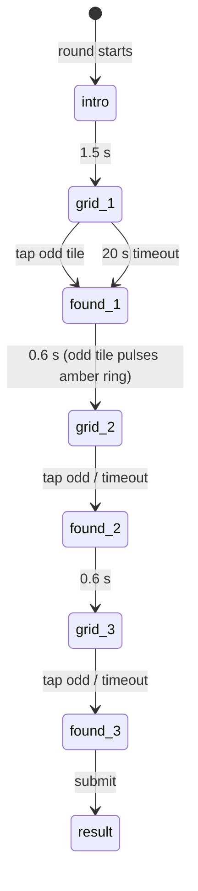

# Game: Odd One Out

Purpose: the complete spec for Odd One Out: rules, flow, timings, difficulty curve, scoring with worked examples, rejection bounds, UI states, theming, accessibility, edge cases and test cases. Shared rules are in `SCORING.md`; if they disagree, `SCORING.md` wins.

Last updated: 2026-09-24

Game id: `odd_one_out` · One-line pitch (COPY `game.ooo.pitch`): "One chevron is different. Find it fast."

---

## 1. Rules

- Three grids of GDG chevrons, each harder. Exactly one tile differs. Tap it.
- A wrong tap adds a **2 s penalty** to that grid and the grid stays up (the tapped tile shakes).
- Each grid has a **20 s timeout**; a timed-out grid counts as 20 s and the next grid appears.
- Total time across the three grids converts to the score.

## 2. Grids and difficulty curve

| Grid | Size | Tiles | Normal tile | Odd tile | Why |
|---|---|---|---|---|---|
| 1 | 4 × 4 | 16 | blue `<` chevron | **amber** `<` chevron | Easy warm-up; colour *and* luminance differ (amber is much lighter), so it works for common colour-vision deficiencies. |
| 2 | 5 × 5 | 25 | blue `<` | blue **`>`** (mirrored) | Shape-only difference, clear at a glance. |
| 3 | 6 × 6 | 36 | blue `<` | blue `<` **rotated 15°** | Subtle; the real test. Rotation is a tunable constant (10°–25°) set at the bright-light test (`TESTING.md` §6). |

Layout rules for small screens under bright light:
- The grid is a square fitting the viewport width minus 2 × 16 px gutters (e.g. 328 px on a 360 px phone), max 480 px.
- Tile gap 8 px (4 × 4, 5 × 5) and 6 px (6 × 6). On a 360 px phone 6 × 6 tiles are ≈ 49 px, above the 44 px touch-target minimum.
- Chevron glyph fills 70 % of the tile; the stroke is thick (≥ 18 % of glyph size) for glare.
- Background off-white, tiles have no border or shadow (less visual noise).
- The odd tile's position is uniformly random, from the per-round seed (so a reload shows the same layout).
- All normal tiles are identical: no jitter or random rotation noise.

## 3. Flow and timings



- `find_ms` is measured from the first animation frame where the grid is painted (`requestAnimationFrame` after render) to the `pointerdown` on the odd tile, via `performance.now()`.
- The 0.6 s "found" transition is not counted.
- Worst case: 3 × 20 s + transitions ≈ 62 s.

## 4. Scoring

`t_i = min(20000, find_ms_i + 2000 × wrong_taps_i)` (timeout → 20000) · `T = Σ t_i` · **`score = round(1000 × clamp((30000 − T) / 28500, 0, 1))`**

| Player | find_ms (grids 1–3) | wrong taps | t (ms) | T | Score |
|---|---|---|---|---|---|
| A (fast) | 700, 1400, 3200 | 0, 0, 0 | 700, 1400, 3200 | 5300 | round(1000 × 24700/28500) = **867** |
| B (typical) | 1500, 3000, 6000 | 0, 0, 0 | 1500, 3000, 6000 | 10500 | round(684.2) = **684** |
| C (one wrong tap) | 1500, 3000, 6000 | 0, 1, 0 | 1500, 5000, 6000 | 12500 | round(614.0) = **614** |
| D (timed out on 3) | 1200, 2500, — | 0, 0, 0 | 1200, 2500, 20000 | 23700 | round(221.1) = **221** |
| E (all timed out) | —, —, — | — | 20000 × 3 | 60000 | **0** |

## 5. Submission and rejection bounds

```json
{
  "$schema": "https://json-schema.org/draft/2020-12/schema",
  "title": "odd_one_out raw",
  "type": "object",
  "required": ["grids"],
  "additionalProperties": false,
  "properties": {
    "grids": {
      "type": "array", "minItems": 3, "maxItems": 3,
      "items": {
        "type": "object",
        "required": ["size", "find_ms", "wrong_taps", "timed_out"],
        "additionalProperties": false,
        "properties": {
          "size":       { "enum": [4, 5, 6] },
          "find_ms":    { "type": "integer", "minimum": 0, "maximum": 20000 },
          "wrong_taps": { "type": "integer", "minimum": 0, "maximum": 50 },
          "timed_out":  { "type": "boolean" }
        }
      }
    }
  }
}
```

Database bounds (`SCORING.md` §4): sizes in order `[4,5,6]`; `wrong_taps` 0–50; non-timed-out `find_ms` 250–20000; timed-out `find_ms` = 20000. 1000 needs T ≤ 1500 ms (under 0.5 s per grid): allowed, but expect real scores to top out in the 900s.

## 6. UI states (phone)

| State | Shows | Input |
|---|---|---|
| `intro` | Title, pitch, "3 grids · each harder" | none |
| `grid_n` | "Grid n of 3" small at top, the grid, nothing else (no visible timer: calmer and faster) | tap tiles |
| `wrong_tap` (overlay, 300 ms) | Tapped tile shakes horizontally 3 × 6 px, "+2 s" floats up | taps still accepted |
| `found_n` | Odd tile gets an amber ring pulse; other tiles dim to 40 % | none |
| `timeout_n` | Odd tile highlighted with an ink ring, "Time's up for this one" (0.6 s) | none |
| `result` | Score large; three rows "Grid 1 · 1.5 s" (+ penalty note); then live round board | none |
| `waiting` | "Waiting for others…" + round board | none |

## 7. Theming

Chevrons are drawn as SVG from the brand chevron shape (not the logo lockup, never the mosaic mark). Blue normal tiles, amber for grid 1's odd tile and for "found" rings. The result screen uses the facing-chevrons framing for the score.

## 8. Accessibility

- Grid 1 difference is colour + lightness; grids 2 and 3 are shape/orientation only, so a player with any colour-vision deficiency can still score well.
- Touch targets ≥ 44 × 44 CSS px (see layout rules); the whole tile is the target, not just the glyph.
- Reduced motion: no shake (the "+2 s" label still appears), no pulse (static ring).
- High-glare: tested at maximum brightness outdoors / under hall lights (`TESTING.md` §6).

## 9. Edge cases

| Case | Behaviour |
|---|---|
| Multi-touch (two fingers) | Only the first `pointerdown` per 100 ms counts. |
| Tap during the 0.6 s transition | Ignored. |
| Reload mid-grid | Same grid (seeded layout) reappears; `find_ms` continues from `gridStartEpoch` (the time spent reloading counts; can't be used to gain time). |
| Screen lock mid-grid | Time keeps counting; if 20 s passed, grid is timed out on return. |
| Round ends early | Current and remaining grids count as timed out; submit. |
| Very small phone (< 340 px wide) | 6 × 6 tiles fall below 44 px: tile gap drops to 4 px; if still < 40 px, the grid may extend under the "Grid n of 3" label (label hides). |

## 10. Test cases

| # | Input | Expected |
|---|---|---|
| OOO-T1 | Example B | 684 |
| OOO-T2 | Example C | 614 |
| OOO-T3 | find_ms 200 on grid 1 (not timed out) | `GD008 ooo.find_ms` |
| OOO-T4 | Sizes `[4,6,5]` | `GD008 ooo.shape` |
| OOO-T5 | Seeded layout identical after reload | same odd-tile index |
| OOO-T6 | 6 × 6 grid on 360 × 640 viewport | tile ≥ 44 px |
| OOO-T7 | Bright-light test: 5 testers find grid 3 odd tile | median ≤ 8 s, no one times out → else raise rotation |
