# Game: Pairs

Purpose: the complete spec for Pairs: rules, board, flow, timings, difficulty curve, scoring with worked examples, rejection bounds, UI states, theming (including the icon set), accessibility, edge cases and test cases. Shared rules are in `SCORING.md`; if they disagree, `SCORING.md` wins.

Last updated: 2026-09-26

Game id: `pairs` · One-line pitch (COPY `game.pairs.pitch`): "Flip two cards at a time. Find all 8 pairs."

Related: ADR-136 (the v3 games), ADR-134 (2) (per-round seeding), `docs/plans/games-v3.md` §3, `docs/games/newgames.md` (the brief, Phase B).

---

## 1. Rules

- A 4 × 4 grid of face-down cards holds **8 pairs** of icons: bug, coffee, terminal, git branch, cloud, lightbulb, rocket, gear.
- Tap a card to flip it, then a second one. A **match** stays face up (with an amber ring). A **mismatch** shows both for **0.7 s**, during which every tap is ignored, then both flip back.
- **60 s** from the board appearing; the game ends early when all 8 pairs are found.
- Score: a clear scores by its time; an unfinished board still scores by the pairs found; every mismatch costs a little.

## 2. Board and difficulty curve

- The board is `layoutFor(seed)` (`src/games/pairs/layout.ts`): a Fisher–Yates shuffle (`Rng.shuffle`) of `[bug, bug, coffee, coffee, …, gear, gear]` over the 16 positions with `Rng("<round seed>:pr:layout")`. Position `i` is row `⌊i / 4⌋`, column `i mod 4`.
- Everyone in the round gets the same board, and a reload shows it again. The same board for the whole round.
- Mechanics are flat; the difficulty is memory load plus the clock. Optimal play needs ≈ 11–12 flip-pairs (some misses are forced: the first sight of each card is a guess); a strong player clears in 30–40 s with 4–6 misses; a typical guest finds 5–7 pairs in 60 s, so a partial board must score.

## 3. Flow and timings

```mermaid
stateDiagram-v2
    [*] --> intro: round starts (3-2-1 done)
    intro --> board: roundStartEpoch + 1.5 s (the 60 s clock starts)
    board --> one_up: tap a face-down card
    one_up --> resolve: tap a second face-down card
    resolve --> board: match (0.3 s amber feedback; both stay up; no lock)
    resolve --> board: mismatch (0.7 s lock, both flip back)
    board --> done: 8 pairs (clear) or 60 s
    done --> [*]: submit
```



| Step | Duration |
|---|---|
| Intro card | 1.5 s, ending at `roundStartEpoch + 1500` (not 1.5 s after mount) |
| Game clock (everything below runs inside it) | 60 s |
| Match feedback (no lock; the next tap is accepted at once) | 0.3 s |
| Mismatch lock (both up, all input ignored) | 0.7 s |
| Worst case total | 1.5 + 60 = 61.5 s → **62 s** (`worstCaseMs = 62_000`, inside the 120 s cap) |

Board clock: `gameStartEpoch = roundStartEpoch + 1500`, fixed, never the time the phone mounted the game or became visible. A phone hidden during the 3-2-1 or the intro therefore still ends its board at `roundStartEpoch + 61.5 s` (worst case 62 s, E15: clocks never pause); if it mounts after `gameStartEpoch` the board appears at once with the time left (and finishes at once if 60 s have passed).

Measurement: `clear_ms` is `Date.now()` at the **`pointerdown`** of the eighth match minus `gameStartEpoch` (the same epoch clock as the 60 s end and the countdown, so a device sleep never shortens it), rounded and capped at 60 000 ms. Taps count on `pointerdown` only.

## 4. Scoring

`p` = pairs found (0–8), `m` = mismatched flip-pairs, `clear_ms` = game-clock time at the eighth match (null unless `p = 8`).

- Cleared (`p = 8`): `base = 1000 − 6 × max(0, clear_ms − 15000) / 1000`.
- Not cleared: `base = 730 − 80 × (8 − p)` (continuous with a clear at exactly 60 s: 1000 − 270 = 730).
- **`score = clamp(round(base − 12 × m), 0, 1000)`**; `p = 0` → 0.

Calibration (`SCORING.md` §3.10, ADR-136): **strong** = a clear in ≈ 34 s with 5 misses → ≈ 825; typical = 6 pairs, 9 misses → 462; **1000** needs a clear in ≤ 15 s with 0 misses (16 taps at ≈ 0.9 s each with no forced miss): out of reach.

| Player | p / m / clear | base | Score |
|---|---|---|---|
| A (strong) | 8 / 5 / 34 200 ms | 1000 − 115.2 = 884.8 | round(824.8) = **825** |
| B (typical) | 6 / 9 / null | 730 − 160 = 570 | **462** |
| C (weak) | 3 / 12 / null | 730 − 400 = 330 | **186** |
| D (idle) | 0 / 0 / null | – | **0** (p = 0 rule) |
| E (fast) | 8 / 3 / 21 500 ms | 1000 − 39 = 961 | **925** |
| F (perfect) | 8 / 0 / 14 000 ms | 1000 | **1000** |
| G (no pair, 5 misses) | 0 / 5 / null | – | **0** (the rule, not 730 − 640 − 60) |

## 5. Submission and rejection bounds

```json
{
  "$schema": "https://json-schema.org/draft/2020-12/schema",
  "title": "pairs raw",
  "type": "object",
  "required": ["matched", "misses", "clear_ms"],
  "additionalProperties": false,
  "properties": {
    "matched":  { "type": "integer", "minimum": 0, "maximum": 8 },
    "misses":   { "type": "integer", "minimum": 0, "maximum": 200 },
    "clear_ms": { "type": ["integer", "null"], "minimum": 0, "maximum": 60000 }
  }
}
```

Database bounds (`SCORING.md` §4, in check order): malformed object/types [`pr.shape`]; `matched` 0–8, `misses` 0–200, `clear_ms` 0–60000 [`pr.range`]; `clear_ms` null iff `matched < 8` [`pr.clear`]; `matched = 0` ⇒ `score = 0` [`pr.zero`]; cleared ⇒ `clear_ms ≥ 4000 + 700 × misses` [`pr.too_fast`]; `|score − clamp(round(base − 12 × misses), 0, 1000)| ≤ 1` with `base` as §4 (`numeric` arithmetic; the ±1 covers rounding) [`pr.formula_band`].

Why: a clear needs 16 taps, and 16 taps at ≥ 250 ms is 4000 ms; every miss adds a 0.7 s lock during which no tap counts. The server never recomputes the score; the band only rejects a score that doesn't follow from the counts. `src/games/pairs/scoring.ts` `validatePairsRaw` mirrors these checks for the unit tests; `supabase/tests/12_score_bounds_pairs.sql` covers them in the database.

## 6. UI states (phone)

| State | Shows | Input |
|---|---|---|
| `intro` | Eyebrow `game.pairs.intro`, title, pitch | none |
| `board` | Countdown bar + seconds (amber tag for the last 5 s); `game.pairs.found` ("Pairs n of 8") small and muted; the 4 × 4 grid (gap `--s-2`, square tiles, 76 px on a 360 px phone) | face-down cards |
| `one_up` | One card face up | another face-down card |
| `resolve`, match (0.3 s) | Both cards keep an amber ring (for the rest of the round) and get a brief amber tint; they stay face up | accepted (the next tap starts a new pair) |
| `resolve`, mismatch (0.7 s) | Both face up with the icon muted; **all input ignored** (the flip-back lock) | ignored |
| `cleared` | Every card face up with its ring, the countdown frozen at the time left, `game.pairs.cleared`; finishes at once | none |
| `done` (60 s or round ended) | The found pairs stay up; every unfound card is shown face down (an open card or a locked mismatch flips down), `game.pairs.times_up` | none |

P7 breakdown (`SCREENS.md` P7): pairs found (`game.pairs.result_pairs`) · misses (`game.pairs.result_misses`) · time (`game.pairs.result_time` with `game.pairs.result_time_value`, or `game.pairs.result_not_cleared`).

Snapshot (persisted through `onProgress` after the board appears and after every flip): `{ phase, gameStartEpoch, faceUp: number[] (0–2 positions), matchedIcons: IconId[], misses, lockUntilEpoch, clearEpoch }`. `clearEpoch` is `gameStartEpoch + clear_ms`. The 0.3 s match tint is display-only and not persisted.

## 7. Theming

- **Icons** (`src/games/pairs/icons.tsx`, `PairsIcon({ id })`): eight hand-drawn inline SVGs, 24 × 24 viewBox, `stroke="currentColor"`, width 2, round caps and joins, no fills, no external assets, in the rounded line style of the brand chevrons (`DESIGN_SYSTEM.md` §7). Drawn in `--primary-text` on a `--surface` face. Generic developer motifs; **no Google (or any) product logo**.
- The silhouettes differ by shape, so colour carries nothing (every icon is the same ink):

| Icon | Silhouette |
|---|---|
| bug | oval body split down the middle, a head cap, two antennae, three legs a side |
| coffee | a rounded cup with a handle on one side, a saucer line, two steam wisps |
| terminal | a framed window with a title bar, a `>` prompt and a `_` cursor |
| branch | three ring nodes: a vertical trunk and one curve forking off to the upper node |
| cloud | a lobed outline on a flat base (small lobe, big lobe, medium lobe) |
| bulb | a round bulb narrowing to a neck, two base lines, a small glint arc inside |
| rocket | an upright pointed body with a round window, two fins, a flame chevron |
| gear | an 8-toothed ring around a round hole |

- **Card back**: `--surface-2`, 1 px `--line-strong`, `--r-control`, with a thin outline of the brand chevron centred on it in `--line-strong` (not the logo).
- **Matched**: amber ring (`--highlight` border plus a 2 px inset) for the rest of the round; the fresh match gets a 0.3 s `--highlight-tint` background.
- **Mismatch lock**: the two icons turn `--text-muted`.
- Countdown bar and number as in Trivia / Color Clash (amber is a fill, never text on paper).

## 8. Accessibility

- Tiles are `<button>`s, 76 px square on a 360 px phone (≥ 48 px enforced by the grid's `minmax`). `aria-label` = the icon name (`game.pairs.icon.<id>`) when face up, `game.pairs.card_back` when face down; `aria-pressed` = matched. The SVGs are `aria-hidden`.
- The icons are distinguishable by shape alone (§7); a colour-blind player loses nothing.
- **Reduced motion**: the flip is a `transform: rotateY` on a two-face card (only `transform` animates). With `prefers-reduced-motion` the board gets `.noFlip` (`data-motion="reduced"`): no rotation, the faces swap instantly; the tokens also zero `--dur-base` (and the host's "Reduce motion" toggle, tokens.css §6.2). The countdown number steps once per second.
- The grid is game geometry: the same order in both languages (`direction: ltr`, as Odd One Out); the texts follow the page language; Western digits.

## 9. Edge cases

| Case | Behaviour |
|---|---|
| Third tap during the 0.7 s lock | Ignored (the lock; PR-T8). A tap arriving after `lockUntilEpoch` but before the late timer resolves the lock first, then counts. |
| Tap on a face-up or matched card | Ignored. |
| Double tap on the same card | The second tap is ignored (the card is already up). |
| Two fingers on two cards at once | Two ordinary flips, in `pointerdown` order. |
| Reload during the lock | Both cards shown up until `lockUntilEpoch`, then flipped back; the miss is already counted (PR-T13). A lock that ended while the page was away resolves at once. |
| Reload with one card up | Restored from `faceUp`; the clock continues from `gameStartEpoch`. |
| Reload or hidden during the intro | The intro shows again until `roundStartEpoch + 1.5 s` (no snapshot is saved before the board appears); the board clock starts at `roundStartEpoch + 1.5 s` regardless, so a late return shows the board with the time left. |
| Screen lock | The clock runs on `gameStartEpoch`, and the clear time includes the lock. On return (`visibilitychange` to visible, or `pageshow`) the board is re-evaluated at once: a passed lock flips back, a passed 60 s finishes with `game.pairs.times_up`, and the countdown re-renders (timers stall while the device sleeps, so the phone never waits for them). |
| Round ended early | Finish now: `matched` so far, `misses`, `clear_ms` null unless cleared; unfound cards go face down. |
| Rotation | The shell's portrait overlay covers the game; the clock keeps running (E16). |
| Clear at the 60 s tick | Taps at or after 60 s are ignored, so a clear is always committed before the clock ends (`clear_ms` < 60000). |
| Language toggle | Hidden during rounds (E17). |
| Shared board | Everyone has the same layout, so a finished player could call out positions (accepted, like Odd One Out's shared grids). A timed-out board is not revealed (open unmatched cards flip down). |

## 10. Test cases

| # | Input | Expected | Where |
|---|---|---|---|
| PR-T1 | Example A | 825 | `scoring.test.ts` |
| PR-T2 | Example B; Example C | 462; 186 | `scoring.test.ts` |
| PR-T3 | Examples D, G | 0 | `scoring.test.ts` |
| PR-T4 | Example E; F | 925; 1000 | `scoring.test.ts` |
| PR-T5 | `clear_ms` 7499 with 5 misses (4000 + 3500 = 7500) | `GD008 pr.too_fast`; 7500 accepted | `scoring.test.ts`, `12_score_bounds_pairs.sql` |
| PR-T6 | Example A with score 827 | `GD008 pr.formula_band`; 824–826 accepted | `scoring.test.ts`, `12_score_bounds_pairs.sql` |
| PR-T7 | `matched` 8 with `clear_ms` null; `matched` 9 | `GD008 pr.clear`; `GD008 pr.range` | `scoring.test.ts`, `12_score_bounds_pairs.sql` |
| PR-T8 | Tap a third card 300 ms into a mismatch lock | ignored; after 700 ms both are face down and the tap works | `Pairs.test.tsx` |
| PR-T9 | Same seed | the same 16-icon layout; each icon exactly twice | `layout.test.ts` |
| PR-T10 | Match | both stay up, `matched + 1`, the next tap accepted after 0 ms | `Pairs.test.tsx` |
| PR-T11 | Idle player | score 0 at 60 s, finished by 62 s | `Pairs.test.tsx`, `worstCase.test.tsx` |
| PR-T12 | Icon review | all eight silhouettes distinct at 40 px on a phone; none resembles a product logo | manual checklist below |
| PR-T13 | Reload during the lock | both cards up until `lockUntilEpoch`; then down; `misses` unchanged | `Pairs.test.tsx` |
| PR-T14 | Playtest, 5 strong players | median 780–900, nobody 1000 → else retune 6 / 12 / 80 (ADR-136) | playtest |
| PR-T15 | Device sleep: 30 s mid-game then clear; live sleep across the 60 s end; sleep across a lock end; timeout with a mismatch up; mount 30 s after the round start | `clear_ms` includes the sleep and the countdown never jumps up; finishes (`times_up`) at once on `visibilitychange`; the pair flips back at once; both tiles down; board at `roundStartEpoch + 1500` with 31.5 s left | `Pairs.test.tsx` |

PR-T12 checklist (at the contrast pass and on a real phone, `/__preview` Pairs fixtures, EN and AR, light and dark):

- [ ] Every icon reads at 40 px, stroke not thinner than the chevron outline on the back.
- [ ] No two icons can be confused at a glance: bug vs gear (legs vs teeth), cloud vs bulb (flat base vs neck + lines), rocket vs bulb (pointed vs round top), terminal (the only rectangle), branch (the only open node diagram), coffee (the only handle).
- [ ] None resembles a product logo (no Git diamond, no Chrome/Android/Firebase/Cloud shapes, no four-colour fill).
- [ ] Face-down backs show only the chevron outline, never the logo.
- [ ] Matched rings are visible in both themes; the muted lock icons stay readable.
