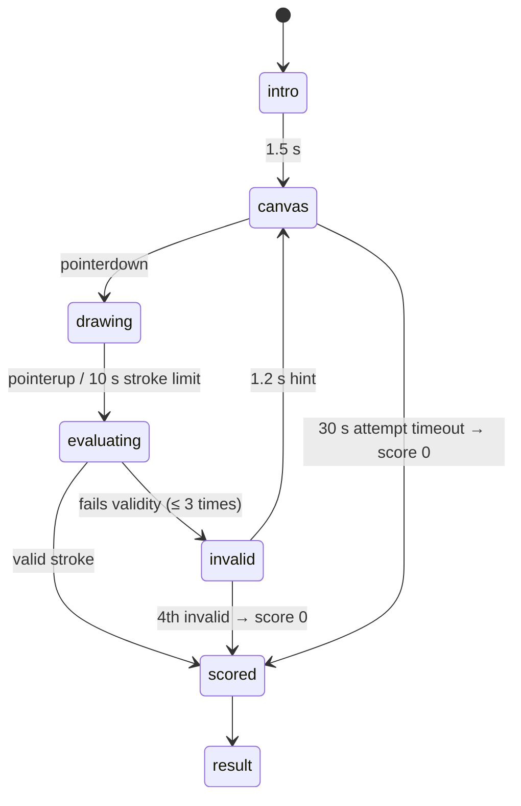

# Game: Perfect Circle

Purpose: the complete spec for Perfect Circle: rules, flow, timings, the exact roundness and closure metric, minimum size, scoring with worked examples, rejection bounds, UI states, theming, accessibility, edge cases and test cases. Shared rules are in `SCORING.md`; if they disagree, `SCORING.md` wins.

Last updated: 2026-09-24

Game id: `perfect_circle` · One-line pitch (COPY `game.pc.pitch`): "Draw one circle with your finger. How round can you go?"

---

## 1. Rules

- The player draws **one circle** with one finger on a square canvas.
- **One scored attempt.** Justification: the game takes seconds, so a second attempt would mostly reward luck, and one attempt keeps the round short while others finish slower games.
- A stroke that is **too small, too short, not closed enough, or loops too far** is rejected with a hint and **doesn't use up the attempt**, up to **3 invalid strokes**. After the 3rd invalid stroke, the next valid stroke still counts; a 4th invalid stroke ends the attempt with score 0.
- The whole attempt has a **30 s timeout** (from the canvas appearing, after the 1.5 s intro); a single stroke is cut off after **10 s**. A stroke still in progress at 30 s is judged as drawn so far; if it's invalid the attempt ends timed out.

## 2. Flow and timings



- Points are collected from `pointermove` with `getCoalescedEvents()` where supported (smoother on fast strokes), in CSS pixels relative to the canvas.
- Only the first pointer counts; other pointers are ignored.
- `stroke_ms` = time from `pointerdown` to `pointerup`.

## 3. Validity rules (checked in order)

Canvas: a square of side `S = min(viewport width − 32, viewport height × 0.6)` CSS px.

| # | Rule | Hint shown (COPY key) |
|---|---|---|
| V1 | ≥ 20 raw points and `stroke_ms ≥ 300` | "Draw a full circle" (`game.pc.hint.short`) |
| V2 | Diameter `2 r̄ ≥ max(100, 0.35 × S)` px | "Bigger!" (`game.pc.hint.small`) |
| V3 | Swept angle around the centroid `sweep ≥ 300°` | "Close your circle" (`game.pc.hint.open`) |
| V4 | `sweep ≤ 450°` | "Just one loop" (`game.pc.hint.loops`) |

`r̄` and the centroid for V2–V4 are computed as in §4 below.

## 4. Metric

1. **Resample** the raw stroke to 64 points at the **midpoints** of 64 equal arc-length intervals (sample k at (k + ½)·L/64), so a closed stroke doesn't count its start point twice.
2. **Centroid** `c` = mean of the 64 points.
3. **Sweep**: unwrap the angle `atan2(p − c)` from the stroke's real first raw point, through the samples, to its real last raw point, and take `|θ_last − θ_first|` in degrees. Note: the sweep is measured around the stroke's own centroid, which for an open arc sits off the true circle centre, so a drawn arc sweeps a little more than its geometric angle (a 300° drawn arc ≈ 309° around its centroid; the V3 cut-off of 300° corresponds to a drawn arc of ≈ 286°).
4. If `sweep > 360°`, trim the raw stroke at the point where 360° is reached, then repeat steps 1–2 on the trimmed stroke (so an overlapping tail doesn't distort the shape).
5. Radii `r_k = |p_k − c|`, mean `r̄`, population standard deviation `σ_r`.
6. Roundness error **`ε = σ_r / r̄`**.
7. **Roundness** `R = clamp(1 − ε / 0.20, 0, 1)`: ε = 0 is perfect; ε ≥ 0.20 (radius varies ±20 %) scores 0.
8. **Closure** `C = min(sweep, 360) / 360`.
9. **`score = round(1000 × R × C)`**.

Why this metric: the coefficient of variation of the radius is scale-free (big and small circles are judged the same), easy to test, and matches what people see as "round". Closure is a separate factor so a round-but-open arc can't win.

## 5. Scoring examples

| Stroke | ε | sweep | R | C | Score |
|---|---|---|---|---|---|
| Very good circle | 0.030 | 358° | 0.850 | 0.9944 | round(845.3) = **845** |
| Typical | 0.065 | 345° | 0.675 | 0.9583 | round(646.9) = **647** |
| Egg shape | 0.120 | 360° | 0.400 | 1.0 | **400** |
| Open arc (drawn ≈ 300°) | 0.150 | 309° | 0.250 | 0.8583 | round(214.6) = **215** |
| Square-ish | 0.210 | 360° | 0 | 1.0 | **0** |
| 4 invalid strokes / timeout | — | — | — | — | **0** |
| Scripted perfect | 0.000 | 360° | 1 | 1 | 1000 → **rejected** (> 975) |

## 6. Submission and rejection bounds

```json
{
  "$schema": "https://json-schema.org/draft/2020-12/schema",
  "title": "perfect_circle raw",
  "type": "object",
  "required": ["epsilon", "sweep_deg", "diameter_px", "stroke_ms", "invalid_strokes", "timed_out"],
  "additionalProperties": false,
  "properties": {
    "epsilon":         { "type": ["number", "null"], "minimum": 0 },
    "sweep_deg":       { "type": ["number", "null"], "minimum": 0, "maximum": 450 },
    "diameter_px":     { "type": ["number", "null"], "minimum": 0 },
    "stroke_ms":       { "type": ["integer", "null"], "minimum": 0, "maximum": 10000 },
    "invalid_strokes": { "type": "integer", "minimum": 0, "maximum": 4 },
    "timed_out":       { "type": "boolean" }
  }
}
```

`timed_out = true` covers both the 30 s timeout and the 4th invalid stroke (then the metric fields are `null`). Database bounds (`SCORING.md` §4): `invalid_strokes` 0–4 (0–3 unless timed out); timed out ⇒ score 0; otherwise `epsilon ≥ 0.005`, `sweep_deg` 300–450, `stroke_ms` 300–10000, `score ≤ 975`.

## 7. UI states (phone)

| State | Shows | Input |
|---|---|---|
| `intro` | Title, pitch, "One circle · one try" | none |
| `canvas` | Square canvas, faint centre dot, "Draw!" label, "Tries left for a clean circle" only after an invalid stroke | draw |
| `drawing` | Live stroke painted with the mosaic texture (§8) | draw |
| `invalid` | Stroke fades out, hint in large text (1.2 s) | none |
| `scored` | Stroke stays; a best-fit reference circle is drawn thin in ink over it; score ring animates 0 → score with colour blue → amber | none |
| `result` | Score large, "Roundness 85 % · Closed 99 %", then live round board | none |

## 8. Theming

- The stroke is filled with the **mosaic texture**: a repeating pattern of small blue/amber shards (from the shatter effect's shard set, `DESIGN_SYSTEM.md` §6), not a flat line. Stroke width 10 px.
- Score ring: a circular progress ring whose colour interpolates **blue → amber** as the score rises (0 = blue, 1000 = amber), in the palette tokens only.
- Canvas background off-white; no grid.

## 9. Accessibility

- Canvas at least 280 × 280 CSS px (on a 320 px phone `S = 288`).
- The game needs fine motor control; this is inherent. Players who can't draw can still play the other two games in the lineup, and a round without a score simply gets no row (ADR-014).
- Reduced motion: the score ring jumps to its value instead of animating.
- Screen readers: the result is read as "Score 845. Roundness 85 percent, closed 99 percent."

## 10. Edge cases

| Case | Behaviour |
|---|---|
| Second finger touches during the stroke | Ignored; the stroke continues with the first pointer. |
| Stroke leaves the canvas | Points outside are clamped to the edge; the stroke continues until `pointerup`. |
| Page scroll/zoom gestures | Canvas has `touch-action: none`; the page can't scroll while drawing. |
| Rotation / resize mid-stroke, or `pointercancel` | The stroke is discarded without using an invalid try; the canvas resizes only if its side S actually changes (the mobile URL bar showing/hiding doesn't discard a stroke). |
| Reload mid-stroke | Stroke lost, not counted as invalid; attempt timer continues from `attemptStartEpoch`. |
| Very slow stroke (> 10 s) | Cut at 10 s and evaluated as is. |
| Round ends early | If no valid stroke yet: `timed_out = true`, score 0. |

## 11. Test cases

Metric tests use synthetic strokes (generated point lists), not a device.

| # | Input | Expected |
|---|---|---|
| PC-T1 | Perfect synthetic circle r = 100, 360°, 200 points | ε < 0.001, client score 1000, server rejects `pc.too_perfect` |
| PC-T2 | Circle with radius noise ±6 % uniform, mean over 50 seeds | mean ε ≈ 0.035 ± 0.01, mean score 775–875 (single strokes vary more) |
| PC-T3 | Ellipse a = 120, b = 80 | ε ≈ 0.14, score 260–340 |
| PC-T4 | Arc sweeping 300° around its centroid | valid, C = 0.8333 |
| PC-T5 | Arc sweeping 290° around its centroid | invalid V3 |
| PC-T6 | 460° spiral | invalid V4 |
| PC-T7 | Diameter 90 px on a 360 px phone | invalid V2 |
| PC-T8 | 1.5 loops (540°) | invalid V4 |
| PC-T9 | 4 invalid strokes | score 0, `timed_out = true`, accepted |
| PC-T10 | Same stroke scaled ×2 | same score (scale-free) |
