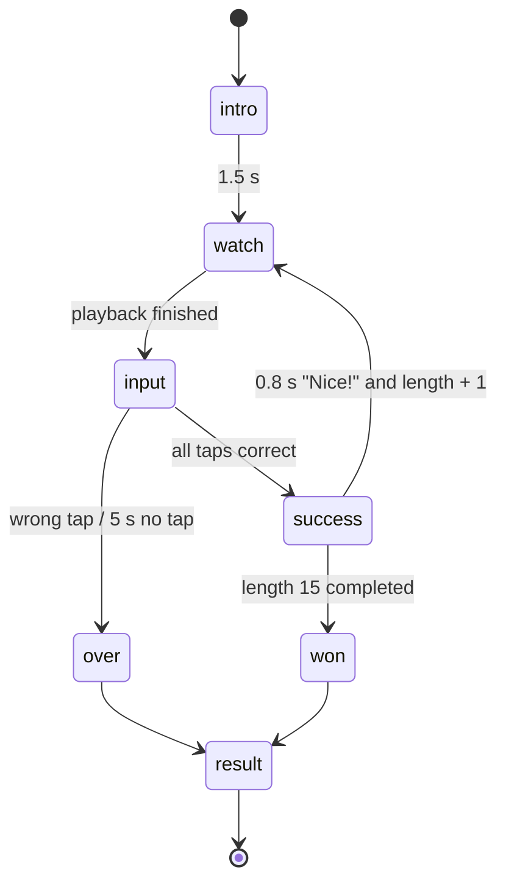

# Game: Simon

Purpose: the complete spec for Simon: rules, flow, timings, difficulty curve, scoring with worked examples, rejection bounds, UI states, theming, accessibility, edge cases and test cases. Shared rules are in `SCORING.md`; if they disagree, `SCORING.md` wins.

Last updated: 2026-09-24

Game id: `simon` · One-line pitch (COPY `game.simon.pitch`): "Watch the pads light up, then repeat the pattern."

---

## 1. Rules

- Four pads flash a sequence; the player taps it back in the same order.
- The first sequence has **length 3**. Each correct repetition adds one step (the sequence keeps its prefix and appends one random pad).
- **One mistake ends the turn.** So does a **5 s** pause before any tap (per-tap timeout).
- Completing **length 15** ends the game as a win. The 120 s round cap also ends it.
- Score = the longest length completed, plus a small speed bonus that only breaks ties.

## 2. Pads

A 2 × 2 grid. Each pad differs by **position and shape**, not colour alone (ADR-026):

| Position | Shape (rounded chevron tip pointing…) | Colour (Google) | Label for screen readers |
|---|---|---|---|
| top-left | up ▲ | blue | "Up" |
| top-right | right ▶ | red | "Right" |
| bottom-left | left ◀ | yellow | "Left" |
| bottom-right | down ▼ | green | "Down" |

Flash = pad brightens to 100 % lightness boost, scales to 1.06, and shows a thick ink outline (3 px). The outline and scale carry the signal for players who can't separate the colours.

Sequence generation: uniform random pad per step from the per-round seed, rejecting a third identical pad in a row.

## 3. Flow and timings



| Constant | Value |
|---|---|
| Flash on time at length L | `max(250, 450 − 20 × (L − 3))` ms (450 at L = 3, 250 from L = 13) |
| Gap between flashes | 150 ms |
| Pause between sequences | 800 ms |
| Per-tap timeout | 5000 ms from end of playback / from the previous tap |
| Max length | 15 |

A fast player reaching length 15 needs ≈ 117 s, so the 120 s cap is the true ceiling. If the cap hits mid-sequence, that sequence doesn't count (`ended = "cap"`).

Input gap `g` measurement: `performance.now()` at the end of each playback and at each `pointerdown`; the gaps of completed sequences are averaged.

## 4. Scoring

`L` = longest completed length (0 if the length-3 sequence failed) · `B = round(40 × clamp((1200 − g) / 950, 0, 1))` if L ≥ 3 else 0 · **`score = 64 × L + B`**

| Player | Completed up to | Mean gap g | B | Score |
|---|---|---|---|---|
| A (strong) | 12 | 420 ms | round(40 × 0.8211) = 33 | 768 + 33 = **801** |
| B (typical) | 8 | 600 ms | round(40 × 0.6316) = 25 | 512 + 25 = **537** |
| C (typical, slower) | 8 | 900 ms | round(40 × 0.3158) = 13 | 512 + 13 = **525** |
| D (failed first) | — | — | 0 | **0** |
| E (perfect run) | 15 (won) | 250 ms | 40 | 960 + 40 = **1000** |
| F (just 3) | 3 | 1300 ms | 0 | **192** |

B and C show the bonus doing its job: same length, faster player ranks higher; one extra level (64) always beats any bonus (≤ 40).

## 5. Submission and rejection bounds

```json
{
  "$schema": "https://json-schema.org/draft/2020-12/schema",
  "title": "simon raw",
  "type": "object",
  "required": ["level", "avg_gap_ms", "taps", "ended"],
  "additionalProperties": false,
  "properties": {
    "level":      { "type": "integer", "enum": [0, 3, 4, 5, 6, 7, 8, 9, 10, 11, 12, 13, 14, 15] },
    "avg_gap_ms": { "type": ["integer", "null"], "minimum": 0, "maximum": 5000 },
    "taps":       { "type": "integer", "minimum": 0, "maximum": 200 },
    "ended":      { "enum": ["mistake", "timeout", "cap", "won"] }
  }
}
```

Database bounds (`SCORING.md` §4): level 0 or 3–15; level 0 ⇒ score 0; level ≥ 3 ⇒ `avg_gap_ms ≥ 120` and `0 ≤ score − 64 × level ≤ 40`; `won` ⇔ level 15; `duration_ms ≥ min_playback_ms(level)` (sum of playback times up to that level: e.g. 26 720 ms for level 10, 53 400 ms for level 15).

## 6. UI states (phone)

| State | Shows | Input |
|---|---|---|
| `intro` | Title, pitch, "Starts at 3 · one mistake ends it" | none |
| `watch` | Pads, "Watch…" label, current length "Length 5" | pads disabled |
| `input` | Pads active, "Your turn", step dots (● ● ○ ○ ○) filling as they tap | pads |
| `success` | "Nice!" 0.8 s, dots turn amber | none |
| `over` | The wrong pad shakes; the correct one flashes once; "Reached length 7" | none |
| `won` | Shatter celebration, "You beat Simon!" | none |
| `result` | Score large, "Length 7 · speed bonus +25", then live round board | none |

## 7. Theming

The only screen using Google's four colours (ADR-026). Everything around the pads (header, labels, result) uses the GDG palette. Pads are rounded chevron tips, a nod to the logo's chevrons, never the logo itself.

## 8. Accessibility

- Shape + position + outline on flash; colours are a bonus cue.
- Each pad ≥ 120 × 120 CSS px on a 360 px phone.
- Sound is **off** (booth noise, shared space); optional short vibration on tap where supported (`navigator.vibrate`, not available on iOS Safari; not relied on).
- Reduced motion: no scale on flash (outline + brightness only), no shake.

## 9. Edge cases

| Case | Behaviour |
|---|---|
| Tap during `watch` | Ignored (pads disabled, no penalty). |
| Two fingers on two pads | First `pointerdown` counts; second within 80 ms ignored. |
| Reload during `watch` or `input` | Same seed; replays the current sequence from the start of `watch`; completed length kept. The per-tap timer restarts; the round clock doesn't. |
| Screen lock | On return, if the 5 s per-tap timeout passed → `over` with `ended = "timeout"`. |
| Round ends early | Completed length counts; `ended = "cap"`. |

## 10. Test cases

| # | Input | Expected |
|---|---|---|
| SIM-T1 | Example A | 801 |
| SIM-T2 | level 16 | rejected by schema/`GD008 simon.level` |
| SIM-T3 | level 10, score 700 (64 × 10 = 640, diff 60) | `GD008 simon.formula_band` |
| SIM-T4 | level 10, duration_ms 20000 | `GD008 simon.too_fast` (min 26 720) |
| SIM-T5 | avg_gap_ms 100, level 5 | `GD008 simon.gap` |
| SIM-T6 | on-time table: L = 3 → 450, L = 12 → 270, L = 13 → 250, L = 15 → 250 | matches |
| SIM-T7 | Colour-blind simulation (Chrome DevTools deuteranopia/protanopia/tritanopia): 3 testers identify every flash | 100 % |
