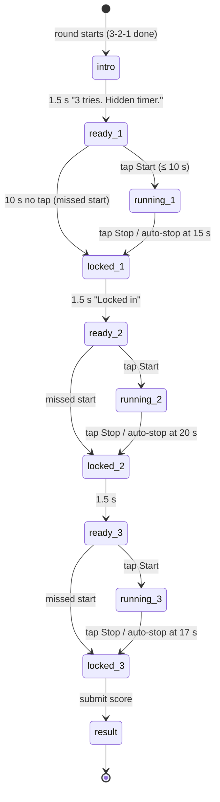

# Game: Stop the Clock

Purpose: the complete spec for Stop the Clock: rules, flow, timings, scoring with worked examples, rejection bounds, UI states, theming, accessibility, edge cases and test cases. It is the first game built (Phase 1) because it is the simplest and proves the whole join → play → submit → leaderboard pipeline. Shared rules are in `SCORING.md`; if they disagree, `SCORING.md` wins.

Last updated: 2026-09-24

Game id: `stop_the_clock` · One-line pitch (COPY `game.stc.pitch`): "No clock, no hints. Stop it when you feel the time is up."

---

## 1. Rules

- Three attempts with fixed targets, in order: **5 s, 10 s, 7 s** (same for every player, ADR-025).
- For each attempt the phone shows the target, the player taps **Start**, and the timer runs **completely hidden**: no numbers, no bar, no ticking, no animation, no sound, no haptics.
- The player taps **Stop** when they think the target time has passed.
- **Auto-stop** at target + 10 s (15 s, 20 s, 17 s): the attempt is recorded as maximum error.
- **Missed start**: if Start isn't tapped within 10 s, the attempt is recorded as maximum error and the next one begins.
- **No feedback** about accuracy until all three attempts are done. After the third, the player sees their score and their three guesses.
- At the end of the round, the big screen reveals everyone's guesses together.

## 2. Flow and timings



| Step | Duration |
|---|---|
| Intro card | 1.5 s |
| Ready (waiting for Start) | ≤ 10 s |
| Running | player-controlled, auto-stop at target + 10 s |
| "Locked in" card between attempts | 1.5 s |
| Worst case total | ≈ 85 s (inside the 120 s cap) |

Measurement:
- Start and Stop are measured on **`pointerdown`** (not `click`), using `performance.now()`; `measured_ms = round(stop − start)`.
- On Start, the phone also stores `attemptStartEpoch = Date.now()` (for reload, `SESSION_LIFECYCLE.md` §4.1).
- The Stop button is the same size and position as Start; the screen does not change in any time-revealing way while running (the label switches from "Start" to "Stop" once, at the moment of the tap).

## 3. Difficulty

Fixed. The difficulty comes from the growing and non-monotonic targets (5 → 10 → 7). No adaptive changes, so every player's guesses are comparable in the reveal.

## 4. Scoring

`e_i = min(10000, |measured_i − target_i|)` (missed start or auto-stop → 10000) · `E = Σ e_i` · **`score = round(1000 × max(0, 1 − E / 6000))`**

Worked examples:

| Player | Guesses (ms) | Errors (ms) | E | Score |
|---|---|---|---|---|
| A (sharp) | 5120, 9800, 7050 | 120, 200, 50 | 370 | round(1000 × 0.93833) = **938** |
| B (typical) | 5400, 10700, 6600 | 400, 700, 400 | 1500 | round(1000 × 0.75) = **750** |
| C (rushed) | 3900, 8200, 5800 | 1100, 1800, 1200 | 4100 | round(1000 × 0.31667) = **317** |
| D (missed one start) | 5100, missed, 7200 | 100, 10000, 200 | 10300 | **0** |
| E (auto-stop on 2nd) | 5000, 20000 (auto), 7000 | 0, 10000, 0 | 10000 | **0** |
| F (bot-perfect) | 5000, 10000, 7000 | 0, 0, 0 | 0 | 1000 → **rejected** (> 990) |

## 5. Submission and rejection bounds

`raw` JSON Schema:

```json
{
  "$schema": "https://json-schema.org/draft/2020-12/schema",
  "title": "stop_the_clock raw",
  "type": "object",
  "required": ["attempts"],
  "additionalProperties": false,
  "properties": {
    "attempts": {
      "type": "array", "minItems": 3, "maxItems": 3,
      "items": {
        "type": "object",
        "required": ["target_ms", "measured_ms", "missed_start"],
        "additionalProperties": false,
        "properties": {
          "target_ms":    { "enum": [5000, 10000, 7000] },
          "measured_ms":  { "type": ["integer", "null"], "minimum": 0, "maximum": 20000 },
          "missed_start": { "type": "boolean" }
        }
      }
    }
  }
}
```

Database bounds (`SCORING.md` §4): targets in order `[5000,10000,7000]`; `measured_ms` null iff `missed_start`; `0 ≤ measured_ms ≤ target + 10000`; `score ≤ 990`.

## 6. UI states (phone)

| State | Shows | Input |
|---|---|---|
| `intro` | "Stop the Clock" title, pitch line, "3 tries · hidden timer" | none |
| `ready_n` | "Try n of 3", target in huge digits ("5 seconds"), big **Start** button | Start |
| `running_n` | Same layout, huge target stays, button label **Stop**; nothing moves | Stop |
| `locked_n` | "Locked in ✓" (no accuracy info), "Next: 10 seconds" | none |
| `result` | Score large (count-up), the 3 guesses vs targets as three rows ("5.00 → 5.40 s"), then live round board | none |
| `waiting` | After result: "Waiting for others…" + live round board + x/y finished | none |

Big screen during the round: live round board (scores only, guesses hidden until the round ends), "x/y finished", time left in the round, next code in the corner.

**Big-screen reveal** (first 7 s of the intermission, replaces the plain round board for this game): three horizontal strips, one per target, each with a centre line at the target and one dot per player at their guess (±5 s window; off-window dots pinned to the edge). The top 5 players' dots are labelled with names. Dots shatter in per strip (5 s, 10 s, 7 s) using the mosaic effect.

## 7. Theming

- Ready/running screens: off-white background, target number in blue, button in blue with the chevron-edge shape; nothing animated while running.
- Result: guesses listed in ink; the closest guess highlighted amber.
- Reveal uses the shatter motif (`DESIGN_SYSTEM.md` §6), never the logo.

## 8. Accessibility

- Start/Stop button: at least 160 × 160 CSS px, centred in the lower half for one-thumb use.
- No reliance on colour: guesses show numbers.
- Reduced motion: reveal dots fade in instead of shattering.
- The hidden timer is inherently accessible (no visual timing), but screen readers must not announce anything while running (no live-region updates).

## 9. Edge cases

| Case | Behaviour |
|---|---|
| Double tap on Start | First `pointerdown` starts; the next `pointerdown` within 150 ms is ignored (debounce) so a bounce can't stop instantly. |
| Reload while running | Resumes `running_n` with `measured` = `Date.now() − attemptStartEpoch` at Stop (precision drops to Date.now resolution for that attempt; acceptable). If auto-stop time has passed, records auto-stop. |
| Reload in `ready_n` | Ready window restarts from the stored `readyStartEpoch` (not reset). |
| Screen lock while running | Timer keeps counting (epoch). On return, if past auto-stop, the attempt is auto-stopped. |
| Round ends early (force-end) | Current attempt: if running, measured = time so far; remaining attempts = missed start. Submit. |
| Tap outside the button | Ignored. |

## 10. Test cases

| # | Input | Expected |
|---|---|---|
| STC-T1 | Guesses 5000, 10000, 7060 | E = 60, score 990, accepted |
| STC-T2 | Guesses 5000, 10000, 7050 | E = 50, score 992 → `GD008 stc.score_above_990` (the bound is on the score, not on E) |
| STC-T3 | Example B above | 750 |
| STC-T4 | All three missed starts | 0, `measured_ms` all null, accepted |
| STC-T5 | Submit `measured_ms` 20001 on target 10000 | `GD008 stc.range` |
| STC-T6 | Submit only 2 attempts | `GD008 stc.shape` |
| STC-T7 | Reload during running attempt 2 | resumes attempt 2; attempt 1 result kept |
| STC-T8 | No visual change on the running screen for 20 s (screenshot diff every 1 s) | identical frames |
| STC-T9 | Double tap within 100 ms | only Start registered |
