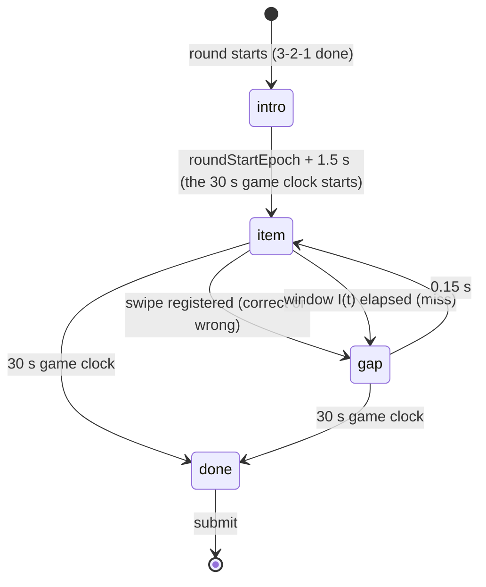

# Game: Swipe Sort

Purpose: the complete spec for Swipe Sort: rules, flow, timings, the gesture and the browser-gesture defence, difficulty curve, scoring with worked examples, rejection bounds, UI states, theming, accessibility, edge cases (including the iOS ones) and test cases. Shared rules are in `SCORING.md`; if they disagree, `SCORING.md` wins.

Last updated: 2026-09-26

Game id: `swipe_sort` · One-line pitch (COPY `game.swipe_sort.pitch`): "Blue goes left, amber goes right. Faster and faster."

Related: ADR-139 (the longer item window, 1100 → 600 ms), ADR-136 (this game, its brief deviations and constants), ADR-134 (per-round seeding), `docs/plans/games-v3.md` §2 (the plan), `docs/games/newgames.md` (the brief, Phase B), `color-clash.md` §7 (the colour pair).

---

## 1. Rules

- Chevrons appear one at a time in the middle of a swipe surface. Swipe **left for blue**, **right for amber**.
- **Second cue:** a blue chevron always points left (`<`), an amber one right (`>`), so the shape agrees with the colour and the game is playable without colour vision (§7).
- Each chevron lives for a shrinking **window**; not swiping in time is a **miss**. Swiping the wrong way is a **wrong** item.
- The game lasts **30 s** from the first chevron. Score: correct items minus wrong and missed ones, plus a small speed bonus.
- Left and right are **physical screen sides**, the same in Arabic and English: the surface is game geometry and never mirrors (§8).

## 2. Items and difficulty curve

- Item `k` (0-based) comes from `Rng("<round seed>:ss:item<k>")`: its colour (50/50 blue/amber) and a small tilt of −12…+12° for variety (`src/games/swipe-sort/items.ts`). Everyone in a round gets the same sequence and a reload shows the same item again; only the pace differs (a faster player sees more items).
- The item window ramps linearly from 1100 ms to 600 ms over the 30 s (ADR-139):

  `I(t) = round(1100 − 500 × t / 30000)` ms, where `t` is the item's onset on the game clock (clamped to 0…30 s): `I(0) = 1100`, `I(15000) = 850`, `I(30000) = 600`.

- The first ten seconds are relaxed; the last ten still leave room above choice-reaction time plus the finger's travel. Cadence = swipe time + 150 ms gap, so the tempo is the player's own: a swipe ends its item at once, so a longer window only helps a slower swipe.
- **Window 1100 → 600 ms** (ADR-139, team request 2026-09-26: "a bit more time for each one"). It was 900 → 450 ms (ADR-136 (4)), itself above the brief's ≈ 350 ms floor because choice reaction time is 340–410 ms plus the finger's travel. Tune only with playtest evidence (SS-T14).

## 3. Flow, timings and the gesture



| Step | Duration |
|---|---|
| Intro card | 1.5 s, ending at `roundStartEpoch + 1500` (not 1.5 s after mount) |
| Game clock (everything below runs inside it) | 30 s |
| Item window `I(t)` | 1100 → 600 ms (§2) |
| Gap after every item (the chevron flies off / fades; feedback) | 0.15 s |
| Worst case total | 1.5 + 30 ≈ **32 s** (`worstCaseMs = 32_000`, inside the 120 s cap) |

The timeline is epoch-exact (`timeline.ts`): item `k + 1`'s onset is item `k`'s gap end, and a missed item's gap starts at its deadline. An idle player therefore misses exactly **30** items (37 on the pre-ADR-139 900 → 450 ms window, as in `docs/plans/games-v3.md`); an item or gap still open at the 30 s mark doesn't count.

The game clock is anchored on the round start: `gameStartEpoch = itemStartEpoch(0) = roundStartEpoch + 1500`, never the time the phone mounted the game or became visible. A phone hidden during the 3-2-1 or the intro (or mounting late) lands on that epoch; the windows that already elapsed are counted as misses in order (the same catch-up as a screen lock), and the game still ends at `roundStartEpoch + 31.5 s` (worst case 32 s).

**Gesture** (`gesture.ts`, a pure reducer, plus the component's pointer handlers):

- `pointerdown` on the surface while an item is live starts a drag (`setPointerCapture`). Only one pointer is tracked (`pointerId`); a second finger is ignored. Presses during the intro or a gap are ignored.
- On `pointermove`, the moment `|dx| ≥ 40 px` and `|dx| > |dy|`, the swipe **registers** in the sign of `dx`. That instant is the measurement: `swipe_ms = performance.now()` at registration − the item's onset (epoch fallback, back-dated, after a reload), capped at the item's window. The rest of that drag does nothing.
- Anything else registers nothing and the item keeps its window: a release before 40 px, a mostly vertical drag, `pointercancel` (the browser took the gesture).
- A drag only ever sorts the item it started on: if the item times out mid-drag, the drag can't sort the next one, and the next chevron doesn't follow it (it stays centred). A swipe that registers but can't count (the item already missed, the window or the clock just ran out) springs the chevron back.
- `mean_swipe_ms` = the rounded mean `swipe_ms` over **correct** items.
- There is **no tap fallback** (tap-left / tap-right halves): the plan doesn't specify one, and a tap would skip the 40 px of travel that the `ss.too_fast` floor assumes. The catch labels are labels, not buttons.

**Browser-gesture defence** (the brief's risk; all set while the game is mounted and removed on unmount):

1. `touch-action: none` (and `overscroll-behavior: none`) on the swipe surface: no scroll, zoom or pan starts from it.
2. A **non-passive `touchmove`** listener on the game root calls `preventDefault()` for every touch that started on the surface or while a drag is tracked (pull-to-refresh on iOS < 16 and Chrome, horizontal history swipes).
3. `overscroll-behavior: none` on `<html>` and `<body>` (inline style, previous value restored on unmount): no pull-to-refresh or rubber band on the page.
4. The surface is inset by **`--swipe-safe-inset` (24 px)** from both viewport edges (the game's own inline padding), and a **non-passive `touchstart` edge guard** calls `preventDefault()` only for touches that start in the 24 px edge band; the reducer also never starts a drag for a press there. iOS's edge-swipe-back cannot be blocked from a page, so such a touch simply never scores.
5. `user-select: none` and `-webkit-touch-callout: none` on the surface (no text selection or long-press callout).

The same applies to iOS Chrome (WKWebView).

## 4. Scoring

`c` = correct, `w` = wrong direction, `m` = missed, `net = c − w − m`, `r̄ = mean_swipe_ms`.

- Speed bonus `B = 60 × clamp((700 − r̄) / 300, 0, 1) × clamp(net / 20, 0, 1)` when `c ≥ 1`, else 0 (full at ≤ 400 ms mean and net ≥ 20; 0 at ≥ 700 ms). The `net / 20` factor keeps a random swiper (expected net 0) at ≈ 0.
- **`score = clamp(round(22 × net + B), 0, 1000)`**; `c = 0` → 0.

Calibration (`SCORING.md` §3.9). On the original 900 → 450 ms window a **strong** player (swipes registering at ≈ 450 ms, SD 80, 2 % wrong) sorted ≈ 49 items with the misses in the last third where `I(t) < 550` → ≈ 43 / 1 / 5 → **≈ 864**; typical (550 ms, 5 %) ≈ 33 / 3 / 8 → ≈ 514. **With the ADR-139 window (1100 → 600 ms)** the strong player's swipe times are unchanged (a swipe ends its item early), but those late misses mostly disappear: only a swipe slower than ≈ 600 ms misses (≈ 3 % at SD 80). Re-modelled with the same assumptions (Monte Carlo, swipe times normal and capped at the window): strong ≈ 49 / 1 / 0 → net ≈ 48 → **1000 (capped)** in most runs; typical ≈ 39 / 2 / 2 → **≈ 815**; weak (640 ms, SD 120, 10 %) ≈ 30 / 3 / 5 → ≈ 490. **1000** needs `22 × net + B ≥ 999.5` (net 43 at ≤ 430 ms, net 44 at ≤ ≈ 540 ms, or net ≥ 46 at any speed): no longer out of reach for strong players. The playtest (SS-T14) decides whether the 22 per net needs retuning (ADR-139).

| Player | c / w / m | `r̄` (ms) | net | B | Score |
|---|---|---|---|---|---|
| A (strong) | 43 / 1 / 5 | 450 | 37 | 60 × 0.833 × 1 = 50 | round(864) = **864** |
| B (typical) | 33 / 3 / 8 | 550 | 22 | 60 × 0.5 × 1 = 30 | **514** |
| C (weak) | 22 / 5 / 12 | 640 | 5 | 60 × 0.2 × 0.25 = 3 | round(113) = **113** |
| D (random spammer) | 30 / 33 / 0 | 260 | −3 | 0 (net ≤ 0) | clamp(−66) = **0** |
| E (idle) | 0 / 0 / 30 | null | −30 | 0 | **0** |
| F (near-perfect) | 46 / 1 / 2 | 430 | 43 | 60 × 0.9 × 1 = 54 | clamp(1000) = **1000** |

## 5. Submission and rejection bounds

```json
{
  "$schema": "https://json-schema.org/draft/2020-12/schema",
  "title": "swipe_sort raw",
  "type": "object",
  "required": ["correct", "wrong", "missed", "mean_swipe_ms"],
  "additionalProperties": false,
  "properties": {
    "correct":       { "type": "integer", "minimum": 0, "maximum": 120 },
    "wrong":         { "type": "integer", "minimum": 0, "maximum": 120 },
    "missed":        { "type": "integer", "minimum": 0, "maximum": 80 },
    "mean_swipe_ms": { "type": ["integer", "null"], "minimum": 0, "maximum": 1100 }
  }
}
```

Database bounds (`SCORING.md` §4, in check order; `validateSwipeSortRaw` mirrors them): malformed object/types [`ss.shape`]; `correct` 0–120, `wrong` 0–120, `missed` 0–80, `mean_swipe_ms` 0–1100 [`ss.range`]; `mean_swipe_ms` null iff `correct = 0` [`ss.rt`]; `correct = 0` ⇒ `score = 0` [`ss.zero`]; `mean_swipe_ms ≥ 200` [`ss.too_fast`]; `correct × (mean_swipe_ms + 150) ≤ 30150` [`ss.too_many`]; `clamp(22 net, 0, 1000) ≤ score ≤ clamp(22 net + 60, 0, 1000)` [`ss.formula_band`].

Why: a 200 ms mean to register a swipe is below choice-reaction time plus 40 px of finger travel; the 0.15 s gap after every item caps how many correct items fit in 30 s; `mean_swipe_ms` can't exceed the longest window (1100 ms, ADR-139; migration `20260926000200`); 30 misses fill the game for an idle player, so 80 is generous. The `ss.too_many` and band checks don't depend on the window. Scores above 1000 fail the band first (the trigger runs before the table's CHECK).

## 6. UI states (phone)

| State | Shows | Input |
|---|---|---|
| `intro` | Eyebrow `game.swipe_sort.intro`, title `game.swipe_sort.name`, pitch | none |
| `item` | Top: countdown bar + seconds left (amber for the last 5 s), `game.swipe_sort.sorted` small and muted. Middle: the swipe surface (`--surface`, 1 px `--line`, `--r-panel`, ≥ 60 % of the viewport height) with the chevron (≈ 40 vw, tilted) centred; it follows the finger horizontally during the drag (`transform` only). Bottom corners of the surface: two catch labels, left `game.swipe_sort.zone_blue` with a `<` glyph and a blue swatch, right `game.swipe_sort.zone_amber` with an amber swatch and a `>` glyph | drag |
| `gap` after correct | The chevron flies off in the swipe direction (`--dur-fast`, `transform` + `opacity`); the matching catch label gets an amber ring | ignored |
| `gap` after wrong | The chevron flies off the way it was swiped; that label shakes, outlined in ink (no red); caption `game.swipe_sort.wrong` | ignored |
| `gap` after miss | The chevron fades (`opacity`); caption `game.swipe_sort.missed` | ignored |
| `done` | `game.swipe_sort.times_up` (the shell then shows P7) | none |

P7 breakdown (`SCREENS.md` P7): correct · wrong way · missed · average time (`game.swipe_sort.result_correct`, `result_wrong`, `result_missed`, `result_speed` + `result_speed_value` in seconds).

## 7. Theming

- Colour **is** the game (the brief's named exception), using the pair already validated for Color Clash: `--clash-blue` / `--clash-amber` (= `--gdg-blue` / `--gdg-amber`; blue–yellow axis, ΔE ≥ 113 under deuteranopia and protanopia, `color-clash.md` §7). No new colours; `npm run contrast` needs no new pair. The chevron is the brand chevron glyph (`odd-one-out/Chevron`, `mirrored` for amber), never the logo.
- Surface: `--surface`, 1 px `--line`, `--r-panel`; catch labels: `--surface`, 1 px `--line-strong`, `--r-control`, a swatch filled with the ink (1 px `--line-strong` edge) and the name in `--text`. Correct = amber ring (`--highlight`), wrong = ink outline + shake (no red).
- Countdown bar as in Trivia / Color Clash.
- Tokens only (`SwipeSort.module.css`); logical properties for the page chrome.

## 8. Accessibility

- **Second cue:** chevron orientation (`<` blue, `>` amber), and the catch labels carry the colour name, a swatch and an arrow glyph, so a player with achromatopsia can still play by shape. The orientation is not a hint beyond what the colour already says.
- Swipe surface ≥ 60 % of the viewport height; catch labels ≥ 48 px tall (`--touch-target-min`).
- Reduced motion (OS setting or the host toggle): no follow-the-finger drag, no fly, fade or shake (durations are zeroed by the tokens, and the chevron is not drawn in the gap, so it disappears at once); feedback = the static ring / ink outline / caption. The countdown steps once per second.
- `aria-live` is silent during play (30 s of announcements would be noise); the surface has `role="img"` with an `aria-label` of the current colour name (`game.swipe_sort.zone_blue` / `zone_amber`).
- **Direction:** the swipe directions are physical left/right, not logical start/end. The surface is `direction: ltr`, its labels never mirror, and in Arabic "blue left" still means the left edge of the screen (the copy says يساراً / يميناً, left / right). The countdown bar and the text around the surface follow the page direction as usual.

## 9. Edge cases

| Case | Behaviour |
|---|---|
| **iOS Safari edge-swipe-back** | Cannot be blocked from a page. Touches starting < 24 px from either viewport edge never start a drag (reducer edge check) and get `preventDefault()` on `touchstart`; the surface itself is inset by `--swipe-safe-inset`, so a swipe that starts on it is never an edge swipe. A back-navigation that still happens returns to the same URL and the shell resumes the round from storage (E2). |
| **iOS Chrome / other iOS browsers** | Same WebKit engine (WKWebView): same behaviour and the same defence. |
| **Pull-to-refresh / rubber band** (iOS < 16, Android Chrome) | `touch-action: none` + non-passive `touchmove.preventDefault()` on the surface; `overscroll-behavior: none` on `<html>`/`<body>` while the game is mounted. |
| **Long-press callout / text selection** (iOS) | `-webkit-touch-callout: none`, `user-select: none` on the surface. |
| Vertical or too-short drag | Ignored; the item keeps its window. |
| `pointercancel` (the browser took the gesture) | Drag state reset; the chevron springs back; the item keeps its window. |
| Two fingers | Only the captured (first) pointer counts. |
| Drag still held when the item times out | The miss counts; that drag can't sort the next item, and the next chevron doesn't move with it (`--ss-drag` stays 0). |
| Press during the intro or a gap | Ignored. |
| Hidden or late during the 3-2-1 / intro | The first chevron's onset is `roundStartEpoch + 1.5 s` regardless; on mount or return the elapsed windows are misses in order and the game ends at the original 30 s. |
| Reload mid-drag | Drag lost; the same item continues from `itemStartEpoch` with its original window (a reload never gains time). |
| Reload during the gap | The gap ends at `gapEndEpoch`, then item `k + 1` (its onset is that epoch). |
| Screen lock / tab in the background | Epochs run. On return (timer or `visibilitychange`) the elapsed windows are counted as misses **in order** until the clock catches up: each due miss advances `itemIndex` onto the next window of the ramp, so a 10 s lock yields ≈ 8–12 misses (more late in the ramp), as an idle player would get. The game still ends at the original 30 s. |
| Round ended early (cap / force-end / all others finished) | Finish now: elapsed windows are misses, the open item doesn't count. `onFinish` is called exactly once. |
| Rotation | The shell's portrait overlay covers the game; clocks keep running (E16). |
| Language toggle | Hidden during rounds (E17). |

Snapshot (persisted with `onProgress` after every start, swipe, miss and gap end): `{ phase, gameStartEpoch, itemIndex, itemStartEpoch, gapEndEpoch, correct, wrong, missed, swipeSumMs, feedback, side }`.

## 10. Test cases

| # | Input | Expected | Where |
|---|---|---|---|
| SS-T1 | Example A | 864 | `scoring.test.ts`, pgTAP 11 |
| SS-T2 | Example B | 514 | `scoring.test.ts`, pgTAP 11 |
| SS-T3 | Example D (spammer) | 0; example C → 113 | `scoring.test.ts`, pgTAP 11 |
| SS-T4 | `mean_swipe_ms` 199 with 40 correct | `GD008 ss.too_fast`; 200 accepted | pgTAP 11, `scoring.test.ts` |
| SS-T5 | 60 correct at 353 ms (60 × 503 = 30180) | `GD008 ss.too_many`; 352 ms accepted | pgTAP 11, `scoring.test.ts` |
| SS-T6 | Example A with score 875 (22 × 37 + 61) | `GD008 ss.formula_band`; 814 and 874 accepted | pgTAP 11, `scoring.test.ts` |
| SS-T7 | Same seed | same colour sequence; over 200 items 40–60 % blue | `items.test.ts` |
| SS-T8 | `I(t)`: t = 0 → 1100; t = 15000 → 850; t = 30000 → 600 | as listed; the idle timeline follows the ramp | `scoring.test.ts`, `SwipeSort.test.tsx` |
| SS-T9 | Gesture: 39 px → nothing; 40 px right → `right`; dy 50 / dx 30 → nothing; cancel → nothing | as listed | `gesture.test.ts`, `SwipeSort.test.tsx` |
| SS-T10 | Wrong swipe | wrong + 1, gap 150 ms, next item | `SwipeSort.test.tsx` |
| SS-T11 | Idle player | 30 misses, score 0, finishes by 32 s | `SwipeSort.test.tsx`, `worstCase.test.tsx` |
| SS-T12 | Reload mid-item | same item, same deadline; the game ends at the original 30 s | `SwipeSort.test.tsx` |
| SS-T13 | **Manual, real devices:** an iPhone in Safari and in iOS Chrome, plus an Android phone in Chrome, on the deployed preview | 20 swipes from the surface centre: 0 back-navigations, 0 refreshes, 0 page scrolls; then 5 swipes starting at the very left edge and 5 at the right edge: none scores (a back-navigation, if iOS makes one, returns to the round and it resumes); a pull-down from the surface doesn't refresh | device matrix (`TESTING.md` §6) |
| SS-T14 | Playtest, 5 strong players | median 780–900, nobody 1000 → else retune 22 / 60 / the window (ADR-136, ADR-139; the ADR-139 model puts strong players at 1000, so expect a retune of the 22 or an accepted 1000, OQ-24) | playtest |
| SS-T15 | Mount 5 s after `roundStartEpoch` (a hidden 3-2-1) | `gameStartEpoch = roundStartEpoch + 1500`; the elapsed windows counted as misses; the game ends at the original 30 s | `SwipeSort.test.tsx` |
| SS-T16 | A drag held across a miss, moved on the next item; a swipe registering past its deadline | the next chevron keeps `--ss-drag: 0px` and nothing is counted; the chevron springs back to 0 | `SwipeSort.test.tsx` |
