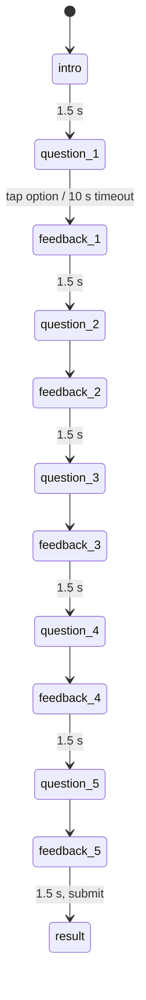

# Game: Trivia

Purpose: the complete spec for Trivia: rules, the per-player draw from the pool, timings, scoring with worked examples, rejection bounds, UI states, theming, accessibility, edge cases and test cases. The question file format and the writing guide are in `docs/content/trivia-format.md`. Shared rules are in `SCORING.md`; if they disagree, `SCORING.md` wins.

Last updated: 2026-09-25

Game id: `trivia` · One-line pitch (COPY `game.trivia.pitch`): "5 quick questions. Faster right answers score more."

---

## 1. Rules

- Each player gets **5 questions** drawn from a **pool of 30**. Repeats across players are fine; **no repeats within one player's five**.
- Each question has **4 options**, shuffled per player. **10 s** per question, with a visible countdown.
- A correct answer scores 100 points plus up to 100 more for time remaining. A wrong answer or a timeout scores 0 for that question; the round continues.
- One tap answers; no changing the answer.

## 2. The draw (on the phone, from the per-round seed)

1. Take only questions with `status: "ready"` from `docs/content/trivia-questions.json` (or, in a `TRIVIA_POOL=family` build, from the family test set, step 7).
2. Draw **2** from bucket `google_dev`, **2** from `ai_basics`, **1** from `gdg_community`, uniformly without replacement.
3. If a bucket has too few ready questions, fill the gap from the other buckets (any), still without replacement.
4. Order the five by difficulty (`easy` → `medium` → `hard`), random within the same difficulty.
5. Shuffle each question's 4 options (Fisher–Yates with the seed). In the file the correct answer is always option 0; after shuffling the phone keeps the correct index in memory only.
6. If fewer than 5 ready questions exist in total, Trivia is unavailable in the lineup picker (shown greyed, "Needs 5+ ready questions").

7. **Family test set** (ADR-133, `trivia-format.md` §7): when every ready question has a `family_*` bucket, steps 2–3 are replaced by a draw by difficulty: **2** `easy`, **2** `medium`, **1** `hard`, each pick preferring a bucket not yet picked (so the five cover all four family buckets), still without replacement. Steps 3–6 apply unchanged if a difficulty runs short. Scoring, timings and bounds are identical.

The seed makes a reload show the same five questions in the same order with the same option order.

## 3. Flow and timings



- `answer_ms` is measured from the first painted frame of the question (options visible) to the `pointerdown` on an option, via `performance.now()`.
- Worst case: 1.5 + 5 × (10 + 1.5) ≈ 59 s.

## 4. Scoring

Per question, correct: `points = 100 + 100 × (10000 − answer_ms) / 10000`; wrong/timeout: 0 · **`score = round(Σ points)`**

| Player | Answers (ms, ✓/✗) | Points | Score |
|---|---|---|---|
| A (all right) | 2000 ✓, 3000 ✓, 4000 ✓, 2500 ✓, 5000 ✓ | 180 + 170 + 160 + 175 + 150 | **835** |
| B (3 right) | 3000 ✓, 4000 ✗, 5000 ✓, 6000 ✓, 2000 ✗ | 170 + 0 + 150 + 140 + 0 | **460** |
| C (one timeout) | 1500 ✓, 2000 ✓, timeout, 9000 ✓, 4000 ✓ | 185 + 180 + 0 + 110 + 160 | **635** |
| D (all wrong) | ✗ ✗ ✗ ✗ ✗ | 0 | **0** |
| E (scripted) | 100 ✓ × 5 | 199 × 5 = 995 | **rejected** (`trivia.too_fast`) |

## 5. Submission and rejection bounds

```json
{
  "$schema": "https://json-schema.org/draft/2020-12/schema",
  "title": "trivia raw",
  "type": "object",
  "required": ["questions"],
  "additionalProperties": false,
  "properties": {
    "questions": {
      "type": "array", "minItems": 5, "maxItems": 5,
      "items": {
        "type": "object",
        "required": ["id", "correct", "answer_ms", "timed_out"],
        "additionalProperties": false,
        "properties": {
          "id":        { "type": "string", "pattern": "^q[0-9]{2}$" },
          "correct":   { "type": "boolean" },
          "answer_ms": { "type": ["integer", "null"], "minimum": 0, "maximum": 10000 },
          "timed_out": { "type": "boolean" }
        }
      }
    }
  }
}
```

Database bounds (`SCORING.md` §4): 5 distinct ids; `answer_ms` null iff timed out; 0–10000; correct ⇒ `answer_ms ≥ 250`; no correct ⇒ score 0; `score ≤ 988`.

## 6. UI states (phone)

| State | Shows | Input |
|---|---|---|
| `intro` | Title, pitch, "5 questions · 10 s each" | none |
| `question_n` | "n / 5", bucket chip (e.g. "AI basics"), question text, 4 large option buttons stacked, countdown bar shrinking over 10 s + seconds number | tap option |
| `feedback_n` | Chosen option marked ✓ (amber fill) or ✗ (ink outline + strike); the correct option always outlined with a ✓ icon; "+170" on correct | none |
| `timeout_n` | "Time's up", correct option outlined | none |
| `result` | Score large, "4 / 5 correct", then live round board | none |

Big screen during Trivia: live round board only (questions aren't shown on the big screen, since players have different ones).

## 7. Theming

- Countdown bar in blue, turning amber in the last 3 s (colour plus the number, never colour alone).
- Option buttons: off-white with a 2 px ink border; pressed state blue fill with off-white text.
- Correct feedback uses amber (highlight/winner colour); wrong uses ink, not red (red isn't in the palette).
- Bucket chips: small outlined labels, same colour for every bucket (text distinguishes them).

## 8. Accessibility

- Option buttons ≥ 56 px tall, full width, 16 px gap; long options wrap (max 3 lines at 17 px).
- Question text 20 px phone size; supports AR and EN at the same layout (RTL mirrors the chips and bar direction).
- Countdown is visible as number + bar; screen readers announce the question and options once, and "5 seconds left" once.
- Reduced motion: the bar steps once per second instead of animating smoothly.

## 9. Edge cases

| Case | Behaviour |
|---|---|
| Two taps on different options within 100 ms | First counts. |
| Reload during a question | Same question (seed); `answer_ms` continues from `questionStartEpoch` (can't gain time by reloading); if 10 s passed, it's a timeout. |
| Language toggle | Not available during the round; questions show in the language chosen before the round. A player can play in Arabic while the big screen is in English. |
| Question missing a translation in the chosen language | Can't happen with `status: "ready"` (both languages required by the schema). |
| Round ends early | Remaining questions count as timeouts; submit. |

## 10. Test cases

| # | Input | Expected |
|---|---|---|
| TRV-T1 | Example A | 835 |
| TRV-T2 | Example C | 635 |
| TRV-T3 | Draw 10 000 times from a full pool | never a repeated id within one draw; bucket split 2/2/1 every time |
| TRV-T4 | Pool with 1 ready `gdg_community` question and 0 ready `ai_basics` | draw still returns 5 unique questions |
| TRV-T5 | Option shuffle over 10 000 draws | correct answer lands in each of the 4 positions 25 % ± 2 % |
| TRV-T6 | Submit with a duplicated id | `GD008 trivia.shape` |
| TRV-T7 | Correct answer with `answer_ms` 200 | `GD008 trivia.too_fast` |
| TRV-T8 | All 5 correct at 250 ms | 988, accepted |
| TRV-T9 | Same seed after reload | same questions, same option order |
| TRV-T10 | 10 000 draws from the family set | 2 easy, 2 medium, 1 hard in that order; 5 unique ids; all 4 family buckets every time |
| TRV-T11 | 2 000 draws from the family set | every one of the 30 questions appears |
