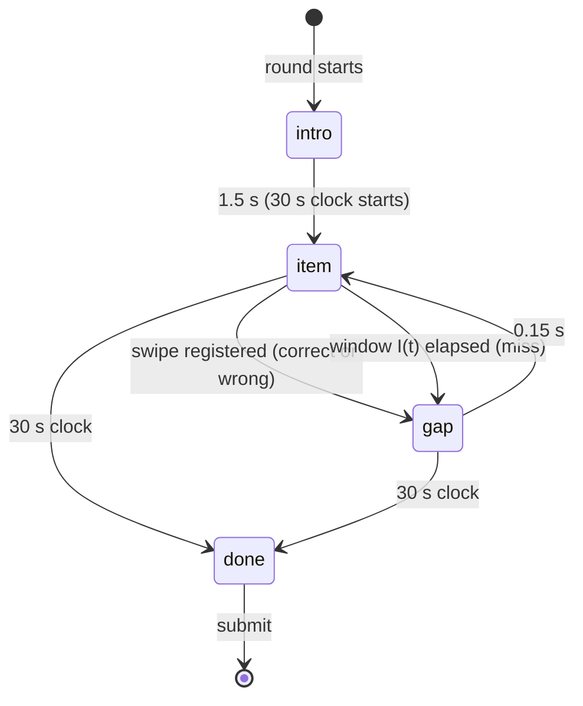

# Plan: games v3 — How Many?, Swipe Sort, Pairs

Purpose: the implementation plan for the next three games of `docs/games/newgames.md` (How Many?, Phase B's Swipe Sort and Pairs), split into work packages with exclusive file ownership so Opus/Sonnet agents can build them in parallel. Steady Hand (Phase C) is **not** built; §8 is its risk entry for `OPEN_QUESTIONS.md`. Everything numeric here is a starting value under the usual rule: the game doc and `SCORING.md` are the source of truth once written, and constants are retuned only with playtest evidence (`TESTING.md` §4).

Last updated: 2026-09-26

Related: ADR-134 (pool expansion, seeding already per round), ADR-136 (this plan, §7), ADR-018/021/025/104/113/116, `docs/plans/host-v3.md` (host redesign, in parallel; it may take ADR-135), research notes `scratchpad/v3/research-games.md` (numerosity Weber fractions, choice RT, 4×4 memory benchmarks, DeviceMotion permissions).

---

## 0. Ground rules that apply to all three games

Same contract as the seven existing games (`.claude/rules/games.md`, `ARCHITECTURE.md` §7, `types.ts`):

- Touch only, portrait, 360 px minimum. Worst case ≤ 62 s, well inside the 120 s round cap. Every attempt has its own timeout; `roundEnded` finishes the game at once with the timeout rule.
- One integer 0–1000 from a pure `score(raw)` in `scoring.ts` (`Math.round` once, then clamp); `buildRaw(...)` builds the exact payload; `validate<Game>Raw(raw, score)` mirrors the server bounds (as `validateColorClashRaw`); worked examples = unit tests with the same numbers.
- All randomness from `GameProps.seed` through `src/lib/rng.ts`, keyed by content position (`Rng(\`${seed}:hm:round${i}\`)` style, ADR-134 (2)), so everyone in the round sees the same content and a reload shows the same thing again. *(Superseded by ADR-137 (1): the shell seeded per player when this plan was written; the round id is the seed since then, Trivia alone per player.)*
- Timing: `performance.now()` on `pointerdown` while live; every clock is a `Date.now()` epoch in the snapshot, persisted with `onProgress` after every start event and every attempt; on reload elapsed time is measured from the stored epoch (ADR-018). Copy the Color Clash pattern: one scheduler effect keyed on the snapshot, `wake` counter, `finishedRef`, `onFinish` exactly once.
- Strings only via `t('game.<id>.…')` from `COPY.md` §5.8–§5.10 (all listed in §6 below; WP0 adds them). Tokens only in CSS modules; logical properties; RTL never mirrors game geometry; player names in `<bdi>`; Western digits.
- Phone chrome per `DESIGN_SYSTEM.md` §0.3 (eyebrow + title intro card 1.5 s, countdown bar + seconds as Trivia/Color Clash, `ScreenHeader`/`DetailList` from `src/player/chrome.tsx` where a shared block fits). Touch targets ≥ 48 px. Reduced motion honoured (`prefers-reduced-motion` → no shake/flip/fly animations; countdown steps once per second).
- Server: enum labels in one migration, bounds in the next (`create or replace private.score_bounds_violation`, the seven existing branches copied **verbatim**, new branches before the `game.unknown` fallthrough). Reason codes `hm.*`, `ss.*`, `pr.*`. The server never recomputes a score: it checks shape, ranges, consistency, human floors and a formula **band** (as `cb.formula_band` / `simon.formula_band`).
- Leak note (accepted, like Odd One Out's shared grid): everyone has the same content, so a finished player could shout an answer. Mitigation per game where cheap (How Many? shows true counts only on the big screen).

---

## 1. How Many? (`how_many`)

One-line pitch: "A flash of chevrons. How many did you see?"

> **Retuned by ADR-138 (2026-09-26, after the playtest).** The numbers in this section are the original plan and are kept as history. Current values (`docs/games/how-many.md` and `SCORING.md` §3.8/§4 win): bands 4–7 / 9–13 / 14–18 (every integer, no "never a multiple of 10"), grids 4 / 5 / 6, a 2.5 s flash, a 15 s answer, worst case 58.5 s (`worstCaseMs` 60 000), no `hm.too_perfect`, `answer_ms` ≤ 15 000, the reveal labels the top 4, the intro string "3 flashes · 2.5 seconds each"; worked example A is now 905.

### 1.1 Rules and flow

Three flashes with rising counts. Each flash: a field of brand chevrons (random rotation, blue/amber mix, never overlapping) shows for exactly **1.0 s**, then disappears; the player types a number on an on-screen pad within **10 s**. No feedback on the phone until the end of the round; the true counts are revealed on the big screen (§5), as Stop the Clock reveals guesses (ADR-025).

```mermaid
stateDiagram-v2
    [*] --> intro: round starts (3-2-1 done)
    intro --> look_i: 1.5 s
    look_i --> flash_i: 1.0 s ("Look", empty field frame, fixation dot)
    flash_i --> answer_i: 1.0 s (field hidden in one frame)
    answer_i --> locked_i: OK tapped
    answer_i --> locked_i: 10 s timeout (typed digits count; nothing typed = no answer)
    locked_i --> look_i+1: 0.5 s ("Locked in")
    locked_3 --> done
    done --> [*]: submit
```



| Step | Duration |
|---|---|
| Intro card | 1.5 s |
| `look` (fixation, field frame drawn, empty) | 1.0 s |
| `flash` | 1.0 s |
| `answer` | until OK, 10 s timeout |
| `locked` | 0.5 s |
| Worst case | 1.5 + 3 × (1 + 1 + 10 + 0.5) = **39 s** → `worstCaseMs = 40_000` |

Field: a square, `min(100vw − 2 × --phone-gutter, 56vh)`. Flash `i` uses a fixed `g_i × g_i` cell grid with `g = [5, 7, 10]` (25 / 49 / 100 cells ≥ the band maxima 15 / 35 / 70; fixed per flash so cell size never hints at N). Chevron glyph = `src/games/odd-one-out/Chevron.tsx` (import, don't copy) at 70 % of the cell, jittered ±15 % of the cell, rotation 0–359°, colour blue/amber 50/50. Because 0.7 + 2 × 0.15 = 1.0, chevrons never overlap or leave the field. On a 360 px phone the flash-3 glyph is ≈ 23 px: small but distinct (check on device, HM-T13).

Seeding (`src/games/how-many/field.ts`): `Rng(\`${seed}:hm:round${i}\`)` draws, in this order, `N_i` uniformly from the band **excluding multiples of 10** (8–15 → {8,9,11,12,13,14,15}; 20–35 minus {20,30}; 40–70 minus {40,50,60,70}; research: round numbers read as placeholders), then `N_i` cells by `sampleWithoutReplacement`, then per chevron jitter-x, jitter-y, rotation, colour. `fieldFor(seed, i)` is pure and memoised per render.

The flash is committed as one frame: the whole SVG mounts at once with all chevrons (no per-chevron transition, no fade-in); `flashStartEpoch` is written on the mount effect; the field is **unmounted** at `flashStartEpoch + 1000` (timer + a `visibility` fallback). Nothing else on the screen changes during the flash.

Number pad: 3 × 4 grid (1–9, backspace, 0, OK), each key ≥ 56 px tall, full width; the typed number in the hero position (`--type-score-size`, tabular); max 3 digits; OK disabled while empty; backspace deletes the last digit. Countdown bar + seconds (10 → 0, amber under 3 s) above the pad. Keys are `pointerdown` with the 60 ms bounce guard.

Timeout with digits typed → those digits are the guess (`timed_out = true`); nothing typed → `guess = null`. Round ended early (`roundEnded`): the open flash counts as timed out with whatever is typed; flashes not started count as `guess: null, timed_out: true`.

### 1.2 Difficulty curve

Counts rise 8–15 → 20–35 → 40–70 while the flash stays 1 s: flash 1 is near-subitizing (groups of 3–4), flash 2 is estimation, flash 3 is estimation with the known log-compressed underestimate (research §1). The tolerance band widens with the flash (`W` below) so a good estimator scores similarly on all three, per Weber's law.

### 1.3 Scoring (`SCORING.md` §3.8)

For flash `i` with true count `N_i` and guess `g_i` (null → `s_i = 0`):

- `rel_i = |g_i − N_i| / N_i`
- `s_i = clamp(1 − max(0, rel_i − D) / (W_i − D), 0, 1)` with **`D = 0.05`** (dead zone: within 5 % = full marks) and **`W = [0.30, 0.40, 0.50]`** (30 / 40 / 50 % off = 0).
- **`score = round(1000 × (s_1 + s_2 + s_3) / 3)`**, then clamp.

Calibration assumptions: adult numerosity Weber fractions cluster at 15–25 %; a **strong** booth player is ≈ 8 % off on flash 1, ≈ 11 % on flash 2, ≈ 16 % on flash 3 (bias included) → ≈ 815. Typical ≈ 17 / 19 / 24 % → ≈ 580. **1000** needs all three inside 5 %: exact on flash 1, ±1 on flash 2, ±2–3 on flash 3, from a 1 s flash of 40–70 items: treated as out of reach without luck.

Worked examples (`N = [12, 27, 55]`):

| Player | Guesses | `rel` | `s` | Score |
|---|---|---|---|---|
| A (strong) | 11, 24, 46 | 0.0833, 0.1111, 0.1636 | 0.8667, 0.8254, 0.7475 | round(813.18) = **813** |
| B (typical) | 10, 22, 42 | 0.1667, 0.1852, 0.2364 | 0.5333, 0.6138, 0.5859 | round(577.7) = **578** |
| C (weak) | 9, 18, 30 | 0.25, 0.3333, 0.4545 | 0.2, 0.1905, 0.1010 | round(163.8) = **164** |
| D (idle) | null ×3 | – | 0, 0, 0 | **0** |
| E (one timeout) | 12, null, 50 | 0, –, 0.0909 | 1, 0, 0.9091 | round(636.4) = **636** |
| F (near-perfect) | 12, 27, 53 | 0, 0, 0.0364 | 1, 1, 1 | **1000** |

### 1.4 Raw payload

```json
{
  "$schema": "https://json-schema.org/draft/2020-12/schema",
  "title": "how_many raw",
  "type": "object",
  "required": ["rounds"],
  "additionalProperties": false,
  "properties": {
    "rounds": {
      "type": "array", "minItems": 3, "maxItems": 3,
      "items": {
        "type": "object",
        "required": ["true_count", "guess", "answer_ms", "timed_out"],
        "additionalProperties": false,
        "properties": {
          "true_count": { "type": "integer", "minimum": 8, "maximum": 70 },
          "guess":      { "type": ["integer", "null"], "minimum": 0, "maximum": 999 },
          "answer_ms":  { "type": ["integer", "null"], "minimum": 0, "maximum": 10000 },
          "timed_out":  { "type": "boolean" }
        }
      }
    }
  }
}
```

`answer_ms` = time from the pad appearing to the OK tap (`performance.now()`, epoch fallback after a reload), null iff `timed_out`. `guess` may be non-null when timed out (auto-submitted digits); `guess` null ⇒ `timed_out`.

### 1.5 Server bounds (in check order)

| Code | Check |
|---|---|
| `hm.shape` | object; `rounds` array of exactly 3 objects; `true_count` int, `guess` int or null, `answer_ms` int or null, `timed_out` bool |
| `hm.range` | `true_count` in the flash's band: 8–15, 20–35, 40–70; `guess` 0–999; `answer_ms` 0–10000 |
| `hm.timeout` | `answer_ms` null iff `timed_out`; `guess` null ⇒ `timed_out` |
| `hm.too_fast` | not timed out ⇒ `answer_ms ≥ 300` (a digit and OK need two taps after the pad appears) |
| `hm.too_perfect` | not all three guesses equal their true counts (three exact hits from 1 s flashes ≈ 1 in 1000 honest players; scripted clients that read the seed are the target) |
| `hm.formula_band` | `score ≤ round(1000 × Σ s_i / 3) + 1`, `s_i` computed in `numeric` as §1.3 (0 for a null guess). Upper side only: under-reporting only hurts the sender |

### 1.6 UI states (phone, P6)

| State | Shows | Input |
|---|---|---|
| `intro` | Eyebrow `game.how_many.intro`, name, pitch | none |
| `look` | Eyebrow `game.how_many.round` ("Flash n of 3"), the empty field frame (1 px `--line` border, `--surface`) with a small ink fixation dot; caption `game.how_many.look` | none |
| `flash` | The field with all chevrons (one frame); no other change | none |
| `answer` | Countdown bar + seconds; `game.how_many.question`; typed number hero (or a muted `–`); the pad | pad keys |
| `locked` | `game.how_many.locked`; pad hidden | none |
| `done` | `game.how_many.done` (the shell shows P7) | none |

P7 breakdown (WP5, `resultDetail.tsx`): one row per flash: label `game.how_many.result_round`, value `game.how_many.result_guess` or `game.how_many.result_missed`. **No true counts on the phone** (they are shared by everyone in the room and P7 is visible while others still play); the big screen reveals them (§5).

### 1.7 Theming, accessibility, colour-blindness

- Chevrons: the Odd One Out glyph, `--gdg-blue` / `--gdg-amber` strokes on `--surface`; the field frame `--line`; the pad = secondary buttons (`--surface`, 1 px `--line-strong`, `--r-control`), OK = primary; typed digits tabular at `--type-score-size` 700 (the one hero).
- Colour carries no information (blue/amber only break up the field); a colour-blind or monochrome viewer plays the same game. No second cue needed.
- Pad keys ≥ 56 px, labelled digits; backspace has `aria-label` `game.how_many.backspace`. A 1 s flash cannot be made screen-reader accessible; documented gap like Perfect Circle.
- Reduced motion: nothing animates anyway; the countdown bar steps per second.
- Direction: the pad grid is `direction: ltr` (game geometry: 1-2-3 rows as on a phone dialler); labels follow the page language.

### 1.8 Edge cases

| Case | Behaviour |
|---|---|
| Reload during `look` | Resume `look` until `lookStartEpoch + 1000`; if that has passed, the flash window (`lookStartEpoch + 1000 … + 2000`) has started or passed: **never show the field again**; go to `answer` with `answerStartEpoch = lookStartEpoch + 2000` (the 10 s timeout counts from there) |
| Reload during `flash` | Same rule: the flash happened; straight to `answer` with the deadline `flashStartEpoch + 1000 + 10000` |
| Reload during `answer` | Same flash, typed digits restored from the snapshot, deadline unchanged |
| Screen lock during the flash | The timer fires late; on return the field is hidden at once (the visibility handler) and `answer` runs with the remaining time |
| Timeout with digits typed | The typed number is the guess, `timed_out = true`, `answer_ms = null` |
| Round ended early | Finish now: open flash = timed out with typed digits; unstarted flashes null |
| Rotation | Shell overlay; clocks keep running (E16) |
| Tap during `look`/`flash`/`locked` | Ignored |
| Leading zeros | `007` → 7 (the display shows the digits as typed) |

Snapshot: `{ phase, roundIndex, lookStartEpoch, flashStartEpoch, answerStartEpoch, lockedEndEpoch, typed: string, rounds: HowManyRound[] }` (epochs only).

### 1.9 Test cases

| # | Input | Expected |
|---|---|---|
| HM-T1 | Example A | 813 |
| HM-T2 | Example B | 578 |
| HM-T3 | Example E (one null) | 636 |
| HM-T4 | Example F | 1000; Example D → 0 |
| HM-T5 | Same seed | same `N_i`, cells, rotations, colours; `N_i` in band and never a multiple of 10; no two chevrons share a cell |
| HM-T6 | 200 seeds × 3 flashes | every chevron's bounding circle inside the field, pairwise centre distance ≥ 0.7 cell (no overlap) |
| HM-T7 | `answer_ms` 299 on a non-timed-out flash | `hm.too_fast`; 300 accepted |
| HM-T8 | Guesses = true counts ×3 | `hm.too_perfect`; two exact + one off accepted |
| HM-T9 | Example A with score 815 | `hm.formula_band`; 814 and 700 accepted |
| HM-T10 | `true_count` 16 in flash 1 | `hm.range`; `guess` null with `timed_out` false → `hm.timeout` |
| HM-T11 | Reload during `flash` (snapshot with `flashStartEpoch` 400 ms ago) | field not rendered; `answer` shown; deadline = `flashStartEpoch + 11000` |
| HM-T12 | Idle player | three nulls, score 0, finished by 40 s (`worstCase.test.tsx`) |
| HM-T13 | Real devices | flash-3 chevrons legible at 360 px; pad keys ≥ 56 px; no zoom on double-tap |
| HM-T14 | Playtest, 5 strong players | median 780–900, nobody 1000 → else retune `D` / `W` (ADR-136) |

---

## 2. Swipe Sort (`swipe_sort`)

One-line pitch: "Blue goes left, amber goes right. Faster and faster."

### 2.1 Rules and flow

Chevrons appear one at a time in the middle of a swipe surface. Swipe **left for blue**, **right for amber** (game geometry, same in Arabic). Each chevron lives for a shrinking window; not swiping in time is a **miss**. 30 s game clock from the first chevron.



| Step | Duration |
|---|---|
| Intro card | 1.5 s |
| Game clock | 30 s |
| Item window `I(t)` | `round(900 − 450 × t / 30000)` ms, `t` = the item's onset on the game clock (900 → 450 ms). Floor 450 ms instead of the brief's ≈ 350 ms: choice RT is 340–410 ms plus swipe travel; at 350 ms nobody scores late items (research §2). Tune at playtest |
| Gap (chevron flies off / fades; feedback) | 0.15 s |
| Worst case | 1.5 + 30 = **32 s** → `worstCaseMs = 32_000` |

Item `k` (0-based): colour from `Rng(\`${seed}:ss:item${k}\`)` (50/50), plus a small tilt −12…+12° for variety. **Second cue:** a blue chevron always points left (`<`), an amber one right (`>`): shape agrees with colour, so the game is playable without colour vision (see §2.7).

Gesture (`src/games/swipe-sort/gesture.ts`, pure state machine + the component's pointer handlers): `pointerdown` inside the surface starts a drag; on `pointermove`, when `|dx| ≥ 40 px` and `|dx| > |dy|`, the swipe **registers** in the sign of `dx` (this is the "gesture completion" instant: `swipe_ms` = onset → registration); anything else (release before 40 px, vertical drag, `pointercancel`) is ignored and the item stays. `setPointerCapture` on down. Only one pointer is tracked (`pointerId`); a second finger is ignored.

Browser-gesture defence (research §2, brief): the surface has `touch-action: none`; a non-passive `touchmove` listener calls `preventDefault()` (pull-to-refresh on iOS < 16 and Chrome); the component sets `overscroll-behavior: none` on `<html>` while mounted (inline style, removed on unmount); the surface is inset by `--swipe-safe-inset` (24 px, new token) from both viewport edges and a `touchstart` guard ignores touches starting within 24 px of either edge (iOS edge-swipe-back cannot be blocked from a page, so such a touch never starts an item drag). The same applies to iOS Chrome (WKWebView).

### 2.2 Difficulty curve

Linear ramp 900 → 450 ms over 30 s: the first ten seconds are relaxed, the last ten are at the typical choice-RT floor; a faster player sees more items (cadence = swipe time + 150 ms). Flow-state pacing as Close the Brackets' growing length.

### 2.3 Scoring (`SCORING.md` §3.9)

`c` correct, `w` wrong direction, `m` missed; `net = c − w − m`; `r̄ = mean_swipe_ms` over correct items.

- Speed bonus `B = 60 × clamp((700 − r̄) / 300, 0, 1) × clamp(net / 20, 0, 1)` when `c ≥ 1` (full at ≤ 400 ms mean and net ≥ 20; 0 at ≥ 700 ms), else 0. The `net / 20` factor keeps a random swiper (expected net 0) at ≈ 0.
- **`score = clamp(round(22 × net + B), 0, 1000)`**; `c = 0` → 0.

Calibration assumptions: a **strong** player registers swipes at ≈ 450 ms (SD 80) with 2 % wrong: ≈ 49 items, misses concentrated in the last third where `I(t) < 550` → ≈ 43 / 1 / 5 → **≈ 864**. Typical (550 ms, 5 %) ≈ 33 / 3 / 8 → ≈ 514. **1000** needs `net ≥ 43` with a ≤ 430 ms mean (e.g. 46 / 1 / 2): out of reach at a 450 ms floor.

| Player | c / w / m | `r̄` | net | B | Score |
|---|---|---|---|---|---|
| A (strong) | 43 / 1 / 5 | 450 | 37 | 50 | round(864) = **864** |
| B (typical) | 33 / 3 / 8 | 550 | 22 | 30 | **514** |
| C (weak) | 22 / 5 / 12 | 640 | 5 | 12 × 0.25 = 3 | round(113) = **113** |
| D (random spammer) | 30 / 33 / 0 | 260 | −3 | 0 (net ≤ 0) | clamp(−66) = **0** |
| E (idle) | 0 / 0 / 37 | null | −37 | 0 | **0** |
| F (near-perfect) | 46 / 1 / 2 | 430 | 43 | 54 | clamp(1000) = **1000** |

### 2.4 Raw payload

```json
{
  "$schema": "https://json-schema.org/draft/2020-12/schema",
  "title": "swipe_sort raw",
  "type": "object",
  "required": ["correct", "wrong", "missed", "mean_swipe_ms"],
  "additionalProperties": false,
  "properties": {
    "correct":       { "type": "integer", "minimum": 0, "maximum": 120 },
    "wrong":         { "type": "integer", "minimum": 0, "maximum": 120 },
    "missed":        { "type": "integer", "minimum": 0, "maximum": 80 },
    "mean_swipe_ms": { "type": ["integer", "null"], "minimum": 0, "maximum": 900 }
  }
}
```

### 2.5 Server bounds

| Code | Check |
|---|---|
| `ss.shape` | object; three ints and int-or-null |
| `ss.range` | `correct` 0–120, `wrong` 0–120, `missed` 0–80, `mean_swipe_ms` 0–900 |
| `ss.rt` | `mean_swipe_ms` null iff `correct = 0` |
| `ss.zero` | `correct = 0` ⇒ `score = 0` |
| `ss.too_fast` | `mean_swipe_ms ≥ 200` (choice reaction plus 40 px of finger travel, measured to registration) |
| `ss.too_many` | `correct × (mean_swipe_ms + 150) ≤ 30150` (the correct items and their gaps fit in 30 s) |
| `ss.formula_band` | `clamp(22 net, 0, 1000) ≤ score ≤ clamp(22 net + 60, 0, 1000)` |

### 2.6 UI states (phone)

| State | Shows | Input |
|---|---|---|
| `intro` | Eyebrow `game.swipe_sort.intro`, name, pitch | none |
| `item` | Top: countdown bar + seconds, `game.swipe_sort.sorted` muted. Middle: the swipe surface (`--surface`, 1 px `--line`, `--r-panel`, inset by `--swipe-safe-inset`) with the chevron (≈ 40 vw, tilted) centred; it follows the finger horizontally during the drag (`transform` only). Bottom corners of the surface: two catch labels, inline-start `game.swipe_sort.zone_blue` with a blue swatch and `<`, inline-end `game.swipe_sort.zone_amber` with an amber swatch and `>` (fixed left/right: `direction: ltr` on the surface) | drag |
| `gap` after correct | Chevron flies off in the swipe direction (150 ms, `transform`); the matching catch label gets an amber ring | ignored |
| `gap` after wrong | Chevron flies off; the tapped-side label shakes in ink; caption `game.swipe_sort.wrong` | ignored |
| `gap` after miss | Chevron fades (opacity); caption `game.swipe_sort.missed` | ignored |
| `done` | `game.swipe_sort.times_up` | none |

P7 rows: correct · wrong way · missed · average time (`game.swipe_sort.result_*`).

### 2.7 Theming, accessibility, colour-blindness

- Colour **is** the game (brief's named exception), using the pair already validated for Color Clash: `--clash-blue` / `--clash-amber` (blue–yellow axis, ΔE ≥ 113 under deuteranopia/protanopia, `color-clash.md` §7); no new colours. `npm run contrast` needs no new pair.
- **Second cue:** chevron orientation (`<` blue, `>` amber) and the catch labels carry the name and a swatch, so a player with achromatopsia can still play by shape; the orientation is not a hint beyond what the colour already says.
- Swipe surface ≥ 60 % of the viewport height; catch labels ≥ 48 px tall. Reduced motion: no follow/fly/shake; the chevron disappears at once; feedback = static ring / caption.
- `aria-live` is silent during play (30 s of announcements would be noise); the surface has `role="img"` with `aria-label` of the current colour name for completeness.

### 2.8 Edge cases

| Case | Behaviour |
|---|---|
| iOS Safari edge-swipe-back | Touches starting ≤ 24 px from either viewport edge are ignored by the game (never start a drag); the surface itself is inset by `--swipe-safe-inset`. A back-navigation that still happens returns to the same URL and the shell resumes the round from storage (E2) |
| Pull-to-refresh / rubber band | `touch-action: none` + non-passive `touchmove.preventDefault()` on the surface; `overscroll-behavior: none` on `<html>` while the game is mounted |
| Vertical or too-short drag | Ignored; the item keeps its window |
| `pointercancel` (browser took the gesture) | Drag state reset; the item keeps its window |
| Two fingers | Only the captured pointer counts |
| Reload mid-drag | Drag lost; the same item continues from `itemStartEpoch` with its original window |
| Reload during the gap | Gap ends at `gapEndEpoch`, then item `k + 1` |
| Screen lock | Epochs run; on return, elapsed windows are misses counted in order until the clock catches up (the scheduler loops: each due miss advances `itemIndex` and re-arms, so a 10 s lock yields ≈ 13–15 misses, as an idle player would get) |
| Round ended early | Finish now; the open item doesn't count |
| Rotation | Shell overlay (E16) |

Snapshot: `{ phase, gameStartEpoch, itemIndex, itemStartEpoch, gapEndEpoch, correct, wrong, missed, swipeSumMs, feedback, side }`.

### 2.9 Test cases

| # | Input | Expected |
|---|---|---|
| SS-T1 | Example A | 864 |
| SS-T2 | Example B | 514 |
| SS-T3 | Example D (spammer) | 0; Example C → 113 |
| SS-T4 | `mean_swipe_ms` 199 with 40 correct | `ss.too_fast`; 200 accepted |
| SS-T5 | 60 correct at 353 ms (60 × 503 = 30180) | `ss.too_many`; 352 ms accepted |
| SS-T6 | Example A with score 875 (22 × 37 + 61) | `ss.formula_band`; 814 and 874 accepted |
| SS-T7 | Same seed | same colour sequence; over 200 items 40–60 % blue |
| SS-T8 | `I(t)`: t = 0 → 900; t = 15000 → 675; t = 30000 → 450 |
| SS-T9 | Gesture: 39 px → nothing; 40 px right → `right`; dy 50 / dx 30 → nothing; cancel → nothing |
| SS-T10 | Wrong swipe | wrong + 1, gap 150 ms, next item |
| SS-T11 | Idle player | 37 misses, score 0, finishes by 32 s (`worstCase.test.tsx`) |
| SS-T12 | Reload mid-item | same item, same deadline; game ends at the original 30 s |
| SS-T13 | Real iPhone (Safari) and iOS Chrome | 20 swipes from the surface centre: 0 navigations, 0 refreshes; an edge-started swipe never scores |
| SS-T14 | Playtest, 5 strong players | median 780–900, nobody 1000 → else retune 22 / 60 / the floor (ADR-136) |

---

## 3. Pairs (`pairs`)

One-line pitch: "Flip two cards at a time. Find all 8 pairs."

### 3.1 Rules and flow

A 4 × 4 grid of face-down cards holds 8 pairs of brand-style icons (bug, coffee, terminal, git branch, cloud, lightbulb, rocket, gear). Tap to flip one card, then a second: a match stays face up; a mismatch shows both for 0.7 s, then both flip back. **60 s** from the board appearing; the game ends early when all 8 pairs are found.

```mermaid
stateDiagram-v2
    [*] --> intro
    intro --> board: 1.5 s (60 s clock starts)
    board --> one_up: tap a face-down card
    one_up --> resolve: tap a second face-down card
    resolve --> board: match (0.3 s amber ring; both stay up)
    resolve --> board: mismatch (0.7 s lock, both flip back)
    board --> done: 8 pairs (clear) or 60 s
    done --> [*]: submit
```



| Step | Duration |
|---|---|
| Intro card | 1.5 s |
| Game clock | 60 s |
| Match feedback (no lock; the next tap is accepted) | 0.3 s |
| Mismatch lock (both up, input ignored) | 0.7 s |
| Worst case | 1.5 + 60 = **61.5 s** → `worstCaseMs = 62_000` |

Layout from `Rng(\`${seed}:pr:layout\`)`: Fisher–Yates over the 16 positions of `[icon0, icon0, …, icon7, icon7]` (`src/games/pairs/layout.ts`, `layoutFor(seed): IconId[16]`). The whole session sees the same board.

### 3.2 Difficulty curve

Flat mechanics; difficulty is memory load plus the clock. Optimal play needs ≈ 11–12 flip-pairs (some misses are forced); a strong player clears in 30–40 s with 4–6 misses; a typical guest finds 5–7 pairs in 60 s (research §3), so partial completion must score.

### 3.3 Scoring (`SCORING.md` §3.10)

`p` = pairs found (0–8), `m` = mismatched flip-pairs, `clear_ms` = clock time at the eighth match (null unless `p = 8`).

- Cleared (`p = 8`): `base = 1000 − 6 × max(0, clear_ms − 15000) / 1000`.
- Not cleared: `base = 730 − 80 × (8 − p)` (continuous with clearing at exactly 60 s: 1000 − 270 = 730).
- **`score = clamp(round(base − 12 × m), 0, 1000)`**; `p = 0` → 0.

Calibration assumptions: **strong** = clear in ≈ 34 s with 5 misses → ≈ 825; typical = 6 pairs, 9 misses → 462; **1000** needs a clear in ≤ 15 s with 0 misses (16 taps at ≈ 0.9 s each with no forced miss): out of reach.

| Player | p / m / clear | base | Score |
|---|---|---|---|
| A (strong) | 8 / 5 / 34 200 ms | 1000 − 115.2 = 884.8 | round(824.8) = **825** |
| B (typical) | 6 / 9 / null | 730 − 160 = 570 | **462** |
| C (weak) | 3 / 12 / null | 730 − 400 = 330 | **186** |
| D (idle) | 0 / 0 / null | – | **0** (p = 0 rule) |
| E (fast) | 8 / 3 / 21 500 ms | 1000 − 39 = 961 | **925** |
| F (perfect) | 8 / 0 / 14 000 ms | 1000 | **1000** |
| G (no pair, 5 misses) | 0 / 5 / null | – | **0** (rule, not 730 − 640 − 60) |

### 3.4 Raw payload

```json
{
  "$schema": "https://json-schema.org/draft/2020-12/schema",
  "title": "pairs raw",
  "type": "object",
  "required": ["matched", "misses", "clear_ms"],
  "additionalProperties": false,
  "properties": {
    "matched":  { "type": "integer", "minimum": 0, "maximum": 8 },
    "misses":   { "type": "integer", "minimum": 0, "maximum": 200 },
    "clear_ms": { "type": ["integer", "null"], "minimum": 0, "maximum": 60000 }
  }
}
```

### 3.5 Server bounds

| Code | Check |
|---|---|
| `pr.shape` | object; `matched` int, `misses` int, `clear_ms` int or null |
| `pr.range` | `matched` 0–8, `misses` 0–200, `clear_ms` 0–60000 |
| `pr.clear` | `clear_ms` null iff `matched < 8` |
| `pr.zero` | `matched = 0` ⇒ `score = 0` |
| `pr.too_fast` | cleared ⇒ `clear_ms ≥ 4000 + 700 × misses` (16 taps at ≥ 250 ms, plus every 0.7 s mismatch lock) |
| `pr.formula_band` | `|score − clamp(round(base − 12 × misses), 0, 1000)| ≤ 1` with `base` as §3.3 (`numeric` arithmetic; the ±1 covers rounding) |

### 3.6 UI states (phone)

| State | Shows | Input |
|---|---|---|
| `intro` | Eyebrow `game.pairs.intro`, name, pitch | none |
| `board` | Countdown bar + seconds; `game.pairs.found` ("Pairs n of 8") muted; the 4 × 4 grid (gap `--s-2`, tiles square, ≈ 76 px on 360 px) | face-down tiles |
| `one_up` | One tile face up | another face-down tile |
| `resolve` match (0.3 s) | Both tiles get an amber ring; stay face up | accepted (next tap starts a new pair) |
| `resolve` mismatch (0.7 s) | Both face up, muted; **all input ignored** (the flip-back lock) | ignored |
| `cleared` | Grid all face up, `game.pairs.cleared`, finishes at once | none |
| `done` (60 s) | `game.pairs.times_up` | none |

P7 rows: pairs found · misses · time (`game.pairs.result_time_value` or `game.pairs.result_not_cleared`).

### 3.7 Theming, accessibility, colour-blindness

- Icons: eight hand-drawn SVGs in `src/games/pairs/icons.tsx` (24 × 24 viewBox, `stroke="currentColor"`, width 2, round caps/joins, no fills), in the brand line style of the chevrons; drawn in `--primary-text` on a `--surface` face. **No Google product logos.** Card back: `--surface-2`, 1 px `--line-strong`, `--r-control`, a thin ink chevron outline centred (not the logo). Matched: amber ring (`--highlight` outline). Silhouettes must differ at 40 px: bug (oval + legs), coffee (cup + handle), terminal (`>_` in a frame), branch (two nodes + fork), cloud (lobed outline), bulb (bulb + base lines), rocket (fin + window), gear (toothed ring). Review at the contrast pass (PR-T12).
- Colour carries nothing (all icons one ink); shape alone distinguishes.
- Tiles ≥ 48 px (≈ 76 px); each tile is a `<button>` with `aria-label` = icon name when face up, `game.pairs.card_back` when down; `aria-pressed` for matched.
- Flip: `transform: rotateY` on a two-face card (`transform` only); reduced motion → instant swap.

### 3.8 Edge cases

| Case | Behaviour |
|---|---|
| Third tap during the 0.7 s lock | Ignored (the lock; PR-T8) |
| Tap on a face-up or matched tile | Ignored |
| Double tap on the same tile | Second tap ignored (it is face up) |
| Reload during the lock | Both tiles shown up until `lockUntilEpoch`, then flipped back; misses already counted |
| Reload with one tile up | Restored from `faceUp` |
| Screen lock | Clock runs on `gameStartEpoch`; on return a passed lock resolves and a passed 60 s finishes |
| Round ended early | Finish now: `matched` so far, `clear_ms` null unless cleared |
| Rotation | Shell overlay (E16) |
| Clear at exactly the 60 s tick | `clear_ms` ≤ 60000 wins if the eighth match was committed before the clock timer fired |

Snapshot: `{ phase, gameStartEpoch, faceUp: number[] (0–2 positions), matchedIcons: IconId[], misses, lockUntilEpoch, clearEpoch }`.

### 3.9 Test cases

| # | Input | Expected |
|---|---|---|
| PR-T1 | Example A | 825 |
| PR-T2 | Example B | 462; Example C → 186 |
| PR-T3 | Examples D, G | 0 |
| PR-T4 | Example E | 925; F → 1000 |
| PR-T5 | `clear_ms` 7499 with 5 misses (4000 + 3500 = 7500) | `pr.too_fast`; 7500 accepted |
| PR-T6 | Example A with score 827 | `pr.formula_band`; 824–826 accepted |
| PR-T7 | `matched` 8 with `clear_ms` null | `pr.clear`; `matched` 9 → `pr.range` |
| PR-T8 | Tap a third tile 300 ms into a mismatch lock | ignored; after 700 ms both are face down and the tap works |
| PR-T9 | Same seed | same 16-icon layout; each icon exactly twice |
| PR-T10 | Match | both stay up, `matched + 1`, next tap accepted after 0 ms |
| PR-T11 | Idle player | score 0 at 60 s, finished by 62 s (`worstCase.test.tsx`) |
| PR-T12 | Icon review | all eight silhouettes distinct at 40 px on a phone; none resembles a product logo |
| PR-T13 | Reload during the lock | both tiles up until `lockUntilEpoch`; then down; `misses` unchanged |
| PR-T14 | Playtest, 5 strong players | median 780–900, nobody 1000 → else retune 6 / 12 / 80 (ADR-136) |

---

## 4. Worst cases (`SCORING.md` §2 rows)

| Game | Attempts | Per-attempt timeout | Worst case | `worstCaseMs` |
|---|---|---|---|---|
| How Many? | 3 flashes | 10 s per answer (15 s since ADR-138) | 1.5 + 3 × 12.5 ≈ 39 s (58.5 s since ADR-138) | 40 000 (60 000 since ADR-138) |
| Swipe Sort | items inside a 30 s clock | `I(t)` 900 → 450 ms | 1.5 + 30 ≈ 32 s | 32 000 |
| Pairs | one board | 60 s clock | 1.5 + 60 ≈ 62 s | 62 000 |

---

## 5. How Many? big-screen reveal (H3)

> Superseded by ADR-137 (5), (6) for the timing and the mode rule: the reveal is anchored on `rounds.ended_at`, not the mount (current spec: `SCREENS.md` H3). Kept below as history, with the numbers corrected.

Extends the Stop the Clock reveal (ADR-025, `StcReveal.tsx`) to a count axis.

- **Data source:** `fetchRoundReveal(roundId)` (unchanged, `src/lib/api.ts`): visible round-board rows with `raw`. Pure layout in `src/host/howManyReveal.ts` (`howManyStrips(rows, labelled = HM_REVEAL_LABELLED)`), mirroring `reveal.ts`: for flash `i`, `N_i` = the **most common** `rounds[i].true_count` across rows (everyone shares the seed since ADR-137 (1); a tampered row can't move the axis only with ≥ 3 rows: with 1–2 rows the higher-ranked row's value wins); one dot per row with a non-null guess at `pos = 50 + 100 × clamp((g − N) / N, −0.5, 0.5)` (the window is ±50 % relative error, `HM_REVEAL_WINDOW = 0.5` in `config.ts`, so all three strips share one scale), `pinned` beyond it; the first `HM_REVEAL_LABELLED = 5` rows (round-board order) are labelled. Also per strip: `mean` = the rounded mean of the non-null guesses and its `meanPos`.
- **Layout** (`src/host/HowManyReveal.tsx`, on the v2 tokens and the existing `.strip*`/`.reveal*` classes; host-v3 restyles later): header eyebrow `game.how_many.reveal_title` with the centre-axis label `game.how_many.reveal_axis`; three strips, each labelled `game.how_many.reveal_round` ("Flash n · 27", the true count as the hero of the label) with `game.how_many.reveal_mean` ("Crowd average 25") muted under it; ticks at 10 %…90 % (every 10 % error); centre line at the true count; player dots as STC (labels in lanes, `labelLanes` moved into a shared helper or duplicated: WP4 may copy it, the file is small); a **crowd-average marker** (`.revealMean`: an amber `--highlight` bar, `--line-width-strong` wide, full track height) at `meanPos`.
- **Timing inside the 7 s round-board step:** every delay counts from `rounds.ended_at` (host offset), not the mount; dots burst in with `revealSchedule([n1, n2, n3], { totalMs: HM_REVEAL_DOTS_MS })` within 3.5 s (shatter, as STC; 200 ms fades with reduced motion); the crowd-average marker fades in at 4.0 s after `ended_at` (`HM_REVEAL_MEAN_MS`, `RevealIn` with `shards = 0`), so the "wisdom of the crowd" beat lands last with ≥ 3 s left in the step; a reloaded host and late rows show what is already due at once (ADR-137 (5)). After the last round the step still shows 7 s then H4 (ADR-129 (2)); nothing to skip.
- **Hook-up:** `Intermission.tsx` replaces the `round.game === 'stop_the_clock'` special case with a `REVEALS` map `{ stop_the_clock: StcReveal, how_many: HowManyReveal }` (same props `roundId`, `version`, `rows?`), one small edit block. Phones show no reveal (as STC). H2 already shows scores only.
- **ADR:** no separate ADR; ADR-136 (§7) records the reveal, the "true counts only on the big screen" rule and the crowd-average marker. ADR-025 is unchanged (it governs Stop the Clock).

---

## 6. Strings (COPY.md §5.8–§5.10; WP0 adds all of them to COPY.md, `en.json`, `ar.json`)

Name and pitch rows go in the §5 table; the rest in new subsections. Arabic needs the native review (OQ-04).

**§5.8 How Many?**

| Key | English | العربية |
|---|---|---|
| `game.how_many.name` | How Many? | كم العدد؟ |
| `game.how_many.pitch` | A flash of chevrons. How many did you see? | ومضة من الأشكال. كم شكلاً رأيت؟ |
| `game.how_many.intro` | 3 flashes · 1 second each | 3 ومضات · ثانية واحدة لكل ومضة |
| `game.how_many.round` | Flash {n} of 3 | الومضة {n} من 3 |
| `game.how_many.look` | Look | انظر |
| `game.how_many.question` | How many? | كم العدد؟ |
| `game.how_many.ok` | OK | تم |
| `game.how_many.backspace` | Delete | حذف |
| `game.how_many.locked` | Locked in ✓ | تم التسجيل ✓ |
| `game.how_many.timeout` | Time's up for this one | انتهى وقت هذه الومضة |
| `game.how_many.done` | Done | انتهى |
| `game.how_many.result_round` | Flash {n} | الومضة {n} |
| `game.how_many.result_guess` | Your guess {g} | تخمينك {g} |
| `game.how_many.result_missed` | No answer | لا إجابة |
| `game.how_many.reveal_title` | Everyone's guesses | تخمينات الجميع |
| `game.how_many.reveal_axis` | True count | العدد الحقيقي |
| `game.how_many.reveal_round` | Flash {n} · {count} | الومضة {n} · {count} |
| `game.how_many.reveal_mean` | Crowd average {n} | متوسط الجميع {n} |

**§5.9 Swipe Sort**

| Key | English | العربية |
|---|---|---|
| `game.swipe_sort.name` | Swipe Sort | فرز بالسحب |
| `game.swipe_sort.pitch` | Blue goes left, amber goes right. Faster and faster. | الأزرق يساراً والبرتقالي يميناً. أسرع فأسرع. |
| `game.swipe_sort.intro` | 30 s · blue left · amber right | 30 ثانية · الأزرق يساراً · البرتقالي يميناً |
| `game.swipe_sort.zone_blue` | Blue | أزرق |
| `game.swipe_sort.zone_amber` | Amber | برتقالي |
| `game.swipe_sort.sorted` | Sorted {n} | فُرزت {n} |
| `game.swipe_sort.missed` | Missed | فاتك |
| `game.swipe_sort.wrong` | Wrong way | الاتجاه الخاطئ |
| `game.swipe_sort.times_up` | Time's up | انتهى الوقت |
| `game.swipe_sort.result_correct` | Correct | صحيحة |
| `game.swipe_sort.result_wrong` | Wrong way | الاتجاه الخاطئ |
| `game.swipe_sort.result_missed` | Missed | الفائتة |
| `game.swipe_sort.result_speed` | Average time | متوسط الوقت |
| `game.swipe_sort.result_speed_value` | {s} s | {s} ث |

**§5.10 Pairs**

| Key | English | العربية |
|---|---|---|
| `game.pairs.name` | Pairs | الأزواج |
| `game.pairs.pitch` | Flip two cards at a time. Find all 8 pairs. | اقلب بطاقتين في كل مرة. اعثر على الأزواج الثمانية. |
| `game.pairs.intro` | 60 s · 8 pairs | 60 ثانية · 8 أزواج |
| `game.pairs.found` | Pairs {n} of 8 | الأزواج {n} من 8 |
| `game.pairs.card_back` | Face-down card | بطاقة مقلوبة |
| `game.pairs.icon.bug` | Bug | حشرة |
| `game.pairs.icon.coffee` | Coffee | قهوة |
| `game.pairs.icon.terminal` | Terminal | طرفية |
| `game.pairs.icon.branch` | Git branch | فرع |
| `game.pairs.icon.cloud` | Cloud | سحابة |
| `game.pairs.icon.bulb` | Lightbulb | مصباح |
| `game.pairs.icon.rocket` | Rocket | صاروخ |
| `game.pairs.icon.gear` | Gear | ترس |
| `game.pairs.cleared` | All pairs found | وجدت كل الأزواج |
| `game.pairs.times_up` | Time's up | انتهى الوقت |
| `game.pairs.result_pairs` | Pairs found | الأزواج المكتشفة |
| `game.pairs.result_misses` | Misses | الأخطاء |
| `game.pairs.result_time` | Time | الوقت |
| `game.pairs.result_time_value` | {s} s | {s} ث |
| `game.pairs.result_not_cleared` | Not finished | لم يكتمل |

---

## 7. Migrations and the ADR

### 7.1 Migrations (after `20260925000600`, the latest; re-check the directory before creating: host-v3 is UI-only and should add none)

**`supabase/migrations/20260925000700_game_ids_v3.sql`** (mirror of `20260925000500`):

```sql
-- 20260925000700 Three new games in the pool: How Many?, Swipe Sort, Pairs (ADR-136).
-- Additive only; a new enum label can't be used in the transaction that adds it, so the bounds
-- are in 20260925000800_score_bounds_v3.sql. Until it runs, a score for these games fails with
-- GD008 'game.unknown'.
alter type public.game_id add value if not exists 'how_many';
alter type public.game_id add value if not exists 'swipe_sort';
alter type public.game_id add value if not exists 'pairs';
```

**`supabase/migrations/20260925000800_score_bounds_v3.sql`:** `create or replace function private.score_bounds_violation(...)` with the **same signature and header** as `20260925000600`; the seven existing branches copied **verbatim** from that file (diff them: only the new `declare` variables and the three new `elsif` branches before `return 'game.unknown'` may differ); then the same `revoke` and an updated `comment` ("Ten games (ADR-136)"). Checks exactly as §1.5, §2.5, §3.5, in that order, using `private.j_int` / `j_bool` / `j_is_int_or_null` as the existing branches do; the formula bands in `numeric` (`round()` half away from zero, as `Math.round` for positives). `hm.formula_band` needs `s_i` per flash: `rel := abs(g - n)::numeric / n; s := greatest(0, least(1, 1 - greatest(0, rel - 0.05) / (w - 0.05)))` with `w` from `array[0.30, 0.40, 0.50]`.

`src/lib/database.types.ts`: append the three labels to the `game_id` union and to the `Constants` array (regenerating with `supabase gen types typescript --local` after `supabase db reset` is fine too; keep the diff to the enum).

pgTAP: one file per game in the style of `09_score_bounds_new_games.sql` (same preamble, its own fixture session, base raws = the worked examples, one passing and one failing case per bound, `plan(n)` exact): `10_score_bounds_how_many.sql`, `11_score_bounds_swipe_sort.sql`, `12_score_bounds_pairs.sql`. Fixture codes 9002/9003/9004.

`DATA_MODEL.md` §2 enum note and §5 reason-code list; `SCORING.md` §2 rows, §3.8–§3.10, §4 rows + a "why these numbers" sentence for 300 ms / 200 ms / 4000 + 700 m.

### 7.2 ADR text (append to `DECISIONS.md` §B; ADR-135 is reserved for host-v3)

> ### ADR-136 Add How Many?, Swipe Sort and Pairs
> **Proposed** · `docs/plans/games-v3.md` (Talal approved building `newgames.md` item 3 and Phase B; Phase C Steady Hand is not built, OQ-22)
> Context: with seven games repeat visitors still meet the same lineups; the brief's remaining touch games fit the contract, and Steady Hand does not (motion permission). Decision: (1) Three new games, `how_many` (`games/how-many.md`), `swipe_sort` (`games/swipe-sort.md`) and `pairs` (`games/pairs.md`): touch only, 1.5 s intro, worst cases 39 / 32 / 62 s, per-attempt timeouts (10 s per answer; a 900 → 450 ms item window; the 60 s board), a 0–1000 integer computed on the phone; seeded per round as ADR-134 (2) (`hm:round<i>`, `ss:item<k>`, `pr:layout`). (2) Formulas and calibration in `SCORING.md` §3.8–§3.10 (strong ≈ 815 / 864 / 825; 1000 needs ≤ 5 % on three flashes, net ≥ 43 at ≤ 430 ms, or a clean clear in ≤ 15 s); bounds in §4 (`hm.*`, `ss.*`, `pr.*`) by migrations `20260925000700` (labels) and `20260925000800` (bounds). (3) **How Many? reveal** on the big screen: the H3 round-board step shows three count strips (true count centred, ±50 % relative window, top 5 labelled, dots in shatter bursts within 5 s) plus an amber crowd-average marker; phones never show the true counts (they are shared by the whole room), only the player's own guesses; ADR-025 stays Stop the Clock's. (4) Brief deviations: Swipe Sort's window floors at 450 ms, not ≈ 350 ms (choice reaction time plus swipe travel), and its chevrons point in the swipe direction as a shape cue beside colour; How Many? counts are never multiples of 10; Pairs scores partial boards (`730 − 80 × missing pairs`) so a typical guest isn't at 0. (5) Swipe Sort defends against browser gestures (`touch-action: none`, `touchmove.preventDefault()`, `overscroll-behavior: none` while mounted, a 24 px edge guard); iOS edge-swipe-back cannot be blocked and is tested on real devices (SS-T13). (6) Pairs icons are hand-drawn SVG in the brand line style; no product logos. Consequences: the pool is 10 games; the picker, boards and dashboard stay data-driven; constants (`D`/`W`, 22/60/450, 6/12/80) are retuned only with playtest evidence (`TESTING.md` §4) and a note here; no existing game changes behaviour.

---

## 8. Steady Hand risk entry (append to `OPEN_QUESTIONS.md` §1 table)

> | OQ-22 | **Steady Hand (tilt game, `newgames.md` Phase C) is a can't-play fairness risk, not built.** iOS 13+ Safari exposes motion only after `DeviceMotionEvent.requestPermission()` from a user gesture, caches a denial across reloads (a denied phone can't retry in-session), and Android Chrome has no prompt at all (the API is just there, or absent on sensorless phones). Because the host picks one lineup for everyone, a session with Steady Hand strands every phone that denied, has no sensor, or runs a browser without the API, while the rest play: unlike every other game this is "no game at all", not a scoring gap. If it is ever approved: feature flag off by default; the picker shows a warning on the tile; a phone that can't play shows a clear message (no spinner, no silent 0) and gets **no score row** (ADR-014 already covers it); the permission gate branches by capability (prompt only where `requestPermission` exists; a 1.5 s wait for the first `devicemotion` event decides "no sensor"); the dry run checks whether iOS scopes a cached denial per origin. Research: `scratchpad/v3/research-games.md` §4. | Talal | Whether Phase C is ever built; nothing else | Don't build it for this event; revisit after the event with real-device numbers | Open |

---

## 9. Work packages

Ownership is exclusive: a package edits only its owned files; anything else it needs goes through the interface described here, or is reported to the owner. Every package runs `npm run typecheck && npm run lint && npm run test && npm run check:i18n && npm run build` before handing back; SQL packages also `supabase test db`. No deploys (ADR-126); nothing is pushed to the cloud database by these packages (`db push` is a separate, non-event-day step).

### Order

1. **WP0a** and **WP0b** first, in parallel (nothing else starts until both are merged: everything imports `GameId`, the strings and the bounds).
2. **WP1, WP2, WP3, WP4** in parallel.
3. **WP5** last (integration + docs sync), after WP1–WP4 are merged.

### WP0a — database plumbing · **opus** (the bounds function is load-bearing; the rest is mechanical)

Owns: `supabase/migrations/20260925000700_game_ids_v3.sql`, `supabase/migrations/20260925000800_score_bounds_v3.sql`, `src/lib/database.types.ts`, `docs/DATA_MODEL.md` (enum + reason-code notes), `docs/SCORING.md` (§2 rows, §3.8–§3.10, §4 rows and the "why" sentence).

Acceptance: (a) `supabase db reset` applies cleanly; `supabase test db` stays green (the existing 420 + files 05/09 unchanged); (b) a diff of the seven existing branches against `20260925000600` is empty; (c) the three new branches implement §1.5, §2.5, §3.5 in order; the worked examples A–F of each game (as JSON) return `null` from `private.score_bounds_violation` when called directly as postgres with their documented scores, and the failing cases HM-T7–T10, SS-T4–T6, PR-T5–T7 return their codes (a throwaway psql check is enough; the pgTAP files are the game packages'); (d) `database.types.ts` compiles with the ten labels; (e) SCORING numbers match this plan exactly.

### WP0b — client plumbing and strings · **sonnet**

Owns: `src/games/types.ts` (`GAME_IDS` + `'how_many' | 'swipe_sort' | 'pairs'`, in this order), `src/styles/tokens.css` (`--swipe-safe-inset: 24px`, in the layout section with a comment pointing at `games/swipe-sort.md`), `docs/COPY.md` (§5 name/pitch rows + §5.8–§5.10 exactly as §6), `src/i18n/en.json`, `src/i18n/ar.json`, `docs/DECISIONS.md` (ADR-136 as §7.2), `docs/OPEN_QUESTIONS.md` (OQ-22 as §8), `docs/DESIGN_SYSTEM.md` (§7 iconography: the Pairs icon set and the swipe inset; a line in §2.5 that Swipe Sort reuses the Color Clash pair).

Acceptance: `npm run check:i18n` green (identical keys/placeholders); `npm run typecheck` green (the registry is `Partial`, so unregistered ids compile; `src/dashboard/Results.tsx` lists ten games automatically); the ADR and OQ text are verbatim from this plan; COPY.md's date bumped.

### WP1 — How Many? · **opus**

Owns: `src/games/how-many/` (`index.ts`, `HowMany.tsx`, `HowMany.module.css`, `field.ts`, `field.test.ts`, `scoring.ts`, `scoring.test.ts`, `HowMany.test.tsx`), `docs/games/how-many.md`, `supabase/tests/10_score_bounds_how_many.sql`, and (after WP0a lands) the `how_many` branch lines of `20260925000800_score_bounds_v3.sql` if a pgTAP case shows a bug (branch-scoped; tell WP0a's owner in the handback).

Interface: `index.ts` default-exports `howMany: GameModule<HowManySnapshot>` with `worstCaseMs = 40_000`; `scoring.ts` exports `HM_BANDS`, `HM_D`, `HM_W`, `HowManyRaw`, `HowManyRound`, `buildRaw(rounds)`, `scoreHowMany(raw)`, `validateHowManyRaw(raw, score)`; `field.ts` exports `fieldFor(seed, i)` and `HM_GRID = [5, 7, 10]`. Imports `Chevron` from `../odd-one-out/Chevron`.

Acceptance: HM-T1–T12 as unit tests / pgTAP (T7–T10 in the pgTAP file, `plan()` exact); `docs/games/how-many.md` in the `color-clash.md` template with these numbers; the flash renders in one commit (a test asserts the field's chevron count on the first frame equals `N_i` and that no chevron node changes between mount and unmount); the reload-during-flash rule (HM-T11); tokens only; no literal strings.

### WP2 — Swipe Sort · **opus**

Owns: `src/games/swipe-sort/` (`index.ts`, `SwipeSort.tsx`, `SwipeSort.module.css`, `items.ts`, `items.test.ts`, `gesture.ts`, `gesture.test.ts`, `scoring.ts`, `scoring.test.ts`, `SwipeSort.test.tsx`), `docs/games/swipe-sort.md`, `supabase/tests/11_score_bounds_swipe_sort.sql`, and its branch lines in the bounds migration under the same rule as WP1.

Interface: `swipeSort: GameModule<SwipeSortSnapshot>`, `worstCaseMs = 32_000`; `scoring.ts` exports `SS_GAME_MS`, `SS_GAP_MS`, `SS_WINDOW_START_MS = 900`, `SS_WINDOW_END_MS = 450`, `itemWindowMs(t)`, `SwipeSortRaw`, `buildRaw(correct, wrong, missed, swipeSumMs)`, `scoreSwipeSort`, `validateSwipeSortRaw`; `gesture.ts` a pure reducer (`down/move/up/cancel` → `none | 'left' | 'right'`), `SS_SWIPE_PX = 40`, `SS_EDGE_GUARD_PX = 24`. Uses `--swipe-safe-inset` and the `--clash-blue/amber` tokens. Chevron glyph: import from `../odd-one-out/Chevron` (`mirrored` for amber).

Acceptance: SS-T1–T12 (T4–T6 pgTAP); the browser-gesture defence in place (`touch-action: none`, non-passive `touchmove` listener with `preventDefault`, `overscroll-behavior` on `<html>` only while mounted and restored on unmount, edge guard); the screen-lock miss loop (§2.8) tested with fake timers (10 s jump → ≥ 12 misses, `itemIndex` advanced, game ends at the original 30 s); doc §"Edge cases" lists the iOS items; SS-T13 written into the doc as a manual device step (WP5 copies it to `TESTING.md`).

### WP3 — Pairs · **opus**

Owns: `src/games/pairs/` (`index.ts`, `Pairs.tsx`, `Pairs.module.css`, `icons.tsx`, `layout.ts`, `layout.test.ts`, `scoring.ts`, `scoring.test.ts`, `Pairs.test.tsx`), `docs/games/pairs.md`, `supabase/tests/12_score_bounds_pairs.sql`, and its branch lines in the bounds migration under the same rule.

Interface: `pairs: GameModule<PairsSnapshot>`, `worstCaseMs = 62_000`; `scoring.ts` exports `PR_GAME_MS`, `PR_LOCK_MS = 700`, `PR_MATCH_MS = 300`, `PairsRaw`, `buildRaw(matched, misses, clearMs)`, `scorePairs`, `validatePairsRaw`; `layout.ts` exports `ICON_IDS` (`bug, coffee, terminal, branch, cloud, bulb, rocket, gear`) and `layoutFor(seed)`; `icons.tsx` exports `PairsIcon({ id })`.

Acceptance: PR-T1–T11, T13 (T5–T7 pgTAP); the flip-back lock (PR-T8) and the reload-during-lock case (PR-T13) as component tests; icons are inline SVG paths with no external assets and no product-logo likeness (PR-T12 recorded as a checklist in the doc); tiles are `<button>`s with the labels from §6; reduced motion swaps faces instantly.

### WP4 — How Many? host reveal · **sonnet**

Owns: `src/host/HowManyReveal.tsx`, `src/host/howManyReveal.ts`, `src/host/howManyReveal.test.ts`, `src/config.ts` (append `HM_REVEAL_LABELLED = 5`, `HM_REVEAL_WINDOW = 0.5` next to the STC constants), `src/host/Intermission.tsx` (only the `REVEALS` map and the branch that renders it; no other change), `src/host/host.module.css` (an appended block `.revealMean` only), `docs/SCREENS.md` H3 (the How Many? reveal paragraph next to the Stop the Clock one, and `hm_reveal` in the H3 states line).

Interface: does **not** import from `src/games/how-many`; reads `raw.rounds[i].true_count` / `.guess` through a local `HowManyRoundLike` type (as `reveal.ts` does with `StcAttemptLike`), so it builds in parallel with WP1. Props identical to `StcReveal` (`roundId`, `version`, `rows?`) so the dev preview and Intermission treat both alike. Test ids: `hm-reveal`, `hm-strip` (`data-count`), `hm-dot`, `hm-dot-label`, `hm-mean`.

Acceptance: pure layout unit tests (positions for `g = N` → 50, `g = 1.5 N` → 100 pinned, `g = 0.8 N` → 30; the mode rule for `N` with one tampered row; null guesses produce no dot; labelled count = 5); a render test with 3 fake rows shows three strips, dots with `insetInlineStart` from the layout, and the mean marker after the last dot's slot (fake timers); the STC reveal's tests still pass; the `stop_the_clock` path in Intermission behaves exactly as before (existing tests green).

### WP5 — integration and docs sync · **sonnet**

Owns: `src/games/registry.ts` (register the three, keeping the order `…, close_brackets, color_clash, how_many, swipe_sort, pairs`), `src/games/worstCase.test.tsx` (`MODULES` + the three), `e2e/payloads.spec.ts` (`Game` union, `build()` cases using each game's worked example A, and a fourth lineup `['how_many', 'swipe_sort', 'pairs']`; the final `accepted` list), `src/player/resultDetail.tsx` (P7 rows per §1.6, §2.6, §3.6, importing the raw types from the game packages), `src/dev/fixtures/player.tsx` (`ALL_GAMES`, example raws, one phone fixture per UI state of each game) and the host fixture that previews the How Many? reveal (find where `preview.reveal` rows are supplied under `src/dev/fixtures/` and add a `how_many` intermission fixture), `docs/SCREENS.md` (P6 states and P7 rows for the three games; the H3 part is WP4's), `docs/TESTING.md` (§2 unit-test list, §3 pgTAP files 10–12, §6 device matrix: iOS swipe conflicts SS-T13 and the number pad HM-T13, §7 payload lineup), `docs/PHASES.md` (Phase 8: "New games v3 (ADR-136)", AC8.1–AC8.10 modelled on Phase 7 with the test ids above), `docs/EVENT_RUNBOOK.md` (one note: How Many? and Swipe Sort play well for crowds, Pairs and How Many? for solo visitors; Pairs is the calmest for children), `docs/README.md` (three game-doc lines), `docs/PROGRESS.md` (done/next), `docs/ARCHITECTURE.md` §8 (source tree entries) if it lists game directories.

Acceptance: `npm run test` green including `worstCase.test.tsx` for ten modules; `npm run e2e` (`payloads.spec.ts`) accepts all ten games in real sessions on the local stack; the dev preview lists the new fixtures; `docs/README.md` has one line per new doc; PROGRESS updated with the calibration playtests (HM-T14, SS-T14, PR-T14) and real-device checks (HM-T13, SS-T13) listed under Next as pending.

### Checks that gate "done" for the whole batch

- `supabase test db` locally, then (not on an event day) `supabase db push` + `supabase test db --linked` (ADR-127) — a maintainer step after WP5, not a package.
- Playtest with ≥ 5 strong players per game; retune per the ADR-136 note only with the numbers recorded.
- Real iPhone (Safari) + Android (Chrome): SS-T13, HM-T13, PR tiles ≥ 48 px, rotation and screen-lock behaviour as the other games.
